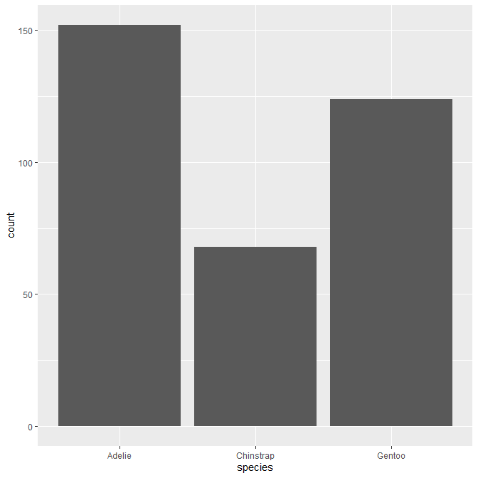
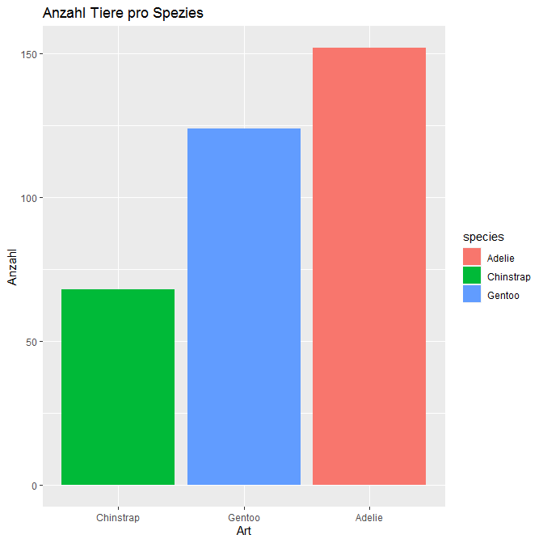
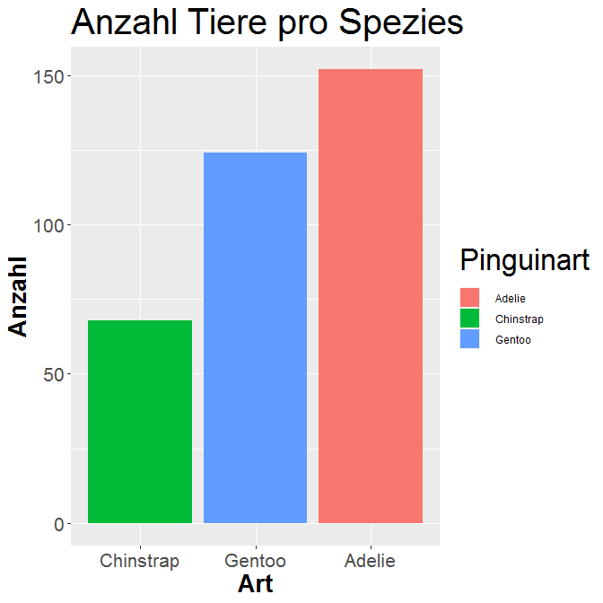
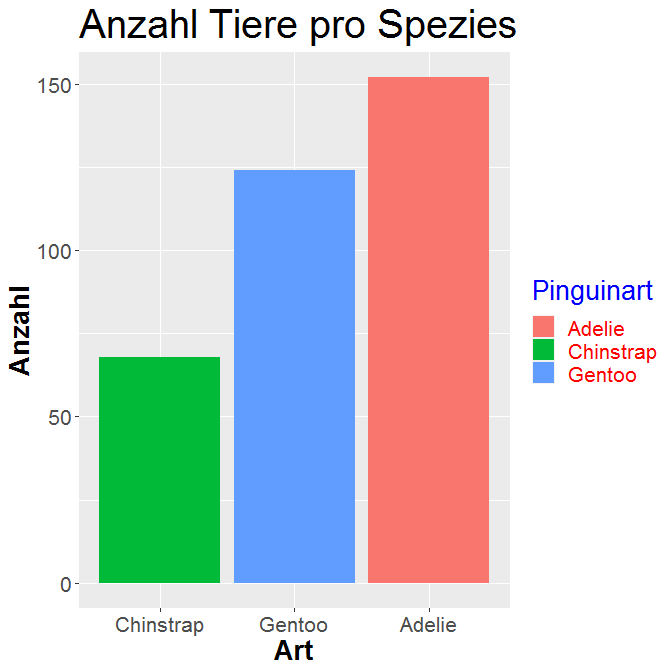

ggplot- Logik!
--------------

ggplot2 ist ein Paket, dase von Hadley Wickham entwickelt wurde, und
viele Funktionen zur Visualisierung von Daten bietet (für eine Übersicht
und Inspirationen siehe z. B:
<a href="http://r-statistics.co/Top50-Ggplot2-Visualizations-MasterList-R-Code.html" class="uri">http://r-statistics.co/Top50-Ggplot2-Visualizations-MasterList-R-Code.html</a>
und
<a href="https://www.r-graph-gallery.com/" class="uri">https://www.r-graph-gallery.com/</a>).
Es folgt einer eigenen Logik, der “Grammatik der Diagramme” und gehört
zum Tidyverse. Grundlegend ist eine Art “Layer-Konzept”, dass ich mit
jeder weiteren Zeile Code ein neues Layer zu dem Diagramm hinzufüge, wie
bei der Bildbearbeitung mit Photoshop oder Gimp.

Erarbeiten wir uns das Schritt für Schritt.

3 Dinge gibt es in jedem ggplot, die definiert werden müssen:

-   Welche Daten es benutzen soll ggplot(data = ),

-   welche Art von Diagramm es bauen soll (geom) und

-   wie das Diagramm aussehen soll (aes() von aesthetics), damit
    überhaupt etwas entsteht, also z. B., was auf der x- und der y-Achse
    abgetragen werden soll.

Alles andere danach sind reine Verschönerungsmaßnahmen. Mit “scales”
lassen sich die Achsen und Legenden verändern, mit “theme”
Hintergrundfarbe u. ä. (für mehr Infos siehe:
<a href="https://r-intro.tadaa-data.de/book/visualisierung.html" class="uri">https://r-intro.tadaa-data.de/book/visualisierung.html</a>
)

Nehmen wir uns ein Beispiel vor und erarbeiten es uns der Reihe nach.

Ein Säulen- oder Balkendiagramm
-------------------------------

Ein Säulendiagramm eignet sich zur Darstellung nominaler und ordinaler
Variablen. Ihr könnt es ja mal mit metrischen probieren, dann seht ihr
schnell, warum das nicht gut ist.

Als erstes müssen wir das Paket ggplot2 installieren
(*install.packages*) und aufrufen, sowie die Daten, die wir nutzen
wollen:

``` r
library(ggplot2)

library(palmerpenguins)

# Daten
data("penguins")
```

Dann bauen wir ein erstes einfaches Säulendiagramm. Der Befehl für diese
Art des Diagramms ist `geom_bar`.

Die Information `data =` kann entweder direkt in die runden Klammern
hinter `ggplot()` geschrieben werden ODER dem `geom_` hinzugefügt.

Wie aber soll das Säulendiagramm (`geom_bar`) aussehen, welche Spalte
des Datensatzes soll genau wie dargestellt werden? Das ist die
Information die in `aes()` eingegeben werden muss.

Wir möchten jetzt also ein Säulendiagramm bauen, dass auf der x-Achse
die verschiedenen Spezies des penguin-Datensatzes und die Häufigkeiten
(wie viele Datensätze aus den verschiedenen Spezies gibt es) auf der
y-Achse zeigt:

``` r
ggplot()+ 
  geom_bar(data = penguins, aes(x = species)) 
```



Das + am Ende jeder Zeile sagt R, dass der Befehl in der nächsten Zeile
weiter geht, ähnlich wie bei der pipe.

Das ist doch schonmal was. Die Information die wir wollen, wird schnell
und einfach angezeigt.

Aber schön ist es noch nicht.

Geben wir den Achsen eine andere Beschriftung. Mit dem “labs”-Befehl
lassen sich die Achsenbeschriftungen und die Überschriften ändern:

``` r
ggplot()+ 
  geom_bar(data = penguins, aes(x = species))+ 
  labs(y = "Anzahl",
       x = "Art",
       title = "Anzahl Tiere pro Spezies")
```


Wir können auch die Säulen bunt einfärben. Der Befehl *fill* gibt den
Balken unterschiedliche Farben, je nach den Angaben in der Spalte, die
ich spezifiziere (hier wieder Spezies):

``` r
ggplot()+ 
  geom_bar(data = penguins, aes(x = species, fill = species))+ 
  labs(y = "Anzahl",
      x = "Art",
       title = "Anzahl Tiere pro Spezies")
```


Vielleicht nervt euch auch, so wie mich, dass die Reihenfolge der Balken
nicht nach Größe geordnet ist?

Ändern wir das doch einmal!

Leider bedeutet das in R, dass wir unseren Datensatz ändern müssen. Da R
bei geom\_bar während der Diagrammerstellung erst die Häufigkeiten
zählt, kann er im Vorhinein nicht die Reihenfolge nach den Häufigkeiten
sortieren.

Also müssen wir R helfen und erst die Häufigkeiten auszählen und ihm
dann einen neuen Befehl geben.

### Exkurs: Pivot-Tabelle

Für das Zählen von Häufigkeiten gibt es einen einfachen Befehl, der
einer pivot-Table in Excel entspricht, falls jemand das kennt. Ich wähle
ein oder zwei Variablen aus, deren Zusammenhänge ausgezählt werden, also
wie häufig kommen sie gemeinsam vor / bzw wie häufig kommt die eine
Variable vor. Der Befehl heißt (echt simpel) `table`.

``` r
table(penguins$species)
#> 
#>    Adelie Chinstrap    Gentoo 
#>       152        68       124
```

Der Output ist klar, aber um damit arbeiten zu können, müssen wir die
Tabelle speichern:

``` r
species <- table(penguins$species)
```

Dummerweise ist das jetzt ein bestimmtes Datenformat, das ggplot nicht
mag, schaut mal welches:

``` r
class(species)
#> [1] "table"
```

ggplot arbeitet am besten mit dataframes. Darum wandeln wir species noch
einmal in einen Dataframe um. Das geht einfach mit der Funktion
`as.data.frame` und damit überschreiben wir die alte table:

``` r
species  <- as.data.frame(species)
```

Schaut euch species jetzt einmal an:

``` r
View(species)
```

Wie ihr seht, gibt es jetzt die Spalte “Var1” und die Spalte “Freq”. Wir
hatten R nicht gesagt, wie es die Spalten der neue Tabelle benennen
sollte. Das holen wir jetzt nach. Nennen wir doch die erste Spalte
“species” und die zweite “n”. “n” ist eine typische Bezeichnung für
Häufigkeiten in der Statistik.

``` r
colnames(species)  <- c("species", "n")
```

Das waren ganz schön viele Zeilen Code. Wir können das auch alles in
einer Zeile machen und die Aufgaben “verschachteln”:

``` r
species <- as.data.frame(table(penguins$species, 
                               dnn = list("species")), 
                         responseName = "n")
```

`as.data.frame` ist die “äußerste” Funktion, wird also als letztes
ausgeführt, darin liegt `table`, welches auf unsere Daten
“penguin$species” angewandt wird, mit dem Argument
`dnn = list("species")`. Innerhalb des as.data.frame-Befehls wird
`responseName = "n"` gesetzt, um die Spalten richtig zu benennen.

Beide Wege führen zu dem Ergebnis, das wir haben wollen. Am Anfang
schreibt man meist alles ausführlich aus, aber mit der Zeit fängt man
an, kürzer und verschachtelter zu schreiben, weil einem das Lesen des
Codes leichter fällt. Macht das, wie ihr wollt!

### x nach Häufigkeiten sortieren

Jetzt können wir endlich die Daten wieder visualisieren. Aber Achtung,
wenn wir ggplot nicht selber die Häufigkeiten auszählen lassen wollen,
sondern sie ihm “an die Hand geben”, nehmen wir nicht `geom_bar` sondern
`geom_col` und spezifizieren mit y die Höhe des Balkens.

``` r
ggplot()+ 
  geom_col(data = species, aes(x = species, y = n, fill = species))+ 
  labs(y = "Anzahl",
       x = "Art",
       title = "Anzahl Tiere pro Spezies")
```


“Aber ey!” werdet ihr sagen. Die Balken sind ja noch nicht in der
richtigen Reihenfolge. Richtig. Aber jetzt können wir das machen, in dem
wir eine ganz kleine Änderung einfügen: Wir ordnen x um, englisch
“reorder”.

``` r
ggplot()+ 
  geom_col(data = species, aes(x = reorder(species, n), y = n, fill = species))+ 
  labs(y = "Anzahl",
       x = "Art",
       title = "Anzahl Tiere pro Spezies")
```

 Die Ansage ist: Nimm als x species, aber
geordnet nach der Größe von n. 

Wunderbar.

### Beschriftungen

Jetzt gefällt mir aber nicht, das die Beschriftung so klein ist. Ändern
wir das doch einmal. Beschriftungsgröße ist etwas, das zu den
“Verschönerungsoptionen” gehört und in einem “theme” abgehandelt wird.
Wir öffnen also ein “theme”, spezifizieren darin, dass wir über die
beiden Achsen-Titel reden wollen (axis.title) und die Elemente des
Textes ändern (element\_text). Wir können dort angeben, dass der Text
dickgedruckt werden soll (face = “bold”) und die Größe (size = 20). Dann
machen wir doch das gleiche noch mit der Beschriftung der Werte auf den
Achsen (axis.text). Hier ändern wir vllt nur die Größe. Und am Ende noch
den Titel von dem ganzen

``` r
ggplot()+ 
  geom_col(data = species, aes(x = reorder(species, n), y = n, fill = species))+ 
  labs(y = "Anzahl",
       x = "Art",
       title = "Anzahl Tiere pro Spezies")+
  theme(axis.title = element_text(face="bold", size=20),
        axis.text  = element_text(size=16),
        title = element_text(size = 25))
```


Ach, werdet ihr sagen, aber diese blöde Legende da rechts. Die gefällt
mir nicht, sie benutzt den englischen Begriff “species”, das ist doch
doof.

Auch hierfür lässt sich leicht abhilfe schaffen. Die legende ist “scale”
im englischen. Und wir wollen die Legende ansprechen, die sich mit der
“Füllung” beschäftigt, dem was unter `fill =` definiert wurde und da es
sich um eine “diskrete Variable” handelt, ändern wir den Legendennamen
mit “scale\_fill\_discrete”.

``` r
ggplot()+ 
  geom_col(data = species, aes(x = reorder(species, n), y = n, fill = species))+ 
  labs(y = "Anzahl",
       x = "Art",
       title = "Anzahl Tiere pro Spezies")+
  theme(axis.title = element_text(face="bold", size=20),
        axis.text  = element_text(size=16),
        title = element_text(size = 25))+
  scale_fill_discrete(name = "Pinguinart")
```



Jetzt ist nur noch die Schrift in der Legende zu klein. Schrift gehört
wieder zu den “theme”-Aspekten, also bauen wir das doch einfach da ein.
Und wir könnten die Farbe des Textes gleich nochmal ändern…:

``` r
 ggplot()+ 
  geom_col(data = species, aes(x = reorder(species, n), y = n, fill = species))+ 
  labs(y = "Anzahl",
       x = "Art",
       title = "Anzahl Tiere pro Spezies")+
  theme(axis.title = element_text(face="bold", size=20),
        axis.text  = element_text(size=16),
        title = element_text(size = 25),
        legend.title = element_text(color = "blue", size = 20),
        legend.text = element_text(color = "red", size = 16))+
    scale_fill_discrete(name = "Pinguinart")
```



Herzlichen Glückwunsch! Das sieht doch langsam nach einer publizierbaren
Grafik aus.

### x- und y vertauschen

Wenn wir der Meinung sind, wir hätten lieber ein Balkendigramm, dann
können wir das ganze einfach um 90 Grad kippen. Der Befehl heißt
`coord_flip()` und wird einfach mit einem + unten dran gehängt:

``` r
 ggplot()+ 
  geom_col(data = species, aes(x = reorder(species, n), y = n, fill = species))+ 
  labs(y = "Anzahl",
       x = "Art",
       title = "Anzahl Tiere pro Spezies")+
  theme(axis.title = element_text(face="bold", size=20),
        axis.text  = element_text(size=16),
        title = element_text(size = 25),
        legend.title = element_text(color = "blue", size = 20),
        legend.text = element_text(color = "red", size = 16))+
    scale_fill_discrete(name = "Pinguinart")+
  coord_flip()
```


Bilder sichern
==============

Jetzt haben wir die Bilder bisher nur in R erstellt, wir haben sie noch
nicht sinnvoll abgespeichert.

Das ist ganz einfach.

Den *letzten* Plot, den wir erstellt haben, können wir mit diesem Code
speichern:

``` r
ggsave("Pfad/Plotname.png", width = 4, height = 4, units = "cm", dpi = 300)
```

Wir geben den Namen den die Datei haben soll (das kann auch ein Pfad
werden, damit es in einem bestimmten Ordner gespeichert wird), wir geben
mit der Endung das Dateiformat udn sagen mit width und height wie groß
das Bild in units = cm abgespeichert werden soll. Außerdem die Auflösung
mit dpi. Super praktisch!

(D. h. ich hab das Bild als png in einer Größe von 4x4cm abgespeichert.
Es hat eine Auflösung von 300 dpi und liegt in dem Ordner, den ich
angebe (Pfad) unter dem Namen “Plotname”.
