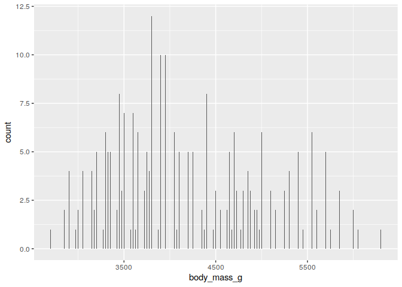
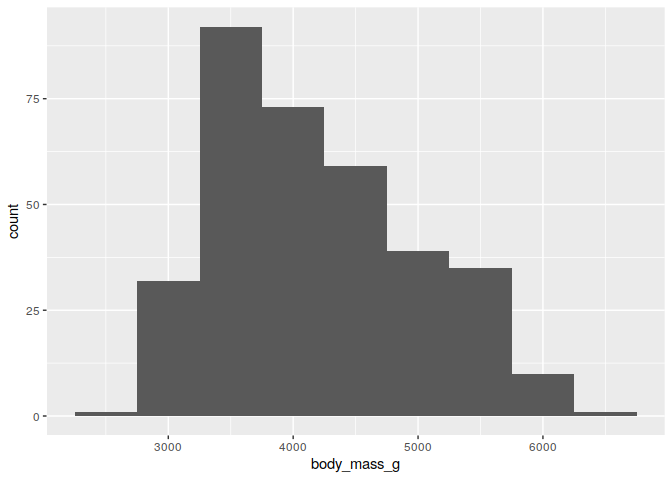

Metrische Daten
===============

In der letzten Stunde haben wir vor allem mit nominalen Daten gearbeitet und sie dargestellt. Dafür eignen sich Balkendiagramme ganz hervorragend. Hier geht es aber um metrische Daten.

Deshalb lernen wir ein paar neue Diagramme kennen.

-   Streudiagramme

-   Histogramme

-   Boxplot-Diagramme

Aber zuerst die Daten laden:

``` r
library(palmerpenguins)
data("penguins")
library(ggplot2)
```

Histogramm
----------

Fangen wir an mit Histogrammen. Histogramme sind sehr beliebt für metrische Daten, weil man relativ einfach die Verteilung der Werte erkennen kann. Ein Histogramm sieht manchmal aus wie ein Balkendiagramm, ist es aber nicht! Histogramme haben auf der x-Achse eine klassifizierte **metrische** Variable und auf der y-Achse entweder die Häufigkeit dieses Wertes oder die Dichte.

Wir wissen ja schon, dass in dem Datensatz ein paar Werte fehlen, deswegen spezifizieren wir wieder, dass diese einfach rausgenommen werden sollen:

Ein Beispiel:

``` r
ggplot(data = penguins)+
  geom_histogram(aes(x = body_mass_g),  na.rm = TRUE)
```

    ## `stat_bin()` using `bins = 30`. Pick better value with `binwidth`.


Wenn ihr das ausgeführt habt, sollte eine Meldung aufgeploppt sein: "`stat_bin()` using `bins = 30`. Pick better value with `binwidth`."

"Binwidth" bezeichnet die Größe, also Breite, der Klasse. "bins = 30" heißt, dass der gesamte Datensatz in 30 gleich große Klassen unterteilt wurde.

Probiert einmal verschiedene Werte für die Klassengröße (binwidth) in dem Beispiel aus, zB einmal 5 und einmal 500:

``` r
ggplot(data = penguins)+
  geom_histogram(aes(x = body_mass_g), binwidth = 5, na.rm = TRUE) # Klassengröße 5. Versucht doch einmal andere Werte und schaut, was passiert!
```



``` r
ggplot(data = penguins)+
  geom_histogram(aes(x = body_mass_g), binwidth = 500, na.rm = TRUE) # Klassengröße 500. Versucht doch einmal andere Werte und schaut, was passiert!
```



Was lernen wir daraus? Die Wahl der Klassengröße macht eine Menge aus, wie ich die Daten wahrnehme und welche Aussagen ich über sie treffen werde.

Was gibt es noch für Möglichkeiten der Datenvisualisierung?

Boxplot
-------

Ich hatte ja schon erläutert, was ein Boxplotdiagramm ist. Hier noch einmal zur Erinnerung:

-   Q1 = 1. Quartil. Bis hier liegen die ersten 25% meiner Werte, wenn ich sie aufsteigend sortiere
-   (Q2 =) Median, den kennen wir schon. Bis hier liegen 50 % meiner Werte, wenn ich sie aufsteigend sortiere
-   Q3 = 3. Quartil, bis hier liegen 75% meiner Werte, wenn ich sie aufsteigend sortiere
-   Q3 - Q1 ist der Quartilsabstand: In diesem Bereich um den Median herum liegen 50% der "mittleren" Werte. Er wird durch die Box gekennzeichnet
-   Bartenden sind das 1,5fache des Quartilsabstandes vom Median aus gerechnet (oder am Ende der Verteilung)
-   Extreme liegen außerhalb der Bartenden
-   Ausreißer sind mehr als das 3fache des Quartilsabstandes vom Median entfernt

Ein Boxplottdiagramm eignet sich sehr gut, um mehrere Verteilungen EINER Variablen zu vergleichen. Also mehrere Gruppen in meinem Datensatz, aber immer die gleiche Variable. Die Gruppen werden dann auf der x-Achse abgetragen.

Ein Beispiel:

``` r
ggplot(data = penguins)+
  geom_boxplot(aes(x = species,  # auf der x-Achse die Art
                   y = body_mass_g), # auf der y-Achse das Gewicht
               na.rm = TRUE) + # alle NAs müssen raus
  labs(x ="Art",               # Beschriftung der Achsen
       y ="Gewicht",
       title = "Das Gewicht der Arten im Vergleich")+
  theme_bw()
```

 Ich kann gut erkennen, dass die Pinguin-Art Gentoo deutlich schwerer ist als die anderen beiden.

Yay!

**Aufgabe:** Sind die Gentoo-Pinguine auch mit längeren Flossen unterwegs?

Hinweis: Ihr müsst bei dem Code oben eigentlich nur den Vektor, der das Gewicht bezeichnet mit dem Vektor austauschen, der die Flipper-Länge angibt. Und dann die Achse wieder richtig beschriften.

Streudiagramme
--------------

Bei Streudiagrammen kann ich zwei Variablen einer Einheit gegeneinander plotten und noch weitere nominale Daten hinzu-visualisieren.

Wir tragen auf der X- und auf der Y-Achse metrische Daten ab. Das gehört zu den aesthetics-Elementen, deshalb tun wir die Info in die Klammern hinter aes():

``` r
ggplot(data = penguins)+
  geom_point(aes(x = bill_depth_mm, y = bill_length_mm), na.rm = TRUE)
```


Jetzt können wir damit wieder die Dinge tun, die wir mit dem Balkendiagramm gemacht hatten, also die Achsen beschriften, einen Titel vergeben und den Style ändern:

``` r
ggplot(data = penguins)+
  geom_point(aes(x = bill_depth_mm, y = bill_length_mm), na.rm = TRUE) + 
  labs(x =" Dicke des Schnabels",
       y ="Höhe des Schnabels",
       title = "Schnabelmaße")+
  theme_bw()
```


Was kann man noch tolles machen? Die Form der Punkte von einer Variablen bestimmen lassen! Und die Farbe!

Welches Merkmal, das ich in der Tabelle als Spalte aufgenommen habe, die Form der Punkte bestimmt, lege ich mit "shape" fest, die Farbe mit "color". Geben wir doch einmal die Pinguinarten als Form und ihr Geschlecht als Farbe an.

``` r
ggplot(data = penguins)+
  geom_point(aes(x = bill_depth_mm, y = bill_length_mm, shape = species, color = sex), na.rm = TRUE) + 
  labs(x =" Dicke des Schnabels",
       y ="Höhe des Schnabels",
       title = "Schnabelmaße")+
  theme_bw()
```


Oooooh, schaut euch mal das Ergebnis an! Da könnte man schon fast was interpretieren!

**Aufgabe**: Probiert doch einmal noch 2-3 andere metrische Parameter aus, ob die vielleicht auch einen Unterschied zwischen den Arten und den Geschlechtern erkennen lassen?

Und wir sollten die Beschriftung der Legende wieder anpassen:

``` r
ggplot(data = penguins)+
  geom_point(aes(x = bill_depth_mm, y = bill_length_mm, shape = species, color = sex), na.rm = TRUE) + 
  labs(x =" Dicke des Schnabels",
       y ="Höhe des Schnabels",
       title = "Schnabelmaße")+
  theme_bw()+
 scale_colour_discrete(name  ="Geschlecht",
                       breaks = c(NA, "female", "male"),
                       labels = c("unbest.", "weibl.", "männl."))+
 scale_shape_discrete(name  ="Art")
```

 Was bedeutet das alles?

Mit `scale_colour_discrete` kann ich Legenden (`scales`) verändern, die mit `color` innerhalb des aesthetics-Bereichs meines Codes für die Graphik definiert werden und die DISKRET sind (also nominale / ordinale Daten).

Hier benenne ich den Legendentitel mit `name =` um.

`breaks` bezeichnet die Werte in meiner Spalte, die dann mit den `labels` in der nächsten Zeile umbenannt werden (der erste Wert bei breaks bekommt den ersten Wert bei labels).

Das gleiche kann ich mit der Legende für die FORM der Punkte machen: `scale_shape_discrete`, aber die Arten brauche ich ja nicht umbenennen.

Voll gut!

Letzte Hinweise ggplot
----------------------

GGplot hat noch viel viel mehr Möglichkeiten. Um einen Überblick zu bekommen, empfehle ich den Blogpost hier zu lesen, der vorführt, wie sich so eine Visualisierung entwickeln kann und am Ende richtig richtig gut aussieht: <https://cedricscherer.netlify.com/2019/05/17/the-evolution-of-a-ggplot-ep.-1/>

Hilfen, um mit R und ggplot zurechtzukommen sind:

-   das englische R-Cookbook: <http://www.cookbook-r.com/> (das nutze ich sehr häufig)

-   die Schummelzettel: <https://www.rstudio.com/wp-content/uploads/2015/06/ggplot2-german.pdf>

-   dieses R-Intro-Buch: <https://r-intro.tadaa-data.de/book/visualisierung.html>

-   das deutsche Wikibook zu R: <https://de.wikibooks.org/wiki/GNU_R> und

Ganz ehrlich: Ich muss ständig googeln, wie ich noch einmal die Legendenbeschriftung ändere und ähnliches. Lasst euch von dem Vergessen-haben nicht aus der Ruhe bringen und sucht nach den Stichworten "ggplot, R" und was ihr ändern wollt. Die meisten Hilfestellungen sind allerdings auf englisch.
