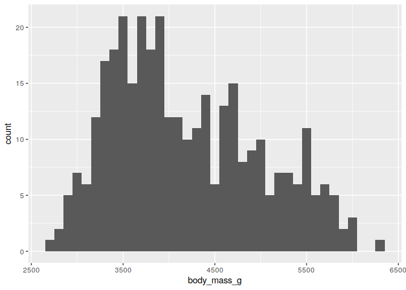
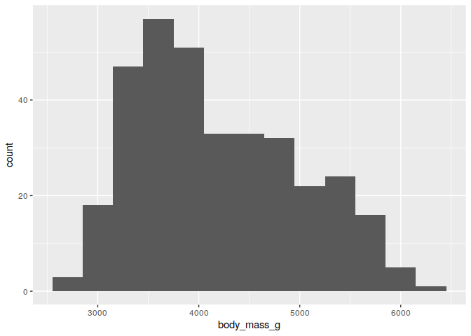
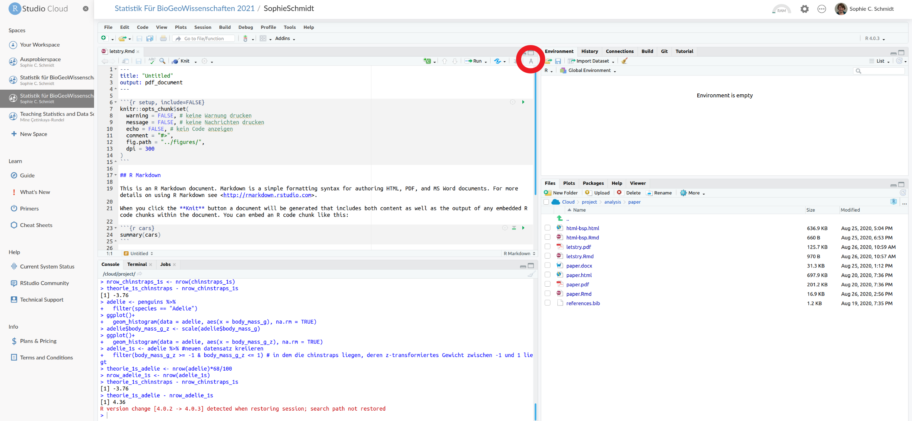
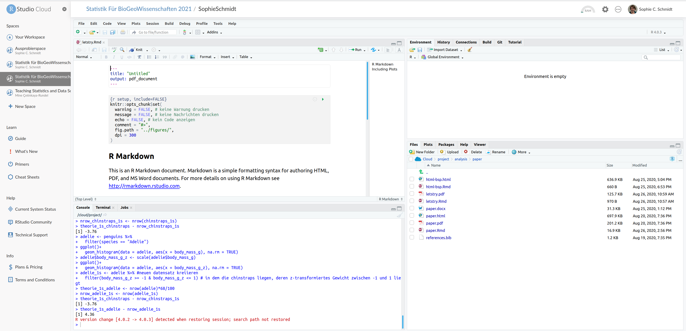

``` r
knitr::opts_chunk$set(echo = TRUE)
```

# Hinweise zur Reproduzierbarkeit

## Style guide

Damit man seinen eigenen Code später auch noch gut lesen kann und auch
andere Leute ihn gut lesen können, gibt es ein paar Hinweise, wie er
geschrieben wird, sogenannte “style guides”. Ich orientiere mich an dem
Style Guide der “Initiative für Statistische Analysen in Archäologie
Kiel” (<https://github.com/ISAAKiel/StyleGuide>) und gebe euch hier ein
paar Hinweise:

1.  Leerzeichen um jeden Operator (`=, +, -, <-`, etc.)) herum, kein
    Leerzeichen vor einem Komma, aber eins dahinter.

2.  Namen von Datensätzen und Variablen sollten keine Sonderzeichen
    enthalten. Leerzeichen sollten mit einem Unterstrich \_ ersetzt
    werden. “Sprechende” Namen, die einen Sinn ergeben, sind nützlich
    (zB `mean_body_mass_g` und nicht einfach nur `m`).

3.  Eine Zeile Code sollte nicht länger als 80 Zeichen sein. Stattdessen
    ist es sinnvoll, den Code hinter jedem Komma “umzubrechen”, denn
    dann hat an einen besseren Überblick und kann ihn viel besser
    kommentieren (siehe 4.). Rstudio “setzt” das auch von alleine
    sinnvoll, in dem die neue Zeile innerhalb einer Klammer dann auf der
    gleichen “Höhe” beginnt, wie der vorhergehende Eintrag.

4.  Kommentiert den Code mit einem Hashtag (\#)-Symbol.

-   VOR dem Code und in eine eigene Zeile kommen längere Hinweise, was
    der folgende Code machen soll: zB “\# Histogramm erstellen, um
    Verteilung der Größe der Pinguine einzuschätzen”
-   IN DIE GLEICHE ZEILE wie Code kommen kurze Hinweise auf die genutzte
    Funktionen und Argumente, zB:

``` r
library(ggplot2)
library("palmerpenguins")
data("penguins")

# Histogramm erstellen, um Verteilung der Größe der Pinguine einzuschätzen
ggplot()+
  geom_histogram(data = penguins, aes(x = body_mass_g), 
                 binwidth = 100, # Klassengröße 100g zeigt klare Verteilungsstrukturen
                 na.rm = TRUE) # zwei NA-Sätze müssen entfernt werden
```

-   Tipp: lieber zu viel als zu wenig kommentieren.

1.  Lasst ein bisschen Platz zwischen verschiedenen Sinneinheiten im
    Code. Eine Leerzeile zwischen `data("penguins")` und dem Kommentar
    im Bsp erleichtert das Lesen ungemein.

## R Markdown

#### wer nicht in der Cloud arbeitet:

Als erstes: bitte Rmarkdown installiern:

``` r
install.packages("rmarkdown")
```

#### weiter für alle

Ein *Rmarkdown*-Dokument (Rmd) ist eigentlich nur ein txt-Dokument, also
das simpelste an Textdatei was man sich vorstellen kann. In dem ich in
dieser Textdatei einer bestimmten Syntax folge, kann ich die Datei von
einem Programm im Hintergrund (namens pandoc) in hübsch formatierte
Word-, html- oder PDF-Dateien umwandeln. Zum Bsp lassen sich
Überschriften mit dem Rautensymbol markieren, Listen mit einem einfach
Minus-Symbol und Text durch Unterstriche *kursiv* und durch zwei
Sternchensymbole **fett** drucken:


(Beispiel von der offiziellen homepage)

### Dokument-Struktur

Fangen wir in einem Dokument von oben an. Ganz oben steht ein
sogenannter “YAML-Header”. Er beginn und endet mit 3 Minuszeichen in
einer eigenen Zeile. In ihm werden einige Meta-Daten zu dem Dokument
abgelegt:

-   Der Titel wird hinter `title:` in Hochkommas geschrieben
-   Hinter `author:` schreibt man seinen eigenen Namen in Hochkommas
-   `date:` ist nicht verpflichtend, aber das kann hilfreich sein
-   und mit `output:` wird spezifiziert, in was für eine Art Dokument
    das Rmarkdown-Dokument verwandelt werden soll. Es gibt
    “html_document”, “word_document” oder “pdf_document” und tatsächlich
    noch einige andere Versionen, die hier nicht so wichtig sind.

Wenn das Paket `knitr` installiert ist (wer nicht in der Cloud arbeitet:
bitte installiert es), gibt es oben den **Knit**-Knopf (englisch für
stricken und das Symbol ist ein Wollknäul mit Stricknadeln), der das
Dokument umwandelt. Wer faul ist wie ich, benutzt den Shortcut
Strg+Umschalt+k.

Überschriften werden in einer einfachen Syntax gegliedert. Ein Hashtag
(\#) markiert die oberste Überschrift, zwei Hashtags (\#\#) die zweite
Rangordnung, drei Hashtags (\#\#\#) die nächste. “Dokument-Struktur” ist
eine Überschrift dritten Grades:
`### Dokument-Struktur{#dokument-struktur}`.

Ach, was soll denn dieses `{#dokument-struktur}`? Das setzt einen Anker.
Mit einem Anker kann ich links innerhalb des Dokuments setzen. Also, auf
andere Überschriften verweisen. Wer html kennt, dem ist das Prinzip
bekannt. Wenn ihr [hierauf](#dokument-struktur) klickt, dann springt ihr
wieder zu der Überschrift Dokument-Struktur. Markiert wurde das
folgendermaßen: `[hierauf](#dokument-struktur)`.

Praktisch, nicht wahr? Ein Anker steht in geschweiften Klammern ({}) und
beginnt mit einer Rautensymbol (\#). Er darf keine Leerzeichen
enthalten! Wenn auf den Anker verwiesen werden soll, wird er in runde
Klammern () hinter das Wort in eckigen Klammern \[\], das als Link
formatiert wird, geschrieben.

So viele Rauten… Hashtags… \#\#\# … Hilfe!

Nicht verwirren lassen! Innerhalb eines Code-Chunks und innerhalb eines
“normalen R-Skripts” gilt die Raute als Symbol zum Markieren von
Kommentaren. Im Text-Teil eines Markdown-Dokuments zeichnet es eine
Überschrift aus, wenn davor und danach eine Leerzeile steht. In
geschweiften Klammern ({}) beginnt ein Hasthag einen Anker, in runden
Klammern () wird daraus ein Link, der auf den Anker verweist.

### Text und Code (das R in RMarkdown)

In einem Rmd gibt es “normale” Textbereiche, wie diesen hier und Code
Chunks: Code chunks sind die Bereiche, in denen ich Code unterbringen
kann. Man erstellt am einfachsten einen mit dem Shortcut Strg+Alt+i.

Sie folgen einer bestimmten Logik und werden durch drei Hochkommas
(\`\`\` = die Art, die man auf der deutschen Tastatur neben dem
Back-Pfeil findet) und einer öffnenden geschweiften Klammer mit einem r
darin geöffnet. Daneben kann ich den Code Chunk benennen. Kann voll
praktisch sein, wenn ich später mal darauf referenzieren möchte.
Dahinter kann man noch Parameter für den Code Chunk setzen, dazu gleich
mehr. Nach diesen Parametern folgt jedoch eine schließende geschweifte
Klammer und der Bereich für Code beginnt. Er ist immer etwas dunkler
hinterlegt. In diese erste Zeile sollte nichts weiter hinter die
geschweifte Klammer kommen.

Der Code Chunk muss aber auch beendet werden. Dafür braucht man wieder
die drei Hochkommas alleine (\`\`\`) in einer Zeile.

``` r
# das hier ist ein Code Chunk. Ich sollte also nur Code hinein schreiben
# alles was nicht Code ist, muss auskommentiert werden, sonst will pandoc es gerne als Code behandeln und fängt an zu weinen, weil es sehr fehlerhafter Code wäre
```

Dieser Code wird in der Regel gleich ausgeführt und, wenn er zu einer
Grafik führen soll, wird die Grafik angezeigt:


(Mehr zum Bilder einfügen [hier](#bilder-einfügen))

Die Parameter des Code Chunks können bestimmen, ob der Code mit als Code
in das html-Dokument übertragen werden werden soll (`echo = TRUE`) oder
nicht (`echo = FALSE`) oder falls ein Diagramm erstellt wird, wie groß
es sein soll (fig.height und fig.width). Einen Parameter, den ich immer
benutze, um die Skripte zu erstellen, ist zB “`eval = FALSE`”, was
besagt, dass der Code in diesem Chunk nicht ausgeführt werden soll.
Ansonsten würde ich bei jedem Umwandeln des RMarkdown-Dokuments in die
html alle Pakete neu installieren, deren Installationscode ich
hinschreibe, das wäre Quatsch. Diese Parameter werden mit Komma
voneinander getrennt, weitere findet ihr unter:
<https://rmarkdown.rstudio.com/lesson-3.html> und eine super
Zusammenstellung hier: <https://yihui.org/knitr/options/>. Man kann sie
aber auch händisch einstellen, wenn man auf das kleine Zahnradsymbol
klickt.

Noch ein Beispiel für einen Code Chunk. Ich möchte das Histogramm aus
dem Beispiel oben in dieses Dokument einfügen. Diesmal gebe ich nicht
den Parameter `eval = FALSE` sondern `eval = TRUE` und spezifiziere,
dass die Grafik 5cm groß sein soll. Dadurch dass in meinem obersten Code
Chunk in diesem Dokument im [setup](#header)
`knitr::opts_chunk$set(echo = TRUE)` gesetzt habe, gilt `echo = TRUE`
als default für alle Code Chunks. Damit wird der Code immer mit
ausgeschrieben.

``` r
library(ggplot2)
library("palmerpenguins")
data("penguins")

# Histogramm erstellen, um Verteilung der Größe der Pinguine einzuschätzen
ggplot()+
  geom_histogram(data = penguins, aes(x = body_mass_g), 
                 binwidth = 100, # Klassengröße 100g zeigt klare Verteilungsstrukturen
                 na.rm = TRUE) # zwei NA-Sätze müssen entfernt werden
```



Wenn ich das nicht möchte, muss ich noch einmal in meinen Code Chunk
Options spezifizieren, dass `echo = FALSE` sein soll. Bsp:



Außerhalb eines Code Chunks weiß pandoc jedoch nicht, dass was ich
schreibe, Code sein soll, es geht davon aus, dass das alles Text ist.

install.packages(“knitr”) tut also genau gar nichts.

Was man aber machen kann, ist Variablen, die man erstellt hat, und
kleine Berechnungen im Text einbetten. Man brauch ein Hochkomma \` r
“Variablenname / Befehl” und wieder ein Hochkomma ´ einfach mitten im
Fließtext. Der Median von der Spalte body_mass_g ist 4050g. Geschrieben
habe ich nicht die Zahl sondern: \` r median(penguins$body_mass_g, na.rm
= TRUE)\` und das Programm hat es sozusagen “on the fly” im Text für
mich ausgerechnet.

Das ist suuuuper praktisch, weil ich mir so keine Zahlen merken muss und
so eine Fehlerquelle reduziere.

### Bilder einfügen

Die Bilder im Text habe ich per Markdown eingefügt. Sie sind online
verfügbar, deshalb war der Code für das erste der folgende:
``.
Um Bilder einzufügen, die irgendwoe auf meinem PC liegen, gilt:
`

Links lassen sich auch einfügen, und zwar als [Hyperlink im
Text](https://rmarkdown.rstudio.com/authoring_quick_tour.html) (Code:
`[Hyperlink im Text](https://rmarkdown.rstudio.com/authoring_quick_tour.html`)

oder einfach so:
<https://rmarkdown.rstudio.com/authoring_quick_tour.html>.

### Kommentare

Auch in Markdown-Text kann man Kommentare abgeben, die nicht mehr
sichtbar sind, wenn das Dokument in eine html/docx oder pdf umgewandelt
wird. Sie werden im “html-style” geschrieben: Mit \<!– hier steht das
Kommentar –\>

Schaut einmal in mein Rmd-Dokument (unter
<https://github.com/SCSchmidt/lehre/blob/R-Kurs-Koblenz/analysis/BioGeo/B06_markdown.Rmd>)
um zu sehen, was ich unter dieser Zeile kommentiert habe.

<!-- Haha. Das hier ist unsichtbar -->

### super neuste Neuigkeiten: Visual editor

Die neuste Rstudio-Version hat ein ganz neues tolles feature: Den visual
markdown editor. Man findet dies oben rechts am Rande des
Markdown-Fensters. Ein kleines unauffälliges A:



Wenn man darauf klickt, ändert sich die Ansicht und plötzlich findet man
sich in einem fast Word-ähnlichem Interface wieder:



Während man schreibt und seine Formatierungen “zusammenklickt” entsteht
“in Wirklichkeit” ein Rmd-Dokument, mit all den Auszeichnungen, wie sie
oben beschrieben wurden. Das erleichtert das Arbeiten am Anfang sicher
ungemein!

Einen Code-Chunk findet man übrigens unter “insert” / “einfügen”.

### Zusammenfassung

RMarkdown verknüpft Markdown, eine Auszeichnungssprache mit
Möglichkeiten R-Code auszuführen. Der große Vorteil eines
RMarkdown-Dokumentes ist es, dass man seinen Code und den Text zur
Interpretation beisammen hat. So lassen sich direkt Zeitschriftenartikel
mit Berechnungen, Analysen, Grafiken etc in einem Dokument ablegen. Man
kann in Markdown mit einem Literaturverwaltungsprogramm zusammenarbeiten
und sich automatisch Literaturverzeichnisse generieren lassen. Dazu
später mehr.

### Links

Wer mehr zu Markdown allgemein lesen will, sei hierauf verwiesen:
<https://vijual.de/2019/03/11/artikel-mit-markdown-und-pandoc-schreiben/>
(insb. Kap 1). Details zu RMarkdown findet ihr hier:
<http://rmarkdown.rstudio.com> und einen sehr praktischen Schummelzettel
hier:
<https://rstudio.com/wp-content/uploads/2015/06/rmarkdown-german.pdf>.
Hilfreich ist auch dieses Buch: <https://bookdown.org/yihui/rmarkdown>.
Wer auf interaktive Weise mehr Markdown lernen möchte, findet hier ein
gutes Tutorial: <https://commonmark.org/help/tutorial/>. Der neuste
heice shice mit dem Visual Markdown Editor wird hier beschrieben:
<https://rstudio.github.io/visual-markdown-editing/#/>

**Aufgabe** Im Beispielprojekt und damit auch in dem Projekt, was ihr
für euch erstellt habt, liegt eine RmD-Datei unter “/analysis/paper/”.
Schaut sie euch an, drückt *knit* und schaut, was passiert.

Anschließend probiert einmal folgendes aus:

-   im YAML-header steht ein großes Stück Code

<!-- -->

    output: 
       bookdown::word_document2:
         fig_caption: yes
         reference_docx: "../templates/template.docx" # Insert path for the DOCX file
         pandoc_args:
         - --lua-filter=../templates/scholarly-metadata.lua
         - --lua-filter=../templates/author-info-blocks.lua
         - --lua-filter=../templates/pagebreak.lua

Ersetzt es durch

    output:
      html_document

und auf *knit* drücken (oder Strg+shift+k). Was passiert?

An die Stelle könnt ihr auch einmal schreiben:

    output:
      pdf_document

und dann *knit* drücken.

Toll oder?! Mit einem Knopfdruck aus einer “Grund”-Datei drei
unterschiedliche Formate exportieren, ohne Probleme. Mit Code, der
korrekt umgewandelt wird. Ich schreibe inzwischen alle meine Artikel in
Rmarkdown, da ich so am einfachsten den Output generieren kann, der
gewünscht ist.

Die in dem Originaldokument gegebene reference_docx definiert solche
Sachen wie Überschriften formatiert werden sollen, wenn es als docx
ausgegeben werden soll. Die pandoc-arcs sind für ähnliche Dinge da. Aber
das führt hier zu weit.
