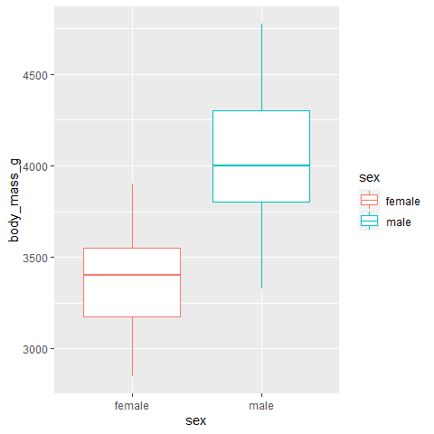

Vergleich zweier Gruppen
========================

Hier geht es darum, zwei Gruppen zu vergleichen und zu schauen, ob sie
eventuell aus der gleichen Grundgesamtheit stammen könnten oder ob die
Unterschiede signifikant sind.

Nicht-parametrische Verfahren
=============================

Nicht-parametrisch bedeutet, dass die Daten nicht normalverteilt sein
müssen, damit man den Test darauf anwenden kann. Es reicht außerdem,
wenn die Daten ordinal skaliert sind.

U-Test nach Mann-Whitney
------------------------

Der U-Test ist geeignet für ordinale und metrische Variablen.

Nehmen wir als erstes Beispiel das Gewicht der Pinguine und schauen, ob
Männchen oder Weibchen einer Art unterschiedlich schwer sind.

Der Test in R benutzt eine recht “alte” Syntax, die manchmal vorkommt.
Mithilfe der Tilde “\~” beschreibt er, welche zwei Variablen
gegeneinander getestet werden sollen. `paired = FALSE` stellt sicher,
dass wir hier den U-Test / Rangsummentest und nicht den Wilcoxon-Test
für gebundene Stichproben berechnen.

``` r
# zuerst einen neuen Datensatz nur mit der Art "Adelie" ersellen 
adelie <- subset(penguins, penguins$species == "Adelie")

# Testberechnung: wilcox.test(data = df, ordinale od. metrische Variable ~ gruppierender Faktor, paired = FALSE):

wilcox.test(data = adelie, body_mass_g ~ sex, paired = FALSE)
```

    #> 
    #>  Wilcoxon rank sum test with continuity correction
    #> 
    #> data:  body_mass_g by sex
    #> W = 6874.5, p-value = 1.813e-15
    #> alternative hypothesis: true location shift is not equal to 0

Dass da `Wilcoxon rank sum test with continuity correction` steht,
bedeutet, dass R erkannt hat, dass die Datensätze stetig (also metrisch)
sind. Dann geht er im Hintergrund leicht anders damit um. Weitere Infos
hier:
<a href="https://data.library.virginia.edu/the-wilcoxon-rank-sum-test/" class="uri">https://data.library.virginia.edu/the-wilcoxon-rank-sum-test/</a>.

Der p-Wert ist wieder super klein, das heißt, die beiden Gruppen sind
signifikant unterschiedlich! Schauen wir uns das einmal an:

``` r
library(ggplot2)

ggplot()+
  geom_boxplot(data = subset(adelie, !is.na(sex)), # Trick: Ich filtere bei "data" alle Datensätze raus, in denen in der Spalte "sex" NA steht
               aes(y = body_mass_g, 
                   x = sex, 
                   col = sex))
```

 Ich bin überzeugt. Das
können wir wirklich stichhaltig interpretieren!

Ein anderes Beispiel, jetzt eins mit einer diskreten Variable.

Nehmen wir dafür den Piraten-Datensatz:

``` r
library(yarrr)
```

    #> Loading required package: jpeg

    #> Loading required package: BayesFactor

    #> Loading required package: coda

    #> Loading required package: Matrix

    #> ************
    #> Welcome to BayesFactor 0.9.12-4.2. If you have questions, please contact Richard Morey (richarddmorey@gmail.com).
    #> 
    #> Type BFManual() to open the manual.
    #> ************

    #> Loading required package: circlize

    #> ========================================
    #> circlize version 0.4.10
    #> CRAN page: https://cran.r-project.org/package=circlize
    #> Github page: https://github.com/jokergoo/circlize
    #> Documentation: https://jokergoo.github.io/circlize_book/book/
    #> 
    #> If you use it in published research, please cite:
    #> Gu, Z. circlize implements and enhances circular visualization
    #>   in R. Bioinformatics 2014.
    #> 
    #> This message can be suppressed by:
    #>   suppressPackageStartupMessages(library(circlize))
    #> ========================================

    #> yarrr v0.1.5. Citation info at citation('yarrr'). Package guide at yarrr.guide()

    #> Email me at Nathaniel.D.Phillips.is@gmail.com

    #> 
    #> Attaching package: 'yarrr'

    #> The following object is masked from 'package:ggplot2':
    #> 
    #>     diamonds

``` r
data(pirates)
```

Die Piraten haben eine Anzahl von Tattoos. Das ist nun eine eindeutig
diskrete Variable, denn es wird wohl kaum jemand mit einem halben Tatoo
herumlaufen. Trotzdem ist sie als `numeric` abgelegt, was gut ist, da
der `wilcox.test` als Datentyp einen numerischen Vektor braucht.

Wir können jetzt schauen, ob die Zahl der Tattoos bei Piraten mit und
ohne Bandana (`headband`) unterschiedlich ist. Das heißt:

``` r
wilcox.test(data = pirates, tattoos ~ headband, paired = FALSE)
```

    #> 
    #>  Wilcoxon rank sum test with continuity correction
    #> 
    #> data:  tattoos by headband
    #> W = 9648, p-value < 2.2e-16
    #> alternative hypothesis: true location shift is not equal to 0

Wir haben einen sehr kleine p-Wert, schauen wir uns das doch noch einmal
als Balkendiagramm an:

``` r
ggplot()+
  geom_bar(data = pirates, 
           aes(x = tattoos,
               fill = headband)) # mit fill gebe ich den Balken unterschiedliche Farben, sie werden dann "übereinander gestapelt"
```


Das sieht doch fast wie ein Histogramm aus.

Aber Vorsicht! Es ist keins! Auf der x-Achse befindet sich eine diskrete
Variable, diese sollte nicht als Histogramm dargestellt werden!

### Wilcoxon-Test

Wir haben in unserem Datensatz kein Beispiel für abhängige Daten.
Deshalb hier nur kurz der Code, solltet ihr solche Daten einmal
bekommen. Eigentlich ganz einfach, der einzige Unterschied zum
Mann-Whitney-Test ist die Angabe von `paired = TRUE`:

    wilcox.test(data = df, metrische/ordinale Variable ~ gruppierende, paired = TRUE)

### Kolmogorov-Smirnov-Test mit zwei Verteilungen:

Kriegen wir das gleiche Ergebnis mit dem K-S-Test?

Auch der K-S-Test ist geeignet für ordinale und metrische Verfahren.

Im Gegensatz zum wilcox-Test sieht die Syntax so aus:

    ks.test(x = Werte der Gruppe 1, y = Werte der Gruppe 2)

Das heißt wir müssen noch einmal schnell die beiden Gruppen definieren:

``` r
adelie_f <- subset(adelie, sex == "female")
adelie_m <- subset(adelie, sex == "male")
```

Jetzt können wir den Test machen:

``` r
ks.test(adelie_m$body_mass_g, adelie_f$body_mass_g)
```

    #> 
    #>  Two-sample Kolmogorov-Smirnov test
    #> 
    #> data:  adelie_m$body_mass_g and adelie_f$body_mass_g
    #> D = 0.44459, p-value = 1.021e-14
    #> alternative hypothesis: two-sided

Ja! Klasse! Ein winziger p-Wert.

Da steht zwar `im Falle von Bindungen sind die p-Werte approximativ` ,
was ein Warnhinweis ist, weil manche Werte mehrmals vorkommen, aber das
ist bei einer großen Stichprobe recht häufig und kein Problem. Bei
kleineren Stichproben sollte man mit dem Ergebnis dann vorsichtiger
sein.

Dann schauen wir doch einmal, ob wir auch Gewichtsunterschiede zwischen
den Spezies finden. Da dies drei Gruppen sind, können wir nicht mehr den
K-S oder U-Test nehmen, sondern brauchen:

### Kruskal-Wallis

Die Syntax des Tests kennen wir schon vom `wilcox.test`

    kruskal.test(weight ~ group, data = my_data)

Wenden wir das auf den Pinguin-Datensatz an, um zu überprüfen, ob das
Gewicht zwischen den Arten signifikant variiert, sieht das so aus:

``` r
kruskal.test(body_mass_g ~ species, data = penguins)
```

    #> 
    #>  Kruskal-Wallis rank sum test
    #> 
    #> data:  body_mass_g by species
    #> Kruskal-Wallis chi-squared = 217.6, df = 2, p-value < 2.2e-16

Ok, der p-Wert ist wieder so klein, das ist auf jedenfall klar, da sind
signifikante Unterschiede zwischen den Gruppen. Aber hmh, es sind ja
drei Gruppen. Sind sie alle zueinander gleich unterschiedlich?
Vielleicht sind sich ja zwei Gruppen sehr ähnlich und nur die dritte ist
anders.

Das können wir mit einer Funktion testen die `pairwise.wilcox.test()`
heißt und eine paar-weisen Vergleich zwischen den Gruppen berechnet.

``` r
pairwise.wilcox.test(penguins$body_mass_g, penguins$species,
                 p.adjust.method = "BH") # p.adjust korrigiert für das Testen mit mehreren Gruppen. siehe: https://www.rdocumentation.org/packages/stats/versions/3.6.2/topics/p.adjust
```

    #> 
    #>  Pairwise comparisons using Wilcoxon rank sum test with continuity correction 
    #> 
    #> data:  penguins$body_mass_g and penguins$species 
    #> 
    #>           Adelie Chinstrap
    #> Chinstrap 0.49   -        
    #> Gentoo    <2e-16 <2e-16   
    #> 
    #> P value adjustment method: BH

Wenn man sich die Output-Tabelle anschaut, sieht man, dass nur Gentoo
signifikant (p \< 0.05 ) zu den beiden anderen Gruppen unterschiedlich
ist. Der p-Wert beim Vergleich von Adelie- und Chinstrap-Pinguinen ist
0,49 und damit nicht signifikant.

Visualisieren wir das kurz als Boxplot, können wir das auch besser
einschätzen:

``` r
ggplot()+
  geom_boxplot(data = penguins, 
               aes(x = species, 
                   y = body_mass_g), 
               na.rm = TRUE)
```


Ja, Adelie und Chinstrap sehen ziemlich gleich schwer aus.

Herzlichen Glückwunsch, das war es auch schon zu den ordinalen
Testverfahren!

**Aufgabe: Findet heraus, ob die drei Pinguin-spezies sich auch in ihrer
“Flipper length” unterscheiden.**

**Nehmt den Kolmomogorov-Smirnov-Test, um herauszufinden, ob das Alter
der Piraten sich unterscheidet, je nachdem auf welchem College sie
waren**
