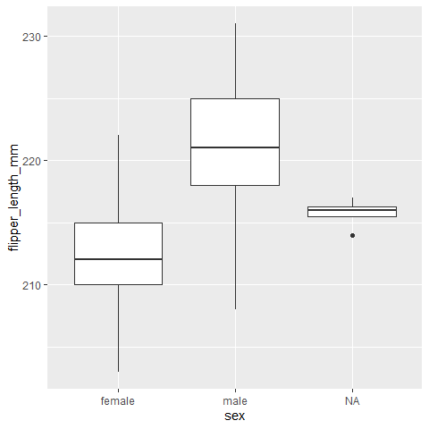
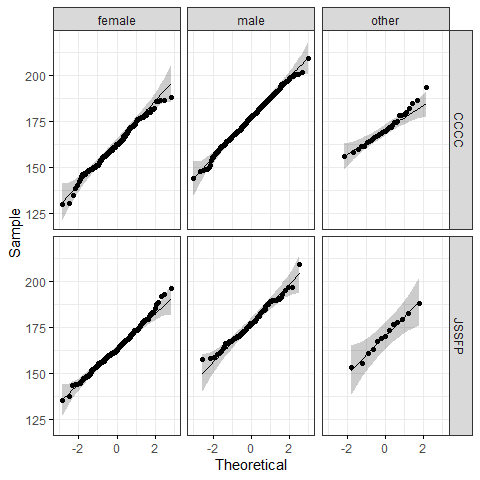
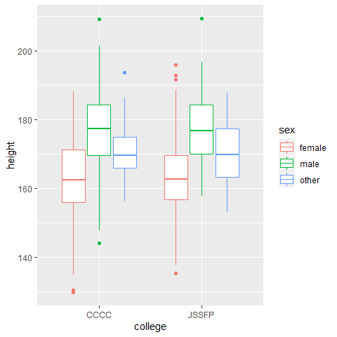

Vergleich zweier Gruppen
========================

Hier geht es darum, zwei Gruppen zu vergleichen und zu schauen, ob sie
eventuell aus der gleichen Grundgesamtheit stammen könnten oder ob die
Unterschiede signifikant sind.

Parametrische Verfahren
=======================

Parametrisch bedeutet, dass die Daten ein metrisches Skalenniveau haben
und **normalverteilt sein müssen**, damit man den Test darauf anwenden
kann. D.h. man sollte immer zuerst einen Test auf Normalverteilung
machen, wie wir ihn schon kennengelernt haben.

F-Test
------

Der F-Test vergleicht die Varianzen von metrischen Variablen. Schauen
wir uns doch noch einmal die Flossenlänge unserer Pinguine an und
differenzieren sie nach Geschlecht.

``` r
library(palmerpenguins)
data(penguins)

# zwei Datensätze nach Geschlecht trennen:

penguins_f <- subset(penguins, penguins$sex == "female")
penguins_m <- subset(penguins, penguins$sex == "male")
```

Der F-Test ist in `base` R vorprogrammiert und die Funktion heißt
`var.test`.

``` r
var.test(x = penguins_f$flipper_length_mm,
         y = penguins_m$flipper_length_mm,
         alternative = "two.sided")
```

    #> 
    #>  F test to compare two variances
    #> 
    #> data:  penguins_f$flipper_length_mm and penguins_m$flipper_length_mm
    #> F = 0.73837, num df = 164, denom df = 167, p-value = 0.05203
    #> alternative hypothesis: true ratio of variances is not equal to 1
    #> 95 percent confidence interval:
    #>  0.5439688 1.0026791
    #> sample estimates:
    #> ratio of variances 
    #>          0.7383713

Die Alternativhypothese ist, dass das Verhältnis der beiden Varianzen
zueinander nicht 1 entspricht – sie also unterschiedlich sind.

Der p-Wert “kratzt” mit 0,052 an der Grenze zur Signifikanz. Wenn wir
die Signifikanzniveaus also nicht als trennscharf sonder eher
“Richtlinien” verstehen, können wir hier sagen, dass es hier vielleicht
doch signifikante Unterschiede zwischen den zwei Gruppen gibt.

Wir wissen ja, was ein Problem sein wird: Wir haben mehrere Pinguinarten
in unserer Stichprobe. Vllt nehmen wir deshalb doch mal lieber nur die
Pinguine einer Art.

``` r
gentoo <- subset(penguins, penguins$species == "Gentoo") 
```

So kann ich auch gleich noch eine zweite Art und weise demonstrieren,
wie der Code der Funktion auch aussehen kann:

``` r
var.test(flipper_length_mm ~ sex, na.rm = TRUE, data = gentoo)
```

    #> 
    #>  F test to compare two variances
    #> 
    #> data:  flipper_length_mm by sex
    #> F = 0.47205, num df = 57, denom df = 60, p-value = 0.004889
    #> alternative hypothesis: true ratio of variances is not equal to 1
    #> 95 percent confidence interval:
    #>  0.2817751 0.7935619
    #> sample estimates:
    #> ratio of variances 
    #>          0.4720494

Dieser p-Wert ist sehr klein. Wir können also sicher davon ausgehen,
dass die Varianz der beiden Gruppen nicht gleich ist.

Schauen wir uns das doch noch einmal visualisiert an, das hilft meistens
bei der Intepretation. Ein Boxplot zeichnet ja immer das 1. und 3.
Quartil ab und kann deshalb als Annäherung an die Standardabweichung
bezeichnet werden:

``` r
library(ggplot2)

ggplot()+
geom_boxplot(data = gentoo, 
               aes(y=flipper_length_mm, 
                   x = sex))
```

 Ja, die beiden “boxes” sind doch
deutlich unterschiedlich groß und stark voneinander verschoben.

Nehmen wir noch einmal ein anderes Beispiel: Das Gewicht, das war doch
schon einmal eine Aufgabe.

Ach ja, trennen wir mal die Geschlechter vorher, schließlich heißt die
Voraussetzung, dass der gemessene Parameter in beiden Gruppen
normalverteilt sein soll.

Also: 1. Ein subset nach dem Geschlecht der Tiere machen und 2. dann den
Shapiro-Wilk-Test für die beiden Gruppen.

``` r
gentoo_f  <- subset(gentoo, gentoo$sex == "female")
gentoo_m  <- subset(gentoo, gentoo$sex == "male")


shapiro.test(gentoo_f$body_mass_g)
```

    #> 
    #>  Shapiro-Wilk normality test
    #> 
    #> data:  gentoo_f$body_mass_g
    #> W = 0.98133, p-value = 0.5107

``` r
shapiro.test(gentoo_m$body_mass_g)
```

    #> 
    #>  Shapiro-Wilk normality test
    #> 
    #> data:  gentoo_m$body_mass_g
    #> W = 0.99336, p-value = 0.985

Sehr gut, diese beiden Variablen sind normalverteilt. Jetzt der F-Test:

``` r
var.test(data = gentoo, body_mass_g ~ sex, na.rm = TRUE)
```

    #> 
    #>  F test to compare two variances
    #> 
    #> data:  body_mass_g by sex
    #> F = 0.80848, num df = 57, denom df = 60, p-value = 0.4205
    #> alternative hypothesis: true ratio of variances is not equal to 1
    #> 95 percent confidence interval:
    #>  0.4825973 1.3591363
    #> sample estimates:
    #> ratio of variances 
    #>          0.8084807

Der p-Wert ist relativ groß. Das bedeutet, die Varianz der beiden
Gruppen ist recht sicher gleich.

Machen wir also mit diesem Bsp jetzt den t-Test:

t-test
------

Wir testen jetzt, ob sich die Mittelwerte so weit unterscheiden, dass
wir von zwei unterschiedlichen Gruppen ausgehen können:

``` r
t.test(data = gentoo, body_mass_g ~ sex, na.rm = TRUE,
         alternative = "two.sided")
```

    #> 
    #>  Welch Two Sample t-test
    #> 
    #> data:  body_mass_g by sex
    #> t = -14.761, df = 116.64, p-value < 2.2e-16
    #> alternative hypothesis: true difference in means is not equal to 0
    #> 95 percent confidence interval:
    #>  -913.1130 -697.0763
    #> sample estimates:
    #> mean in group female   mean in group male 
    #>             4679.741             5484.836

Es wurde ein Welch-Test durchgeführt, weil R die Varianz der
Grundgesamtheit noch aus der Varianz der Stichproben errechnet.

Der p-Wert erlaubt es uns, die Alternativhypothese sicher anzunehmen.

Jetzt erweitern wir das Spektrum der Gruppen. Durch einen Faktor
getrennt, der aber mehr als nur 2 Ausprägungenannehmen kann, können zB
durch den Faktor “species” drei Gruppen entstehen. Bevor wir diese
jedoch auf ihren Mittelwertsunterschied testen können, müssen wir auch
hier die Varianzgleichheit untersuchen:

Levene-Test
-----------

Der Levene-Test ist im Paket “car” umgesetzt. Wie immer installieren
bitte nur diejenigen das Paket, die nicht in der Cloud arbeiten!

``` r
install.packages("car")
```

``` r
library (car)
```

    #> Loading required package: carData

``` r
leveneTest(data = penguins, body_mass_g ~ species, na.rm = TRUE)
```

    #> Levene's Test for Homogeneity of Variance (center = median: TRUE)
    #>        Df F value   Pr(>F)   
    #> group   2  5.1203 0.006445 **
    #>       339                    
    #> ---
    #> Signif. codes:  0 '***' 0.001 '**' 0.01 '*' 0.05 '.' 0.1 ' ' 1

Ein sehr kleiner p-Wert sagt: Die Gruppen haben nicht die gleiche
Varianz.

Nehmen wir also ein anderes Beispiel, und zwar die Flügellänge. Haben da
die Pinguinspezies eine ähnliche Varianz?

``` r
leveneTest(data = penguins, flipper_length_mm ~ species, na.rm = TRUE)
```

    #> Levene's Test for Homogeneity of Variance (center = median: TRUE)
    #>        Df F value Pr(>F)
    #> group   2  0.3306 0.7188
    #>       339

Jawohl! Der p-Wert ist sehr hoch, das heißt, wir können von
Varianzhomogenität ausgehen.

einfaktorielle ANOVA
--------------------

Die ANOVA ist bereits in `base` umgesetzt, mit der Funktion `aov`.

Aus irgendwelchen Gründen wir bei der ANOVA der p-Wert nicht gleich
angezeigt. Deswegen weisen wir das Ergebnis der eigentlichen
Test-Berechnung einer Variablen zu und lassen uns dann das Ergebnis
zusammengefasst ausgeben:

``` r
# eigentliche ANOVAberechnung
res.aov <- aov(flipper_length_mm ~ species, data = penguins)

# Zusammenfassung des Ergebnisses
summary(res.aov)
```

    #>              Df Sum Sq Mean Sq F value Pr(>F)    
    #> species       2  52473   26237   594.8 <2e-16 ***
    #> Residuals   339  14953      44                   
    #> ---
    #> Signif. codes:  0 '***' 0.001 '**' 0.01 '*' 0.05 '.' 0.1 ' ' 1
    #> 2 observations deleted due to missingness

Höchstsignifikant! Das bedeutet? Die Art hat einen Einfluss auf die
Flügellänge der Pinguine.

Wer hätte es gedacht. ;-)

mehrfaktorielle ANOVA
---------------------

Eine mehrfaktorielle ANOVA ist in R relativ aufwändig.

Wir rechnen hier deshalb nur eine zwei-faktorielle ANOVA. Wer mehr
wissen will, schaue hier, das ist eine super Anleitung, wie man ANOVAs
in R berechnet:
<a href="https://www.datanovia.com/en/lessons/anova-in-r/" class="uri">https://www.datanovia.com/en/lessons/anova-in-r/</a>

Wir könnten untersuchen, ob bei den Piraten die Größe von Geschlecht und
dem College abhängt.

Als erstes checken wir alle Voraussetzungen:

1.  Sind die Daten in den jeweiligen Gruppen normalverteilt?

Machen wir hier also ein QQ-plot für alle Werte gleichzeitig:

``` r
library(yarrr)
```

    #> Loading required package: jpeg

    #> Loading required package: BayesFactor

    #> Loading required package: coda

    #> Loading required package: Matrix

    #> ************
    #> Welcome to BayesFactor 0.9.12-4.2. If you have questions, please contact Richard Morey (richarddmorey@gmail.com).
    #> 
    #> Type BFManual() to open the manual.
    #> ************

    #> Loading required package: circlize

    #> ========================================
    #> circlize version 0.4.10
    #> CRAN page: https://cran.r-project.org/package=circlize
    #> Github page: https://github.com/jokergoo/circlize
    #> Documentation: https://jokergoo.github.io/circlize_book/book/
    #> 
    #> If you use it in published research, please cite:
    #> Gu, Z. circlize implements and enhances circular visualization
    #>   in R. Bioinformatics 2014.
    #> 
    #> This message can be suppressed by:
    #>   suppressPackageStartupMessages(library(circlize))
    #> ========================================

    #> yarrr v0.1.5. Citation info at citation('yarrr'). Package guide at yarrr.guide()

    #> Email me at Nathaniel.D.Phillips.is@gmail.com

    #> 
    #> Attaching package: 'yarrr'

    #> The following object is masked from 'package:ggplot2':
    #> 
    #>     diamonds

``` r
data(pirates)

library(ggpubr)

# in ggpubr gibt es im unterschied zu ggplot2 kein aes und die Variablennamen müssen an dieser Stelle in "Hochkommas".
# da es aber im Hintergrund ggplot2 laufen hat, können wir die ggplot2-Funktionalitäten wie theme_bw und facet_grid aufrufen

ggqqplot(pirates, "height", 
         ggtheme = theme_bw()) +
  facet_grid(college ~ sex) # facet grid stellt nach den gegebenen Variablen mehrere Plots nebeneinander
```



Ja, das sieht doch ganz gut aus insgesamt.

Testen wir also als nächstes, ob

1.  die Varianz in den Gruppen gleich ist.

Dafür nehmen wir den leveneTest aus dem Paket `car`. Wir stellen die
abhängige metrische Variablen den beiden kategorialen Faktoren
gegenüber:

``` r
library(car)

# leveneTest(abhängige Variable ~ Faktor1*Faktor2, data = df)
leveneTest(height ~ sex*college, data = pirates)
```

    #> Levene's Test for Homogeneity of Variance (center = median)
    #>        Df F value Pr(>F)
    #> group   5  1.0538 0.3846
    #>       994

Die Wahrscheinlichkeit steht unter `Pr(>F)` und liegt deutlich über
0,05. Wir können also von einer Varianzgleichheit ausgehen.

Dann also jetzt die ANOVA. Wie oben geben wir die Berechnung erst in
eine Variable und lassen uns das Ergebnis dann zusammengefasst ausgeben:

``` r
res.aov <- aov(height ~ sex * college, data = pirates)
summary(res.aov)
```

    #>              Df Sum Sq Mean Sq F value Pr(>F)    
    #> sex           2  46298   23149 215.290 <2e-16 ***
    #> college       1     69      69   0.638  0.425    
    #> sex:college   2     26      13   0.119  0.887    
    #> Residuals   994 106879     108                   
    #> ---
    #> Signif. codes:  0 '***' 0.001 '**' 0.01 '*' 0.05 '.' 0.1 ' ' 1

Interpretieren wir das Ergebnis:

Wir sehen hier in der ersten Spalte die Faktoren, in der zweiten die
“degrees of freedom”, die Freiheitsgrade, in der dritten die “Sum of
Squares” – erinnert euch an die Vorlesung, das war die Abweichung der
Messungen zum Gesamtmittelwert, die “mittlere sum of squares”, den
F-Wert und die Wahrscheinlichkeit, dass dieser Faktor einen Einfluss
hat. Ganz klar: Das Geschlecht hat einen großen Einfluss, aber das
College nicht.

Schauen wir uns das einmal an, plotten wir doch einfach die Körpergröße
der Piraten in einem Boxplot nach College und Geschlecht:

``` r
ggplot(data = pirates)+
  geom_boxplot(aes(x = college,
                   col = sex,#
                   y = height))
```

 Ja. Die Unterschiede
zwischen den Colleges sind sehr viel kleiner als zwischen den
Geschlechtern.

Erinnert ihr euch an das Thema “crossed” und “nested”, das ich beim
Chi-Quadrat-Test aufgeworfen hatte? Da bei diesem Datensatz alle
Geschlechter in den Colleges vorkommen, haben wir ein “crossed design”
(ein gekreuztes Design).

Sehr gut! Wir haben in diesem Kapitel untersucht, wie metrische
Variablen eventuell von gruppierenden Faktoren abhängig sein können und
wie wir das testen.

**Aufgabe: Als Übung versucht doch das gleiche noch einmal
herauszufinden für das Gewicht der Piraten. Hängt das Gewicht vom
College oder dem Geschlecht ab? **

multivariate Analysis of Variance
---------------------------------

Jetzt schauen wir, wie mehrere abhängige Variablen gleichtzeitig
untersucht werden können.

Hängen Größe und Gewicht von dem Geschlecht ab?

Dazu benutzen wir die Funktion `manova`, so wird die multivariate
Varianzanalyse auch meistens abgekürzt.

wir fügen beide Variablen mit einem cbind (column bind) zusammen und
setzen diese mit der Tilde gegenüber den Faktor Geschlecht. Wie auch
vorhin wird das Ergebnis einer Variablen zugewiesen und dann mit
`summary` ausgegeben.

``` r
library(yarrr)
data(pirates)

res.man <- manova(cbind(height, weight) ~ sex, data = pirates)

summary(res.man)
```

    #>            Df  Pillai approx F num Df den Df    Pr(>F)    
    #> sex         2 0.30553   89.885      4   1994 < 2.2e-16 ***
    #> Residuals 997                                             
    #> ---
    #> Signif. codes:  0 '***' 0.001 '**' 0.01 '*' 0.05 '.' 0.1 ' ' 1

Wir haben eine hochsignifikanten Zusammenhang!

Mit einem speziellen summary-Befehl können wir uns die Details ansehen:

``` r
summary.aov(res.man)
```

    #>  Response height :
    #>              Df Sum Sq Mean Sq F value    Pr(>F)    
    #> sex           2  46298 23148.9  215.75 < 2.2e-16 ***
    #> Residuals   997 106973   107.3                      
    #> ---
    #> Signif. codes:  0 '***' 0.001 '**' 0.01 '*' 0.05 '.' 0.1 ' ' 1
    #> 
    #>  Response weight :
    #>              Df Sum Sq Mean Sq F value    Pr(>F)    
    #> sex           2  31932 15965.9  187.03 < 2.2e-16 ***
    #> Residuals   997  85109    85.4                      
    #> ---
    #> Signif. codes:  0 '***' 0.001 '**' 0.01 '*' 0.05 '.' 0.1 ' ' 1

Erst wird uns “response height”, also die Ergebnisse für die Größe und
dann “response weight”, die Ergebnisse für das Gewicht angezeigt. Wir
sehen unterschiede in den absoluten Werten, aber hochsignifikant sind
beide.

Wie ist das mit der Spezies, den Pinguinen, ihrer Flipper-Length und dem
Gewicht?

**Aufgabe: Berechnet und interpretiert eine multivariate ANOVA für das
Gewicht der Pinguine und ihrer Flossenlänge in Abhängigkeit von der
Spezies!**
