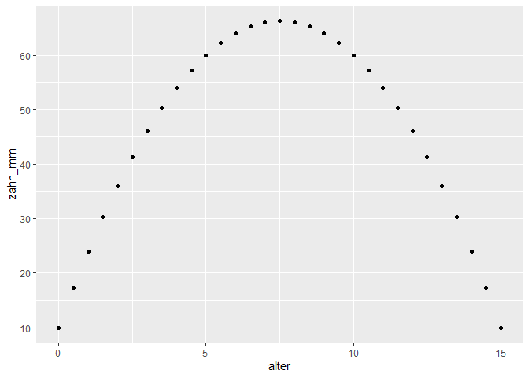
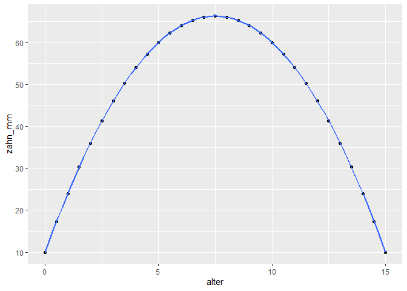

Nicht-lineare Regression
========================

Jetzt hatten wir schon das Beispiel für eine nicht-lineare Regression
mit dem Alter der Schafe und der Größe der Zähne. Nicht-lineare
Zusammenhänge können durch polynomiale Funktionen beschrieben werden,
die dem Schema:

$ y = a + b\_1*x + b\_2*x² + b\_3\*x^3 …$

folgen. Natürlich lassen sich auch solche Regressionsanalysen in R
berechnen.

Nehmen wir als Bsp die fiktiven Schafszähne und nehmen das Alter der
Schafe alle halbe Jahre in Jahren auf, sowie die Zahngröße in mm.

``` r
alter <- seq(0,15, 0.5) # Reihe von Werten von 0 bis 15 in 0,5-er Schritten
zahn_mm <- 10 + 15*alter - alter^2  # ich simuliere eine Polynom-Funktion für die Abfolge von mm Angaben

schafe <- as.data.frame(cbind(alter, zahn_mm))

library(ggplot2)
ggplot()+
  geom_point(data = schafe,
             aes(x = alter,
                 y = zahn_mm))
```



Diese Verteilung kann ich jetzt mit einer nicht-linearen Funktion
abschätzen. Dafür nehme ich wieder das `linear model`, aber definiere
die Formel nicht einfach als `y ~ x` wie vorher, sondern gebe eine
polynomial-Formel, eine einfache quadratische Funktion (mit einem x²)
passt hier am besten: `y ~ x + I(x^2))` . Auch hier muss erst die
Berechnung des Modells einer Variablen zugewiesen werden und dann kann
man sich wieder das Ergebnis zusammenfassen lassen:

``` r
fit <- lm(zahn_mm ~ alter + I(alter^2), data = schafe) 


summary(fit)
```

    ## Warning in summary.lm(fit): essentially perfect fit: summary may be unreliable

    ## 
    ## Call:
    ## lm(formula = zahn_mm ~ alter + I(alter^2), data = schafe)
    ## 
    ## Residuals:
    ##        Min         1Q     Median         3Q        Max 
    ## -2.774e-14 -4.283e-15  2.220e-16  3.836e-15  6.020e-14 
    ## 
    ## Coefficients:
    ##               Estimate Std. Error    t value Pr(>|t|)    
    ## (Intercept)  1.000e+01  7.251e-15  1.379e+15   <2e-16 ***
    ## alter        1.500e+01  2.238e-15  6.703e+15   <2e-16 ***
    ## I(alter^2)  -1.000e+00  1.442e-16 -6.937e+15   <2e-16 ***
    ## ---
    ## Signif. codes:  0 '***' 0.001 '**' 0.01 '*' 0.05 '.' 0.1 ' ' 1
    ## 
    ## Residual standard error: 1.434e-14 on 28 degrees of freedom
    ## Multiple R-squared:      1,  Adjusted R-squared:      1 
    ## F-statistic: 2.406e+31 on 2 and 28 DF,  p-value: < 2.2e-16

Da die Daten hier vorher mit genau einer solchen Formel berechnet
wurden,ist natürlich das Konfidenzintervall extrem schmal. R sagt uns
auch “essentially perfect fit: summary may be unreliable”, hat also
mitbekommen, dass da irgendetwas komisch ist. ;-)

Wir können uns das Ergebnis auch wieder visualisieren, wie bei einer
linearen Regression:

``` r
library(ggplot2)
ggplot(data = schafe,
             aes(x = alter,
                 y = zahn_mm))+
  geom_point()+
    stat_smooth(method = "lm", formula = y ~ x + I(x^2))
```



Und all die anderen Dinge tun, die wir mit linearen Regressionen getan
haben (v.a. Residualanalyse!).

### x³

Die polynomen Gleichungen können immer komplexer werden.

Nehmen wir ein kleines witziges Beispiel nach dem Comic von Jorge Cham:


Ich konstruiere also einmal “wild” Zahlen mithilfe der Kosinusfunktion,
um das abzubilden und versuche dann diese Werte mit einer Funktion zu
schätzen, die der Formel $ y = x + x^2 + x^3$ folgt:

``` r
years_at_uni <- seq(1,20,1)
happiness <- cos(years_at_uni/2.7 + 5)

phd <- as.data.frame(cbind(years_at_uni,happiness))

ggplot(data = phd,
             aes(x = years_at_uni,
                 y = happiness))+
  geom_point()+
    stat_smooth(method = "lm", formula = y ~ x + I(x^2) + I(x^3))
```


Bei solchen Verteilungen kann es durchaus sinnig sein, eine komplexe
Funktion anzunehmen, da wir inhaltlich verstehen, warum die Werte erst
sinken und dann wieder steigen. Man muss dabei jedoch das Thema
“overfitting” beachten:

overfitting
-----------

Mit Polynomen und trigonometrischen Funktionen lassen sich unheimlich
viele und unterschiedliche Wertereihen abbilden. Diese Funktionen können
manchmal deutlich “bessere” Beschreibungen von den Verteilungen sein,
die wir beobachten als zB eine lineare Regression (also höherer R²-Wert,
kleinere Residuen etc). Man muss jedoch vorsichtig sein, dass man damit
nicht “über das Ziel hinausschießt”. Eine perfekte Anpassung mit 3 oder
4 “x hoch-Teilen” in der Gleichung mag möglich sein, aber was bedeutet
das? Aus welcher Logik folgend sind die Beziehungen zwischen x und y so
komplex? Und, ganz wichtig: Wenn ein paar Werte aus meiner Analyse
herausfallen oder ein paar neue hinzukommen: Würde sich die Gleichung
dann massiv ändern? Wenn ja, ist das ein guter Hinweis auf das
“overfitting”, die Über-Anpassung der mathematischen Gleichung an genau
diesen einen Datensatz. Da wir aber mit Stichproben arbeiten, kann eine
perfekte Anpassung an diese eine Stichprobe keinen Erkenntnisgewinn für
die Grundgesamtheit bringen, wenn die veränderung weniger Werte die
Gleichung verändern würde.

Würde ich die Person aus dem Comic von Jorge Cham die nächsten 30 Jahre
weiter befragen, würden irgendwann die “happiness”-Werte vermutlich
wieder sinken, da man dann als grauhaarige Professorin vllt nicht mehr
mit einer Doktorandin verwechselt werden möchte. Und dann würde die
Funktion *y* = *x* + *x*<sup>2</sup> + *x*<sup>3</sup> wieder nicht
passen, ich bräuchte eine neue.
