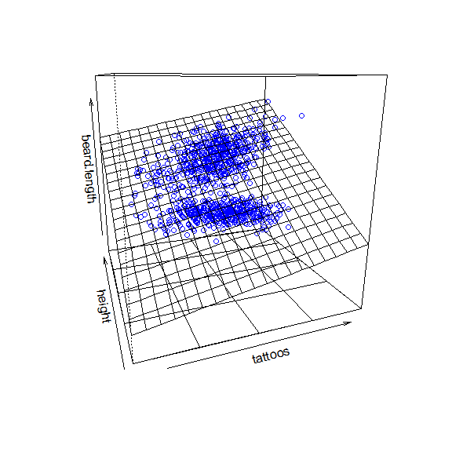
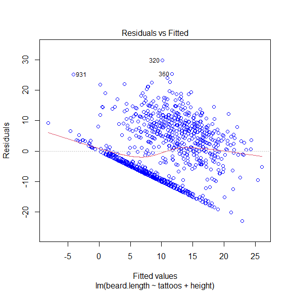
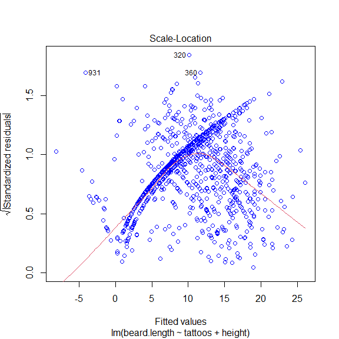

Multiple Lineare Regression
===========================

Mithilfe der multiplen linearen Regression kann ich die Abhängigkeit
einer metrischen Variable von mehreren anderen metrischen Variablen
schätzen und zwar gleichzeitig und nicht einfach hintereinander.

Es gelten alle Voraussetzungen wie für die normale lineare Regression
(d.h. eine lineare Beziehung zwischen den unabhängigen und der
abhängigen Variable, Homoskedastizität, Normalverteilung der Residuen
und Unabhängigkeit der Residuen).

Dabei müssen die unabhängigen Variablen auch von einander unabhängig
sein (Problem der „Multikollinearität“)! Wenn zwei der unabhängigen
Variablen stark miteinander korrelieren, kann das Modell nicht mehr
herausfinden, welche der gegebenen unabhängigen Variablen einfluss auf
die abhängige Variable hat.

Eine Gleichung für die multiple lineare regression sieht so aus: $ y = a
+ b\_1 \* x\_1, + b\_2 \* x\_2 + b\_3 \* x\_3 … + e $ und stellt damit
eine Linearkombination von mehreren linearen Funktionen dar, die am Ende
einen Fehler (e) berücksichtigen kann.

Nehmen wir als Bsp zwei Variablen. Ich teste, ob die Größe der Piraten
mit ihrer Anzahl von Tattoos zu tun hat:

``` r
library(yarrr)
data("pirates")
pirates <- subset(pirates, pirates$sex == "male")

cor(pirates$tattoos, pirates$height, method = "pearson")
#> [1] -0.06458851
```

und stelle fest: Nein.

Diese beiden Werte möchte ich jetzt nehmen und schauen, ob sie mit der
Länge der Bärte zusammenhängen:

``` r
model1 <- lm(beard.length ~ tattoos + height, data = pirates)

summary(model1)
#> 
#> Call:
#> lm(formula = beard.length ~ tattoos + height, data = pirates)
#> 
#> Residuals:
#>     Min      1Q  Median      3Q     Max 
#> -13.946  -3.326  -0.026   3.117  15.299 
#> 
#> Coefficients:
#>             Estimate Std. Error t value Pr(>|t|)    
#> (Intercept) 11.17191    3.86645   2.889  0.00403 ** 
#> tattoos      0.93987    0.06466  14.535  < 2e-16 ***
#> height      -0.00352    0.02132  -0.165  0.86889    
#> ---
#> Signif. codes:  0 '***' 0.001 '**' 0.01 '*' 0.05 '.' 0.1 ' ' 1
#> 
#> Residual standard error: 4.938 on 487 degrees of freedom
#> Multiple R-squared:  0.3038, Adjusted R-squared:  0.3009 
#> F-statistic: 106.2 on 2 and 487 DF,  p-value: < 2.2e-16
```

R erklärt uns wieder, welche Berechnung wir da vorgenommen haben, dann
die Verteilung der Residueen (das sieht doch recht gleichmäßig aus, sehr
gut) und im Anschluss die Koeffizienten-Schätzung mit
Standardabweichung, t-Wert und Wahrscheinlichkeit.

Wir haben es also mit einer Korrelation von Tattoos und Größe mit
Bartlänge zu tun, die dieser Formel folgt:
*beard.length =  − 64.87 + 0.59 \* tattoos + 0.41 \* height*

Daraus können wir uns auch die Konfidenzintervalle anzeigen lassen:

``` r
confint(model1)
#>                   2.5 %      97.5 %
#> (Intercept)  3.57492531 18.76888945
#> tattoos      0.81282109  1.06692532
#> height      -0.04540058  0.03836025
```

Und so die Bereiche abschätzen, in denen die Regressionslinie mit einer
sehr hohen Wahrscheinlichkeit liegt.

Wie kann man am besten etwas visualisieren, in dem drei metrische
Variablen vorkommen?

Richtig. Im 3D-Raum. Das Paket “rockchalk” hat eine
`plotPlane`-Funktion.

``` r
  rockchalk::plotPlane(model = model1, plotx1 = "tattoos", plotx2 = "height")
```



(Idee geklaut von:
<a href="https://wgruber.github.io/Modellbildung2/multiple-regression.html#voraussetzungen-mlr" class="uri">https://wgruber.github.io/Modellbildung2/multiple-regression.html#voraussetzungen-mlr</a>
)

Residualanalyse
---------------

Genau wie bei der “normalen” linearen Regression können wir
Residualanalyse betreiben:

### Q-Q-Plot

``` r
library(ggpubr)
ggqqplot(model1$residuals)
```


### Residuen und vorhergesagte Werte (residuals vs fitted)

``` r
plot(model1, which=1, col=c("blue")) # Residuals vs Fitted Plot
```



Die rote Linie zeigt eine Regression zwischen den Residuen und den
vorhergesagten Werten. Das “Ziel” für eine gute lineare Regression ist,
dass sie auf der 0-Achse liegt. Auch wenn es hier eine leichte Kurve am
Ende gibt, liegt sie aber doch echt nahe dran. Das zeigt, dass die
Residuen halbwegs gleichmäßig verteilt sind und damit eine Voraussetzung
für die lineare Regression erfüllt ist.

### “Scale-Location”

Hier schauen wir, ob die Homoskedastizität gegeben ist, d. h. die
Varianz der Residuen entlang der Regressionslinie etwa gleich bleibt.

Der Plot wird mit `which = 3` aufgerufen:

``` r
plot(model1, which=3, col=c("blue"))  # Scale-Location Plot
```

 Auch das ist überzeugend. Sehr
schön!

Aufgabe
-------

Nun haben wir natürlich eigentlich noch Frauen im Datensatz, die eine
Bartlänge von 0 haben. Das könnte uns das Ergebnis ganz schön verzerren.

**Aufgabe** Nehmt noch einmal nur die männlichen Piraten und überprüft,
ob sich das Modell deutlich verändert!
