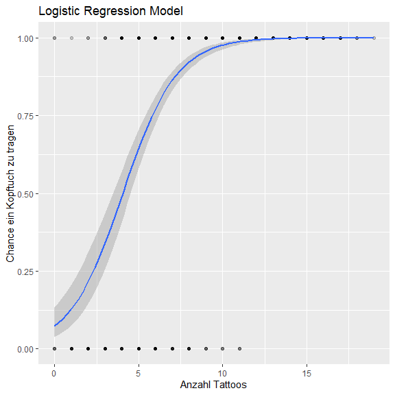

Logistische Regression
======================

Wie in der Vorlesung erläutert, ist eine logistische Regression dazu da,
einzuschätzen, welche Faktoren zu der Wahrscheinlichkeit des Auftretens
einer binären abhängigen Variablen beitragen.

Dafür brauchen wir also eine binäre Variable. In dem Piratendatensatz
gibt es die Variable “headband”, also Kopftuch. Wir können also
untersuchen, ob z. B. das Geschlecht, das College und das Tragen von
Tattoos Einfluss darauf haben, ob ein Pirat ein Kopftuch trägt oder
nicht. All das könnte logisch sein: Vielleicht finden nur Frauen
Kopftücher schick, eventuell gab es da eine Mode in einem College oder
es ist etwas, das v.a. Leute, die schon Tattoos haben tragen. Who knows?

Wir. gleich. ;-)

Laden wir die Daten:

``` r
library(yarrr)
data(pirates)
```

Als erste müssen wir die headband-Variablen in 0 und 1 umformen, damit R
das auch als binäre Daten erkennt:

``` r
pirates$headband[pirates$headband == "yes"] <- 1 # schreibe in pirates$headband, da wo in der Spalte headband "yes" steht, eine 1 hin
pirates$headband[pirates$headband == "no"] <- 0 # schreibe in pirates$headband, da wo in der Spalte headband "no" steht, eine 0 hin

# in einen "numerischen" Vektor umwandeln (ist noch als character markiert)
pirates$headband <- as.numeric(pirates$headband)
```

Kategorie Geschlecht müssen wir auch noch umformen, da es zur Zeit
männl, weibl, other gibt. Sagen wir doch einfach, dass binäre Menschen
und nicht-binäre (“other”) getrennt werden:

``` r
pirates$sex[pirates$sex == "other"] <- 1
pirates$sex[pirates$sex != "1"] <- 0

pirates$sex <- as.numeric(pirates$sex)
```

Diese Umwandlung machen wir jetzt auch noch mit der Collegeangabe: CCCC
sei 1, das andere College sei 0:

``` r
pirates$college[pirates$college == "CCCC"] <- 1
pirates$college[pirates$college != "1"] <- 0

pirates$college <- as.numeric(pirates$college)
```

Jetzt funktioniert die Berechnung der Regression mit der Funktion `glm`,
also `general linear model`, aber wir setzen das Argument `family` zu
“binomial”.

``` r
mylogit <- glm(headband ~  college + tattoos + sex, data = pirates, family = "binomial")
```

Wie vorhin, schauen wir uns das Ergebnis jetzt mit `summary` an:

``` r
summary(mylogit)
#> 
#> Call:
#> glm(formula = headband ~ college + tattoos + sex, family = "binomial", 
#>     data = pirates)
#> 
#> Deviance Residuals: 
#>      Min        1Q    Median        3Q       Max  
#> -2.90912   0.06396   0.17231   0.33099   2.49789  
#> 
#> Coefficients:
#>             Estimate Std. Error z value Pr(>|z|)    
#> (Intercept) -3.07454    0.41441  -7.419 1.18e-13 ***
#> college      0.64868    0.26799   2.421 0.015496 *  
#> tattoos      0.66285    0.05488  12.079  < 2e-16 ***
#> sex         -1.86470    0.50497  -3.693 0.000222 ***
#> ---
#> Signif. codes:  0 '***' 0.001 '**' 0.01 '*' 0.05 '.' 0.1 ' ' 1
#> 
#> (Dispersion parameter for binomial family taken to be 1)
#> 
#>     Null deviance: 705.48  on 999  degrees of freedom
#> Residual deviance: 413.74  on 996  degrees of freedom
#> AIC: 421.74
#> 
#> Number of Fisher Scoring iterations: 7
```

Als erstes sehen wir wieder, was genau wir berechnet haben.

Als nächstes steht da “deviance residuals”, also “Abweichung vom
Idealwert”. Diese sind ein Maß dafür, wie gut unser Modell auf die Daten
passt, ähnlich wie die Residuen bei der linearen Regression.

Dann werden die Coefficients (Regressionskoeffizienten) der unabhängigen
Variablen dargestellt, ihr Einfluss auf das Tragen eines Kopftuchs
(estimate), die Standardabweichung, der z-Wert (auch Wald z-Wert, ein
Art Normalverteilungstest) und die dazugehörigen p-Werte. Mit Sternchen
sind wieder die Werte markiert, die statistisch relevant sind, an dieser
Stelle nur sexother und tattoos.

Anders als bei der linearen Regression können die Koeffizienten nicht
direkt interpretiert werden. Die Koeffizientengeben uns einzig die
Richtung des Zusammenhangs an, nicht die Stärke!

-   “Intercept” ist lediglich der Y-Achsenabschnitt.

-   Dass man auf dem College 1 (CCCC) war, vergrößert die Chance, dass
    man ein Kopftuch trägt. Das ist signifkant (1 Sternchen).

-   Für jedes Tattoo mehr das man hat, steigt die Chance, dass man ein
    Kopftuch trägt und das ist tatsächlich ein höchstsignifikantes
    Ergebnis!

-   Ist das Geschlecht 1 (“other”), sinkt die Chance ein Kopftuch zu
    tragen und das ist hochsignifikant.

Das mit “dispersion” können wir hier ignorieren.

Darunter finden wir weitere Hinweise auf, wie gut das Modell passt.

-   Residual deviance: Maß für die Abweichung insgesamt

-   Null deviance: Maß für ein reduziertes Modell, in dem nur der
    y-Achsenabschnitt vorkommt.

-   AIC (Akaikes Informationskriterium): Ebenfalls ein Güßtemaß, kann
    genutzt werden, um die Güte verschiedener Modelle miteinander zu
    vergleichen (je kleiner, desto besser).

Der Hinweis auf die Fisher scoring iterations hat etwas damit zu tun,
wie das Modell geschätzt wurde (hier wurden 7 verschiedene Modelle
ausprobiert, bis entschieden wurde, dass es so am besten passt).

<a href="http://www.dwoll.de/r/gddmr_ed2/08_glm.pdf" class="uri">http://www.dwoll.de/r/gddmr_ed2/08_glm.pdf</a>

<a href="https://stats.idre.ucla.edu/r/dae/logit-regression/" class="uri">https://stats.idre.ucla.edu/r/dae/logit-regression/</a>

<a href="https://stats.stackexchange.com/questions/86351/interpretation-of-rs-output-for-binomial-regression" class="uri">https://stats.stackexchange.com/questions/86351/interpretation-of-rs-output-for-binomial-regression</a>

### Vorhersage

Können wir jetzt herausfinden, welcher Wert vorhergesagt wird, wenn wir
bestimmte Parameter haben? Am praktischsten wäre es doch, gleich einen
Parameter sich verändern zu lassen und dann zu schauen, wie sich die
Chancen verändern, dass der Pirat ein Kopftuch trägt.

Dazu brauchen wir ein neues Paket namens `glm.predict`, das wir
installieren (wenn wir nicht die Cloud nutzen):

``` r
install.packages("glm.predict") 
```

Nun können wir die Funktion `predicts` nutzen, um uns Vorhersagen und
wie sie sich mit einer diskreten Veränderung verschieben, anzeigen zu
lassen. Der erste Wert ist immer unser Modell (`mylogit`), danach müssen
wir in der Reihenfolge wie im Modell angegeben, in Hochkommas und mit
Semikolon getrennt die Werte angeben. Das Modell war
`headband ~ college + tattoos + sex`, also müssen wir jetzt als erstes
das College, dann den Wert für Tattoos und den Wert für das Geschlecht
angeben, für die wir die Vorhersage haben möchten. Einer der Werte muss
sich dabei als “veränderbar” gekennzeichnet werden und diese Veränderung
muss in diskreten Schritten passieren.

Sagen wir doch einmal, wir schauen auf einen Piraten, der 6 Tattoos hat
und sich als “other” definiert, und schauen, wie sich die Vorhersage
verändert, wenn sich das College ändert. Achtet auf den Unterschied
zwischen Semikolon und Komma im Code!

``` r
library(glm.predict)

predicts(model = mylogit, values = "-1,0,1;6;1", position = 1) # position = 1 bedeutet der erste Wert wird verändert
#>   val1_mean val1_lower val1_upper val2_mean val2_lower val2_upper    dc_mean
#> 1 0.1802163 0.05052913  0.4226773 0.2808460  0.1240667  0.5101015 -0.1006297
#> 2 0.2871700 0.12240864  0.5124548 0.4274972  0.2354458  0.6527792 -0.1403272
#>     dc_lower    dc_upper college_val1 college_val2 tattoos sex
#> 1 -0.1822689 -0.02969555           -1            0       6   1
#> 2 -0.2626172 -0.03100334            0            1       6   1

# -1,0,1 -- beschreibt den ersten Parameter also college. Da für numerische Daten immer ein Anfangs und ein Endwert angegeben werden muss, muss ich hier "tricksen" und die Kategorie -1-0 und 0-1 erstellen.

# 6 legt die 6 Tattoos fest

# 1 legt das Geschlecht als "other" fest
```

Die diskrete Änderung wird für die erste Variable durchgeführt, weshalb
esdort immer min. zwei Werte braucht (position = 1). Die Funktion gibt
ein data.frame zurück.

Dieser data.frame hat zwei Zeilen für die beiden Colleges und gibt uns
mit mean den Mittelwert der Vorhersage, lower und upper markieren das
95%-Konfidenzintervall für jeweils Wert 1 (kein) und Wert 2 (ein
Kopftuch). Wir können das so interpretieren. Hat der Pirat 6 Tattoos,
definiert sich als “other” und ging in College 0 (JSFFP), gibt es eine
Chance von 42%, dass er kein Kopftuch trägt und eine Chance von 28%,
dass er eins trägt – man sieht, diese beiden Werte müssen nicht
gemeinsam 100% ergeben!

Wenn ein “gleicher” Pirat auf dem College CCCC gewesen wäre, wäre seine
Chance kein Kopftuch zu tragen 28% und eins zu tragen 18%.

Wir hatten ja oben gesehn, dass die Anzahl der Tattoos von Bedeutung zu
gewesen scheint. Nehmen wir also die Tattoos als sich verändernden Wert.

``` r
predicts(model = mylogit, values = "1;0-20,5;1", position = 2) 
#>   val1_mean  val1_lower val1_upper val2_mean val2_lower val2_upper      dc_mean
#> 1 0.0170517 0.003823329 0.04653053 0.2884607  0.1188833  0.5032799 -0.271408974
#> 2 0.2842527 0.132671535 0.51602979 0.9047031  0.7932566  0.9628316 -0.620450384
#> 3 0.9033951 0.793361858 0.96184172 0.9958288  0.9884580  0.9987711 -0.092433606
#> 4 0.9957941 0.988042597 0.99900876 0.9998195  0.9993405  0.9999776 -0.004025317
#>      dc_lower      dc_upper college tattoos_val1 tattoos_val2 sex
#> 1 -0.45830595 -0.1167411217       1            0            5   1
#> 2 -0.72697044 -0.4372869765       1            5           10   1
#> 3 -0.19729524 -0.0367149029       1           10           15   1
#> 4 -0.01127789 -0.0009536791       1           15           20   1

# 1 -- bedeutet diesmal, dass nur das College, das wir mit 1 kodiert haben, also CCCC, betrachten (der Wert verändert sich nicht)

# 0-20,5 -- bedeutet wir teilen den Datensatz der Anzahl Tattoos in 5-er Schritte auf. 0-5, 5-10, 10-15, 15-20 

# 1 legt das Geschlecht als "other" fest

# position = 2 sagt dem Algorithmus, dass der zweite Wert der ist, der sich verändert
```

Hier sieht man die vorhergesagten Wahrscheinlichkeiten abhängig von der
Anzahl der Tattoos, dem College und dem Geschlecht, wobei sich in den
unterschiedlichen Zeilen nur die Anzahl der Tattoos ändert und davon
abhängig die vorhergesagten Wahrscheinlichkeiten (Mittelwert des 1.
Wertes (also 0 – kein Kopftuch) mit lower und upper
Konfidenzintervallgrenze, Mittelwert d. 2. Wertes (also 1 – ja Kopftuch)
und dc gibt “difference of coefficients” (Mittelwertsunterschied, obere
Konfidenzintervall- und unter Konfidenzintervallgrenze). Wir sehen also,
dass der zweite Mittelwert (val2\_mean) schon bei Gruppe zwei (Tattoos
zwischen 5 und 10) massiv steigt, während der erste (val1\_mean) es
nicht tut. Wenn der Pirat also zwischen 5-10 Tattoos hat, auf das
College CCCC ging und sich als “other” definiert, gibt es eine 90%
Wahrscheinlichkeit, dass er ein Kopftuch trägt, aber nur eine 28%
Wahrscheinlichkeit, dass er keines trägt.

Interessant.

#### Odds Ratio

Eine weitere Möglichkeit das Ergebnis zusammengefasst zu betrachten ist
die Odds Ratio. Wir erinnern uns, ist die odds-ratio über 1, steigt die
Chance, dass die abhängige Variable 1 ist mit jedem Schritt, der
unabhängigen Variable. Ist die odds-ratio kleiner als 1, singt die
Chance mit jeder Iteration.

``` r
exp(coef(mylogit))
#> (Intercept)     college     tattoos         sex 
#>  0.04621066  1.91301933  1.94032133  0.15494230
```

Eine Person mit Tattoos hat mit jedem Tattoo eine 1,94-fach höhere
Chance ein Kopftuch zu tragen als eine Person ohne und wenn eine Person
auf das College CCCC geht, steigt die Chance ebenfalls um das 1,9fache.
Allerdings sinkt die Chance, wenn sich der Pirat als “other” definiert.
Das sind doch schon Erkenntnisse!

Visualisierung
--------------

Wir können das Ergebnis natürlich auch visualisieren. Da die
Visualisierung 2D ist, ist es sinnvoll sich die einflussreichste
Variable für die x-Achse rauszusuchen. Nehmen wir also Anzahl Tattoos.

``` r
library(ggplot2)
  ggplot(data = pirates, 
         aes(tattoos , # logit-modell unabhängige Variable
             headband)) + # abhängige variable
  geom_point(alpha = 0.2) + # Transparenz der Punkte mit alpha
  geom_smooth(method = "glm", # Methode
              method.args = list(family = "binomial")) + # binomial angeben
  labs(title = "Logistic Regression Model",  # Beschriftungen
       x = "Anzahl Tattoos", 
       y = "Chance ein Kopftuch zu tragen")
```



Das ist natürlich auch eine verkürzte Darstellung, aber wir sehen, dass
das Konfidenzintervall am Anfang deutlich breiter ist und bei Werten
über 10 die Chance sehr hoch ist, dass die Piraten ein Kopftuch tragen.

### Aufgaben

Pinguine. Versuchen wir das noch einmal mit dem Pinguindatensatz. Können
wir vllt das Geschlecht vorhersagen (binär), indem wir uns das Gewicht
(1.Parameter) und die Länge der Flossen (2.Parameter) anschauen (beide
metrisch)?

Obacht! Wir wissen, da sind mehrere Untergruppen im Datensatz. Also
filtern wir doch einmal die Gentoo-Pinguine heraus und nehmen nur die.

1.  Daten einladen:

``` r
library(palmerpenguins)
data("penguins")

#Daten filtern
penguins <- subset(penguins, penguins$species == "Gentoo")

# Datentyp ändern

penguins$sex <-  as.character(penguins$sex) # das muss sein, weil ich einem Faktor keine anderen Werte geben kann als die, die vorher definiert wurden (female und male)

penguins$sex[penguins$sex == "female"] <- "0" # da wo sex = female, schreibe eine 0

penguins$sex[penguins$sex != "0"] <- "1" # da wo keine 0, schreibe 1

penguins$sex <- as.numeric(as.character(penguins$sex)) 
```

2.**Aufgabe**: Füllt diese Syntax aus und berechnet das logit!

    mylogit <- glm(___ ~  __________ + ________, data = penguins, family = ________)

1.  **Aufgabe:** Schaut euch die Summary-Statistik des Logit an.

2.  **Aufgabe:** Diskutiert die Ergebnisse in eurer Gruppe! Was sagt das
    Estimate? Wie signifikant sind die Ergebnisse?

3.  **Aufgabe:** Berechnet die Veränderung der Chance, wenn das Gewicht
    zwischen 4000-5000 oder 5000 - 6000 liegt, die Länge der Flossen
    aber der Mittelwert bleibt.

Denkt daran, die Syntax von values trennt die Werte der beiden Parameter
mit Semikolon, aber die Spezifizierung der Schritte der Werte des ersten
Parameter muss mit Komma von dem Parameterwerten getrennt werden. Es
gibt die Möglichkeit, den Mittelwert eines Parameters festzulegen, indem
an seine Stelle `mean` schreibt:
`values = "Spannbreite d. 1. Parameters den ich betrachten möchte,Schritte für Gruppenbildung;Mittelwert 2. Parameters"`
\`

1.  **Aufgabe:** Wie kann man dieses Ergebnis diskutieren?

2.  **Aufgabe**: Jetzt berechnet noch die odds Ratio und visualisieren
    den Faktor Gewicht.
