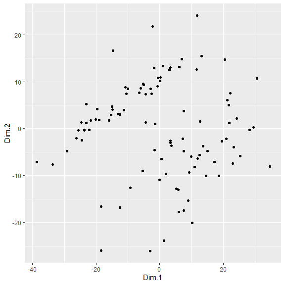
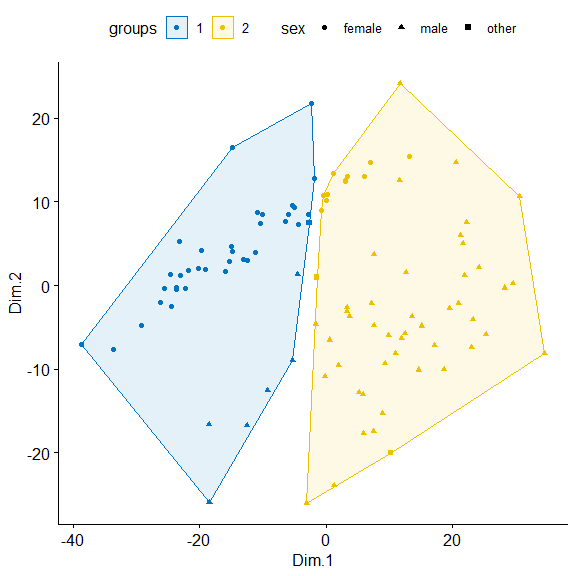
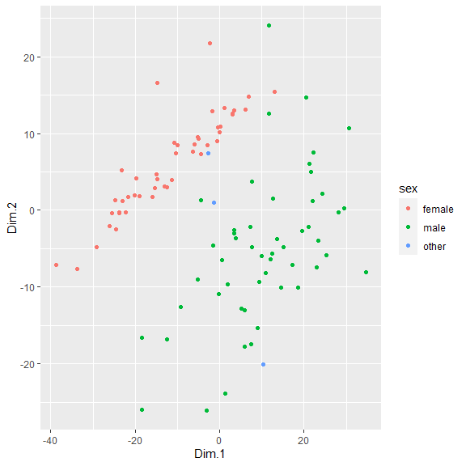
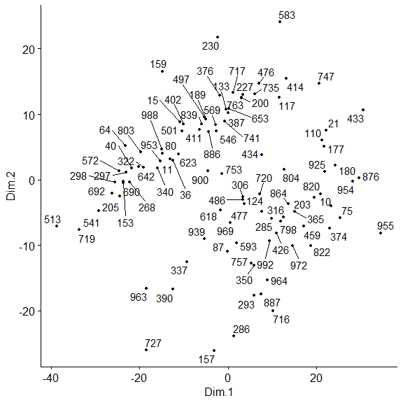
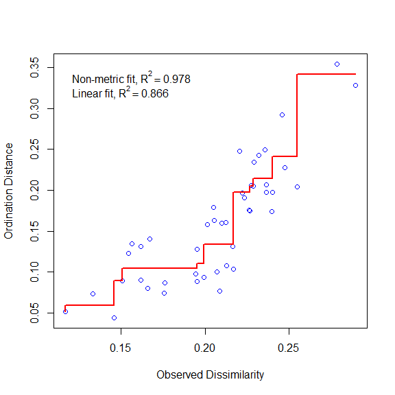
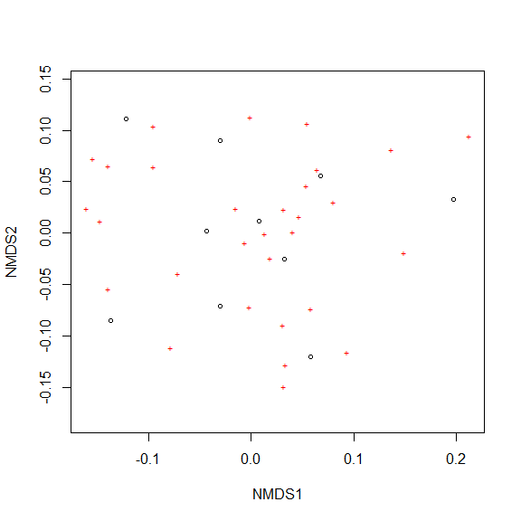
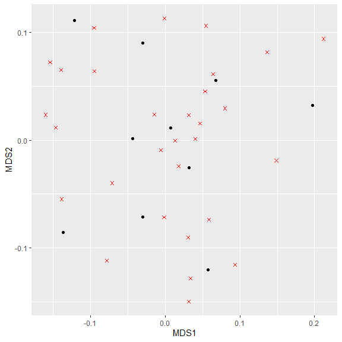
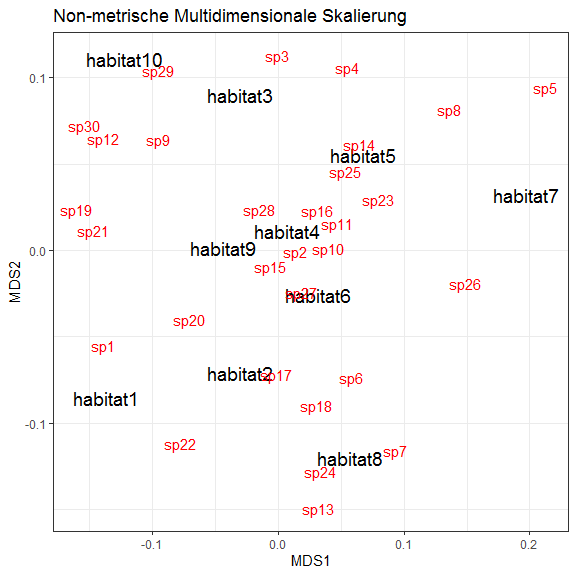

Multidimensionale Skalierung
============================

Klassische Multidimensionale Skalierung
---------------------------------------

Wie in der Vorlesung besprochen, ist die multidimensionale Skalierung
ein weiteres Verfahren zur Dimensionsreduzierung. Die klassische MDS
zielt darauf ab, die Abstände der Daten zueinander in einer möglichst
“realistischen” Weise auf den 2D-Raum anzupassen, so dass Punkte, die
nahe beieinander dargestellt werden auch in allen Variablen in den
Originaldaten nahe bei einander liegen.

Als Datensatz nehmen wir den Piratendatensatz, aber wir verkleinern ihn
drastisch, da die Ergebnisse sonst schlecht zu erkennen sind. D. h. wir
ziehen zuerst eine Zufallsstichprobe von 1/10 des Datensatzes (es
bleiben also noch 100 Piraten drin):

``` r
#load pirates

library(yarrr)
data("pirates")

# Zufallsstichprobe von Zahlen erstellen

sample <- sample(nrow(pirates), size = 0.1*nrow(pirates)) 

# Zufallsstichprobe ziehen
pir <- as.data.frame(pirates[sample,])
```

und als zweites reduzieren wir diesen Datensatz auf die metrischen
Variablen.

``` r
# auf metrische Daten reduzieren

pir_metric <- pir[,c(3:5,14:15)]
```

Als allererstes müssen wir jetzt eine Distanzmatrix berechnen. Dies
bedeutet, die “Entfernung” aller Piraten zu allen Piraten wird
berechnet. Die `dist()`-Funktion nutzt als Standard dafür die
euklidische Distanz. Wir können uns die euklidische Distanz immer
besonders gut im 2- und 3-Dimensionalen Raum vorstellen, wo man zu ihrer
Berechnung den Satz des Pythagoras (a² + b² = c²) nutzen kann. Im
multidimensionalen Raum geht das ebenso.

Die eigentliche multidimensionale Skalierung passiert dann mit der
Funktion `cmdscale`. Als Standardeinstellung ist hier vorgesehen, dass
die Daten auf den zweidimensionalen Raum reduziert werden. `as_tibble`
ist eine “Schnellumwandlung” der Ergebnisses in einen data.frame
(eigentlich das gleiche, geht aber schneller als as.data.frame). Die
Spalten sollten wir noch in Dimension 1 (Dim.1) und Dimension 2 (Dim.2)
umbenennen.

``` r
# Load required packages
library(magrittr)
library(dplyr)

mds <- pir_metric %>%
  dist() %>%         # berechne euclidische Distanz
  cmdscale()  %>%    # mds berechnung
  as_tibble()        # Umformung in einen data.frame

colnames(mds) <- c("Dim.1", "Dim.2") # benennt die beiden Spalten
```

Wir haben mit mds jetzt einen Data.frame, in dem die “neuen Koordinaten”
stehen. Das lässt sich wunderbar mit ggplot visualisieren:

``` r
library(ggplot2)

ggplot(data =  mds)+
  geom_point(aes(x = Dim.1,
                 y = Dim.2))
```



Das sind die 100 Piraten, und ihre Ähnlichkeit zueinander. Es wäre doch
jetzt aber hochinteressant zu sehen, ob sich dahinter bestimmte Gruppen
verbergen.

Dazu müssen wir die neuen Koordinaten mit dem alten Datensatz
zusammenführen. Da die Reihenfolge der Daten durch die MDS nicht
verändert wurde (das könnt ihr gerne prüfen mit
`rownames(pir) == rownames(mds)`), können wir einfach mit einem
`cbind()` den ersten zufallsgenerierten Piratendatensatz `pir` wieder
mit `mds` zusammenführen:

``` r
mds_pir <- cbind(mds, pir)
```

Man könnte diese Daten jetzt auch noch mit Clusteranalysen automatisch
gruppieren lassen, dafür gibt es unterschiedliche Verfahren. Eine reißen
wir hier ganz kurz an: k-means ist vermutlich das bekannteste
Clusterverfahren, das es gibt. Es basiert auf einem iterativen
Verfahren, bei dem die Distanzen der Clustermitglieder zu einem
Cluster-Mittelpunkt reduziert werden. Bei k-means muss man k definieren,
d.h., wie viele Cluster gebildet werden sollen. Dafür nutzen wir
folgenden Code:

``` r
clust <- kmeans(mds, 2)$cluster %>% # auf mds wird kmeans berechnet mit k = 2
  as.factor() # und diese Clusterzuweisung wird als Faktor-Vektor gespeichert

mds_c <- mds_pir %>%         # wir erstellen mds_c aus mds_pir
  mutate(groups = clust)    # und weisen die Gruppen als eigene Spalte zu
```

Jetzt können wir folgendes machen: Die Punkte werden nach Dimension 1
und 2 geplottet, die Form der Punkte (shape) gibt das Geschlecht an und
die Gruppen, wie sie von k-means erkannt wurden, werden farblich
dargestellt und umrandet. Nehmen wir dafür`ggscatter` in dem Paket
`ggpubr`:

``` r
library(ggpubr)


ggscatter(mds_c, x = "Dim.1", y = "Dim.2",  #Punkte zeichnen
          shape = "sex",                    # Form der Punkte nach Geschlecht
          color = "groups",              # Farbe nach Gruppen von k-means
          palette = "jco",               # Farbauswahl
          size = 1.5,                    # Größe der Punkte
          ellipse = TRUE,               # wir zeichnen eine Ellipse
          ellipse.type = "convex",     # konvex um die Gruppen herum
          repel = TRUE)               # Punkte sollen sich nicht überlagern
```



Etwas übersichtlicher ist es vllt, wenn man nur visualisiert, ob diese
Verteilung zB mit dem Geschlecht zusammenhängt:

``` r
ggplot(data =  mds_pir)+
  geom_point(aes(x = Dim.1,
             y = Dim.2,
             col = sex))
```



Aha! Dachten wir uns das doch. ;-)

Manchmal sieht man in diesem Scatter-Plot Punkte und würde gerne wissen,
“wer” sie genau sind, also welchen Datensatz sie repräsentieren:

Wir können das herausfinden, indem wir die Punkte labeln, am einfachsten
mit `ggscatter` in dem Paket `ggpubr`:

``` r
ggscatter(mds_pir, x = "Dim.1", y = "Dim.2", 
          label = rownames(mds_pir),
          size = 1,
          repel = TRUE)
```



Praktisch!

**Aufgabe:** Wiederholt die Berechnung mit den Pinguinen, Gewicht,
Schnabelmaßen und Flossenmaß. Visualisiert das Ergebnis und färbt die
Punkte nach Spezies ein.

Non-metrische MDS
-----------------

Da die NMDS nur mit Rängen arbeitet, ist sie sehr flexibel und weiter
anwendbar als die metrische MDS, z.B. mit Häufigkeitsangaben
(“Häufigkeiten verschiedener Spezies in bestimmten Habitaten”). Wie
gesagt, sind euklidische Distanzen nicht sehr dafür geeignet.

Zuerst kreiieren wir jedoch einen zufälligen Datensatz, eine
Kreuztabelle: Spezies und Habitat. Wie häufig kommt eine Spezies darin
vor?

``` r
set.seed(2) # mit set.seed geben wir einen Anfangspunkt für die Zufallsvariablen

habitat_matrix = matrix(                      # erstelle Matrix
   sample(1:100,300,replace=T),               # Zufallsvariable mit zurücklegen, 300 Werte zwischen 1 und 100
   nrow=10,                                   # organisiere sie in 10 Zeilen
   dimnames=list(paste("habitat",1:10,sep=""), # nenne die Zeilen Habitat1-10
                 paste("sp",1:30,sep="")))     #Nenne die Spalten sp1-30
```

Jetzt haben wir einen Beispieldatensatz “habitat\_matrix”.

Wir nutzen das Paket `vegan` und darin die Funktion `metaMDS`.

``` r
library(vegan)

example_NMDS = metaMDS(habitat_matrix, # unsere matrix
                     k=2) # Anzahl reduzierter Dimensionen
#> Square root transformation
#> Wisconsin double standardization
#> Run 0 stress 0.1486476 
#> Run 1 stress 0.1913739 
#> Run 2 stress 0.1908305 
#> Run 3 stress 0.1908317 
#> Run 4 stress 0.1849162 
#> Run 5 stress 0.1906937 
#> Run 6 stress 0.1486489 
#> ... Procrustes: rmse 0.0007687706  max resid 0.001221702 
#> ... Similar to previous best
#> Run 7 stress 0.1849759 
#> Run 8 stress 0.1688829 
#> Run 9 stress 0.1650751 
#> Run 10 stress 0.1486477 
#> ... Procrustes: rmse 0.000106901  max resid 0.0001907307 
#> ... Similar to previous best
#> Run 11 stress 0.164544 
#> Run 12 stress 0.3153591 
#> Run 13 stress 0.219889 
#> Run 14 stress 0.2237401 
#> Run 15 stress 0.1699875 
#> Run 16 stress 0.1650804 
#> Run 17 stress 0.1906937 
#> Run 18 stress 0.2255724 
#> Run 19 stress 0.1494912 
#> Run 20 stress 0.1650751 
#> *** Solution reached
```

Wie R rechnet, wird uns angezeigt. Wie häufig er die Berechnung
durchführt, kann man mit `trymax =` als Argument begrenzen. Wenn die
Stress-Werte zu hoch bleiben, kann man auch k hochsetzen auf 3 (gemäß
der Ansage: je mehr Dimensionen, desto geringer der Stress in der
Regel).

In `vegan` ist die Berechnung eines Shepard plot zur Darstellung des
Stresses gleich implementiert:

``` r
stressplot(example_NMDS)
```



Es wird in dieser Darstellung durch die Gegenüberstellung der
beobachteten Unähnlichkeit (observed dissimilarity) gegenüber der
angeordneten 2D-Distance (ordination distance) eine lineare Regression
und eine nicht-metrische Regression berechnet. Wenn R² sehr groß wird,
ist das Modell nicht sehr gelungen (die 2D-Darstellung stellt die
“Originaldaten” nicht angemessen dar).

Jetzt können wir die NMDS noch visualisieren:

``` r
plot(example_NMDS)
```



Ich kann diese Darstellung auch in ggplot erreichen und dann noch andere
Dinge damit machen. Dazu muss ich erst die Koordinaten aus der
Berechnung example\_NMDS herausziehen

``` r
example_points <- as_tibble(example_NMDS$points)
example_species <- as_tibble(example_NMDS$species)

library(ggplot2)
ggplot()+
  geom_point(data = example_points,
             aes(x = MDS1,
                 y = MDS2)) +
  geom_point(data = example_species,
              aes(x = MDS1,
                 y = MDS2),
             col = "red",
             shape = "cross")
```



Das ist nicht schlecht, aber gut wäre es doch zu wissen, welches Kreiz
welche Spezies und welcher Punkt welches Habitat ist.

Also müssen wir unseren herausgezogenen Datensatz noch mit Zeilennamen
versehen:

``` r
row.names(example_points) <- dimnames(example_NMDS$points)[[1]]
row.names(example_species) <- dimnames(example_NMDS$species)[[1]]
```

In ggplot kann man statt `geom_point` `geom_text` eingeben und ein
`label` spezifizieren und so die Punkte beschriften, ohne sie vorher zu
“malen”.

``` r
ggplot()+
  geom_text(data = example_points,
             aes(x = MDS1,
                 y = MDS2,
             label=row.names(example_points)),
            size = 5)+
  geom_text(data = example_species,
           aes(x = MDS1, 
           y = MDS2, 
          label = row.names(example_species)),
          size = 4,
          col = "red")+
  theme_bw()+
  ggtitle("Non-metrische Multidimensionale Skalierung")
```



Das ist ein gutes Ergebnis! Wir sehen, wie ähnlich sich die Habitate
sind und welche Spezies v.a. dazu beitragen, sie zu definieren.

Wer die non-metrische multidimensionale Skalierung noch einmal üben
**möchte**, kann noch einmal diesem Skript folgen:
<a href="https://rpubs.com/CPEL/NMDS" class="uri">https://rpubs.com/CPEL/NMDS</a>

Zusammenfassung
---------------

Sie haben eine metrische und eine nicht-metrische multidimensionale
Skalierung kennengelernt und berechnet, die die Ähnlichkeit der Objekte
/ Individuen zueinander, die sie im multivariaten Raum besitzen, im
2D-Raum abbildet.

**Herzlichen Glückwunsch!**
