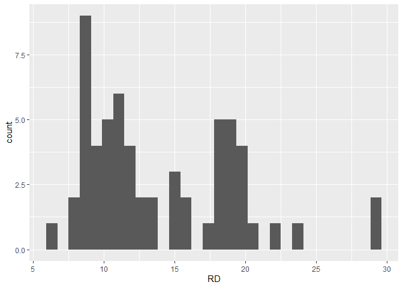
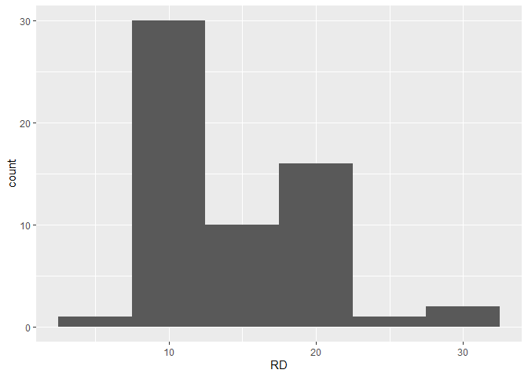
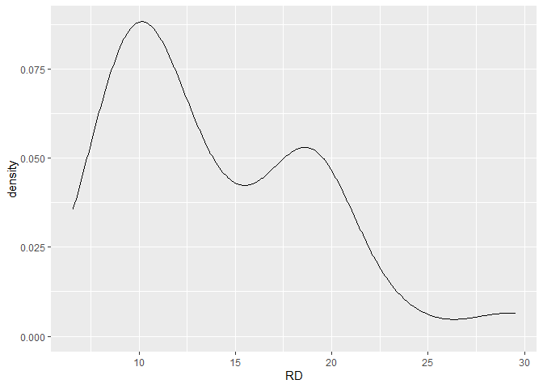
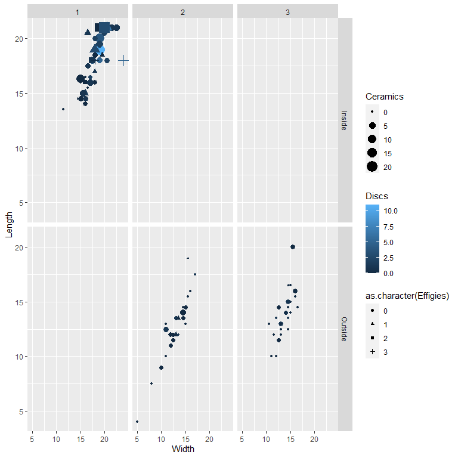

Intro
=====

Letzte Stunde haben alle ein R-Projekt erstellt, in dem unter
analysis/paper eine Datei namens “paper.Rmd” lag.

Jetzt üben wir das Anlegen eines neuen Rmd-Dokuments und wie wir daraus
einen Artikel entwickeln. Nebenher lernen wir noch ein paar neue Arten
Grafiken zu erstellen kennen.

Öffnet das R-Projekt der letzten Stunde.

Zuerst: In Rstudio gibt es oben links das + -Symbol mit einem kleinen
weißen Papier. Wenn man dort auf das Drop-Down-Menü geht, kann man
“R-Markdown” auswählen. Tut ihr das, kommt ein Fenster, in dem
unterschiedliche Dinge angegeben werden können:

Titel des Dokuments, Autor und default-Output - Format. Füllt sie aus,
so wie ihr denkt und drückt “ok”. Es erscheint ein - erstmal
ungespeichertes! - neues Dokument, in dem im YAML-Header oben die
Angaben eingebracht sind, die ihr gerade eingegeben habt. Das sind die
absoluten Minimalangaben für einen YAML-Header. Wenn ihr die
ausführlichere Version aus dem rrtools-erstellten paper-Dokument
übernehmen wollt, könnt ihr den YAML-Header von dort auch einfach
kopieren und hier einfügen und dabei den hiesigen YAML-Header ersetzen.
Vergesst dann aber nicht, Titel und Datum anzupassen.

Unterhalb des YAML-Headers findet ihr noch den setup - Codechunk. Alles
darunter könnt ihr erst einmal löschen, es ist nur Beispieltext.

Speichert die Datei in eurem analysis/paper - Ordner.

Jetzt gebt eine Überschrift mit einem Hashtag markiert, in der ihr das
Thema der heutigen Stunde festlegt:

\# Visualisierungen mit ggplot

Lest das erste kleine Unterkapitel auf dieser website
<a href="https://r-intro.tadaa-data.de/book/visualisierung.html" class="uri">https://r-intro.tadaa-data.de/book/visualisierung.html</a>
(bis 9.2) und schreibt euch zu dieser Frage eine Antwort auf: Welche
Layer braucht jedes ggplot um angezeigt werden zu können?

Versucht ruhig ein wenig den Text zu formatieren, zB mit **fett**
gedruckt (Wort mit zwei Sternchen umklammern) oder *schräg* zu markieren
(Wort mit je einem Unterstrichen umgeben).

“Strickt” das Rmarkdown und schaut euch das Ergebnis an.

Wenn ihr zuversichtlich seid, dass das mit Rmarkdown so ganz gut klappt,
legt euch eine neue Überschrift “Histogramm” an.

Jetzt benötigen wir einen Code-Chunk, der uns die Pakete und Daten
einlädt:

``` r
library(ggplot2)

library(archdata)
```

    ## Warning: package 'archdata' was built under R version 4.0.2

``` r
data("BACups")
```

In der letzten Stunde haben wir vor allem mit nominalen Daten gearbeitet
und sie dargestellt. Dafür eignen sich Balkendiagramme ganz
hervorragend. Jetzt geht es aber um metrische Daten.

Fangen wir an mit Histogrammen. Histogramme sind sehr beliebt für
metrische Daten, weil man relativ einfach die Verteilung der Werte
erkennen kann. Ein Histogramm sieht manchmal aus wie ein Balkendiagramm,
ist es aber nicht! Histogramme haben auf der x-Achse eine klassifizierte
metrische Variable und auf der y-Achse entweder die Häufigkeit dieses
Wertes oder die Dichte.

Ein Beispiel, schreibt euch diesen Code-Chunk ab und führt ihn aus, in
dem ihr euren Cursor innerhalb der Code-Zeilen stehen lasst und
Strg+Enter drückt:

``` r
ggplot(data = BACups)+
  geom_histogram(aes(x = RD))
```

    ## `stat_bin()` using `bins = 30`. Pick better value with `binwidth`.



Es sollte eine Meldung aufgeploppt sein: “`stat_bin()` using
`bins = 30`. Pick better value with `binwidth`.”

“Binwidth” bezeichnet die Größe der Klasse. “bins = 30” heißt, dass der
gesamte Datensatz in 30 gleich große Klassen unterteilt wurde.

Probiert einmal verschiedene Werte in dem Beispiel aus. Arbeitet immer
im gleichen Code-Chunk und verändert nur den Wert hinter `binwidth =`, n
z. B. so:

``` r
ggplot(data = BACups)+
  geom_histogram(aes(x = RD), binwidth = 5) # Klassengröße 5. 
```


Versucht doch einmal andere Werte und schaut, was passiert!

Was lernen wir daraus?

Die Wahl der Klassengröße macht eine Menge aus, wie ich die Daten
wahrnehme und welche Aussagen ich über sie treffen werde.

Entscheidet euch für die Klassenbreite, die euch am besten gefallen hat
und lasst diese als “richtige” Version im Code-Chunk stehen.
Dokumentiert euch unterhalb des Code-Chunks im “normalen Textbereich”
was für Unterschiede ihr bei den unterschiedlichen Werten beobachten
konntet und schreibt, warum ihr euch für diesen Wert entschieden habt.

Es gibt noch viele andere Visualisierungsmöglichkeiten. Erstellt eine
neue Überschrift zum Thema:

Boxplot
=======

Zur Wiederholung:

-   Q1 = 1. Quartil. Bis hier liegen die ersten 25% meiner Werte, wenn
    ich sie aufsteigend sortiere
-   (Q2 =) Median, den kennen wir schon. Bis hier liegen 50 % meiner
    Werte, wenn ich sie aufsteigend sortiere
-   Q3 = 3. Quartil, bis hier liegen 75% meiner Werte, wenn ich sie
    aufsteigend sortiere
-   Q3 - Q1 ist der Quartilsabstand: In diesem Bereich um den Median
    herum liegen 50% der “mittleren” Werte. Er wird durch die Box
    gekennzeichnet
-   Bartenden sind das 1,5fache des Quartilsabstandes vom Median aus
    gerechnet (oder am Ende der Verteilung)
-   Extreme liegen außerhalb der Bartenden
-   Ausreißer sind mehr als das 3fache des Quartilsabstandes vom Median
    entfernt

Ein Boxplottdiagramm eignet sich sehr gut, um mehrere Verteilungen EINER
Variablen zu vergleichen. Also mehrere Gruppen in meinem Datensatz, aber
immer die gleiche Variable.

Ein Beispiel:

``` r
ggplot(data = BACups)+
  geom_boxplot(aes(x = Phase, y = ND)) + 
  labs(x ="Phasen",
       y ="Nackendurchmesser",
       title = "Die Nackendurchmesser der zwei Phasen im Vergleich")+
  theme_bw()
```


Sokumentiert euch unterhalb des Codes, was man hiermit gut erkennen
kann!

Noch einmal Boxplots für Daten aus Snodgrass:

``` r
data("Snodgrass")

ggplot(data = Snodgrass)+
  geom_boxplot(aes(x = Segment, y = Length, fill = Inside))+ 
  labs(x ="Grabungsareale",
       y ="Länge des Hauses",
       title = "Häuser in Snodgrass")+
  theme_bw()+
   scale_fill_discrete(name  ="Innerhalb der Mauer oder nicht",
                            breaks=c("Inside","Outside"),
                            labels=c("innerhalb", "außerhalb")) 
```


Was stellt das Diagramm dar und was kann man daraus eventuell schließen?

Jetzt wollen wir aber nicht nur eine metrische Variable darstellen,
sondern visualisieren, ob es eventuell einen Zusammenhang zwischen zwei
Variablen gibt. Dafür eignen sich Streudiagramme.

Streudiagramme
==============

Bei Streudiagrammen kann ich zwei Variablen einer Einheit gegeneinander
plotten.

Wir tragen auf der X- und auf der Y-Achse metrische Daten ab. Das gehört
zu den aesthetics-Elementen, deshalb tun wir die Info in die Klammern
hinter aes():

``` r
ggplot(data = BACups)+
  geom_point(aes(x = RD, y = ND))
```


Jetzt können wir damit wieder die Dinge tun, die wir mit dem
Balkendiagramm gemacht hatten, also die Achsen beschriften, einen Titel
vergeben und den Style ändern:

``` r
ggplot(data = BACups)+
  geom_point(aes(x = RD, y = ND)) + 
  labs(x =" Randdurchmesser",
       y ="Nackendurchmesser",
       title = "Rand- und Nackendurchmesserim Verhältnis zueinander")+
  theme_bw()
```


Was kann man noch tolles machen? Die Form der Punkte von einer Variablen
bestimmen lassen! Und die Farbe!

Welches Merkmal, das ich in der Tabelle als Spalte aufgenommen habe die
Form der Punkte bestimmt lege ich mit “shape” fest, die Farbe mit
“color”.

``` r
ggplot(data = BACups)+
  geom_point(aes(x = H, y = SD, shape = Phase, color = Phase)) + 
  labs(x =" Höhe des Gefäßes",
       y ="Schulterdurchmesser",
       title = "Höhe des Gefäßes im Verhältnis zum Schulterdurchmesser")+
  theme_bw()
```


Oooooh, schaut euch mal das Ergebnis an! Da könnte man schon fast was
interpretieren!

Probiert doch einmal noch 2-3 andere Parameter aus, ob die vielleicht
auch einen Unterschied zwischen den zwei Phasen erkennen lassen?

Lasst eine der Visualisierungen am Ende “stehen” und kommentiert im
normalen Textbereich, was man anhand dieser Visualisierung erkennen
kann.

“Strickt” zwischendurch das Dokument um zu schauen, wie die
Visualisierung und der Text zusammen auf einer Seite aussehen. Wenn das
Diagramm zu groß oder zu klein ist, könnt ihr mithilfe von `fig.height=`
und`fig.width=` im Kopf des Code-Chunks also
`{r Name des Codechunks, -> hier <- }` die Breite und Höhe des
ausgegebenen Code-Chunks spezifizieren. Da RMarkdown englisch redet,
sind die Angaben in inches, nicht Zentimeter!

mehrere nominale Variablen in einem Streudiagramm
-------------------------------------------------

Form und Farbe kann man natürlich auch von unterschiedlichen Parametern
bestimmen lassen. Da diese Eigenschaften jedoch nominaler Art sein
müssen und wir keinen zweiten nominale Variable in dem BACups-Datensatz
haben, benutzen wir doch mal einen anderen. Nämlich den Datensatz
“Snodgrass” aus dem `archdata`-Paket. Hier geht es um Häuser in
Missouri, USA. Schaut euch die Hilfe an (zB mit ?Snodgrass) oder über
die Suchfunktion von “Help”, um einen Überblick zu bekommen, was das für
ein Datensatz ist.

Anschließend visualisieren wir die Größe und Länge der Häuser als
Streudiagramm und färben sie dementsprechend ein, ob sie innerhalb oder
außerhalb der Mauer lagen und die Form des Punktes wird durch das
Segment, in dem das Haus lag, bestimmt.

``` r
data("Snodgrass")


ggplot(data = Snodgrass)+
  geom_point(aes(x = Width, y = Length, shape = Segment, color = Inside))+ 
  labs(x =" Breite des Hauses",
       y ="Länge des Hauses",
       title = "Häuser in Snodgrass")+
  theme_bw()
```


Hmmmhh, interessant. Aber ich vermute, der normale Leser des Diagramms
kann nicht erkennen, was “Inside” für eine Information beinhaltet. Also
ändern wir das noch einmal.

``` r
ggplot(data = Snodgrass)+
  geom_point(aes(x = Width, y = Length, shape = Segment, color = Inside))+ 
  labs(x =" Breite des Hauses",
       y ="Länge des Hauses",
       title = "Häuser in Snodgrass")+
  theme_bw()+
 scale_colour_discrete(name  ="Innerhalb der Mauer oder nicht",
                            breaks=c("Inside","Outside"),
                            labels=c("innerhalb", "außerhalb")) +
    scale_shape_discrete(name  ="Grabungsareal",
                           breaks=c("1","2","3"),
                           labels=c("Areal 1", "Areal 2", "Areal 3"))
```


Zur Wiederholung: Was bedeutet das alles?

Mit scale\_colour\_discrete kann ich Legenden (scales) verändern, die
mit “color” innerhalb des aesthetics-Bereichs meines Codes für die
Graphik definiert werden und die DISKRET sind (also v.a. nominale /
ordinale Daten).

Hier benenne ich den Legendentitel mit `name =` um.

`breaks` bezeichnet die Werte in meiner Spalte, die dann mit den
`labels` in der nächsten Zeile umbenannt werden.

Das gleiche kann ich mit der Legende für die FORM der Punkte machen:
`scale_shape_discrete`.

Dokumentiert euch unterhalb des plot-Codes, was ihr anhand der
Visualisierung erkennen könnt.

Auf zur nächsten Visualisierungsmöglichkeit!

Dichtediagramme!
----------------

Wie die funktionieren, erinnert ihr euch hoffentlich.

Bei den Dichtediagrammen wird die Klasseneinteilung, mit der wir eben
bei dem Histogramm herumprobiert haben “abstrahiert”.

Die Funktion in ggplot heißt `geom_density`.

``` r
ggplot(data = BACups)+
  geom_density(aes(x = RD))
```



Das war doch ganz einfach. Aber jetzt möchte ich gern die
unterschiedlichen Messungen an den Tassen im Vergleich sehen. Also
mehrere Variablen gleichzeitig dastellen. Ich kann ganz einfach den
geom\_density-Befehl mehrmals rufen:

``` r
ggplot(data = BACups)+
  geom_density(aes(x = RD, col ="Randdurchmesser"))+
  geom_density(aes(x = ND, col = "Nackendurchmesser"))+
  geom_density(aes(x = SD, col = "Schulterdurchmesser"))
```


Das funktioniert zwar, aber es ist nicht gerade “elegant”.

Elegant wär es, erst die Daten so umzuformen, dass sich in ggplot dann
mit möglichst wenig Befehlen meine Grafik darstellen lassen kann.

Wir brauchen also eine Daten-Umformung. Wir nutzen dafür das Paket
`tidyr`. Der Schritt ist relativ einfach. Ich nehm die Spalten, die mich
interessieren und sortiere die Werte dieser Spalten neu, so dass ich
eine Spalte habe, in der steht die ehemalige Überschrift der Spalte und
einen Spalte, in der der dazugehörige Wert steht. Das ist der
`gather`-Befehl. Hinter `key =` schreibe den Namen der neuen Spalte, in
der die Überschriften der Spalten. `value =` bezeichnet den Namen der
Spalte, in dem die eigentlichen Werte aus den ursprünglichen Spalten
eingefügt werden. Dahinter nenne ich einfach die Spaltennamen, die so
zusammengefasst werden sollen in Hochkommas: “RD”, “ND”,“SD”.

Die so zusammengefassten Werte kann ich direkt in ggplot einspeisen, in
dem ich sie mit der *pipe* verbinde. In ggplot brauche ich dann nicht
mehr `data =` unterzubringen und muss nur in den aesthetics für x die
Spalte angeben, die die ursprünglichen Werte beinhaltet und die
Density-Kurven je nach ursprünglichen Spaltennamen einfärben:

``` r
library(tidyr)
BACups%>%
  gather(key = "Durchmesser", value = "Wert", "RD", "ND","SD") %>%
  ggplot()+
  geom_density(aes(x = Wert, col= Durchmesser))
```


Deutlich eleganterer Code. Kommentiert euch unter diese Grafik, was die
Datenumformung bedeutet, die ihr da vorgenommen habt.

Die Datenumformung ist eine der wichtigsten Tätigkeiten eines data
scientists, jemanden, der v.a. Statistik betreibt. Denn Daten kommen
leider im echten Leben meist nicht so hübsch daher wie in Beispielen…
Aber damit beschäftigen wir uns nächste Stunde noch einmal im Detail.

Facettierung!
-------------

Jetzt wird es nochmal richtig cool. Den Dichteplot eben nochmal nach
unterschiedlichen Phasen anzulegen, das wär gut oder?

``` r
BACups%>%
  gather(key = "Durchmesser", value = "Wert", "RD", "ND","SD") %>%
  ggplot()+
  geom_density(aes(x = Wert, col= Durchmesser))+
  facet_grid(Phase~.)
```


Nur eine einzige Zeile Code mehr und schaut es euch an: Interessantes
Ergebnis oder? mit facet\_grid unterteile ich die Daten noch einmal nach
den angegeben Variablen. Ich kann zwei Variablen angeben, die ich mit
einer Tilde trenne. Die erste Variable wird dann auf der vertikalen
Ebene angelegt und die zweite Variable auf der horizontalen. Da wir nur
eine Variable hier haben (“Phase”), muss die andere mit einem Punkt
markiert werden, das besagt einfach nur, dass dieses Argument an dieser
Stelle leer bleibt. Aber probiert einmal aus, diese beiden (Punkt und
Phase) zu vertauschen. Was passiert? Entscheidet euch für einen der
beiden Plots und kommentiert euch darunter, wie man ihn interpretieren
kann.

Noch ein anderes Bsp fürs Facettieren. Nehmen wir doch mal den
Snodgrass-Datensatz mit den Häusern. Da gibt es zwei nominale Attribute,
die man bei der “Facettierung” geenüber stellen kann.

Achja. Und ich benutz mal alle Variablen eines Streudiagramms, die mir
einfallen… Versucht einmal durchzublicken.

``` r
ggplot(data = Snodgrass)+
  geom_point(aes(x = Width, y = Length, col= Discs , shape = as.character(Effigies), size = Ceramics))+
             facet_grid(Inside~Segment)
```



Zwei Fragen: 1. Wer blickt noch durch? (lessons learned: man sollte nie
zu viele Informationen in einen plot packen) und 2. Da entstehen ja
“leere” Kästchen? Woher könnte das kommen?

Wenn man in einer Fazettierung nur die Kästchen zeigen möchte, in denen
auch Daten enthalten sind, kann man statt `facet_grid` den Befehl
`facet_wrap` benutzen.

Hausaufgabe
===========

Erstellt ein Streudiagramm aus dem Snodgrass-Datensatz. Benutzt East und
South als Grundlage und visualisiert, ob ein Haus innerhalb oder
außerhalb der Mauer liegt, sowie die Gesamtanzahl von Fundstücken in dem
Haus.

Wie ihr das genau macht, ist euch überlassen, mehrere Wege sind möglich.
Speichert die Grafik ab und schickt sie mir bis nächste Woche.
