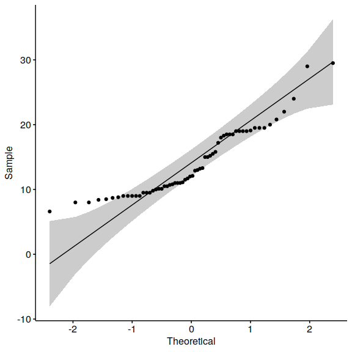

``` r
knitr::opts_chunk$set(
  collapse = TRUE,
  warning = FALSE,
  message = FALSE,
  echo = TRUE,
  comment = "#>",
  fig.path = "../figures/",
  fig.width=6, 
  fig.height=6
)
```

Sind meine Daten normalverteilt?
================================

Q-Q-plot
--------

Optisch die Normalverteilung abzuschätzen ist sinnvoll, dann hat man
schon einmal eine Idee.

Ein Q-Q-plot ist ein “Quantil-Quantil-Plot”: Die Beobachtungswerte eines
Merkmals werden der Größe nach geordnet und abgetragen. Als Vergleich
dienen die Quantile der Normalverteilung (theoretische Verteilung),
diese werden als Linie abgetragen. Wenn die abgetragene Messwertreihe
normalverteilt ist, stimmen die empirischen und die theoretischen
Quantile annähernd überein, d. h. die Werte liegen auf einer Diagonalen.

Große systematische Abweichungen von dieser Diagonalen geben einen
Hinweis darauf, die Messwerte doch nicht normalverteilt sind. Das
Quantil-Quantil-Diagramm kann keinen Verteilungstest ersetzen.

Das Paket, in dem Q-Q-plots für R umgesetzt wurden, heißt `ggpubr`,
installieren wir es also:

``` r
install.packages("ggpubr")
```

Und wenden es an. Wir schauen uns die Randdurchmesser der
bronzezeitlichen Tassen aus Italien an, die im Datensatz `BACups`
liegen:

``` r
library(ggpubr)
library(archdata)
data("BACups")
ggqqplot(BACups$RD)
```

 

Man sieht: auf der x-Achse wird die
theoretische Verteilung abgetragen und auf der y-Achse die unserer
Stichprobe (sample). Die Linie zeigt den Idealverlauf an.

Wie man sieht, weichen einige Punkte deutlich von der Linie und dem
95%-konfidenzintervall (das ist der graue Bereich) ab. Wir können also
*nicht* davon ausgehen, dass die Daten normalverteilt sind.

Testen wir das jetzt mit dem richtigen Test: Shapiro, los geht’s!

Shapiro-Wilk-Test
-----------------

``` r
  shapiro.test(BACups$RD)
#> 
#>  Shapiro-Wilk normality test
#> 
#> data:  BACups$RD
#> W = 0.89773, p-value = 0.0001088
```

Ok, ok, was ist hier passiert?

Der Shapiro-Wilk Test testet, ob es einen signifikanten Unterschied
zwischen der Normalverteilung und den z-transformierten Daten der
eigenen Messwertreihe gibt. Da der Test die Daten selber transformiert,
müssen wir ihm nicht die z-transformierten Werte geben.

Nehmen wir das Ergebnis einmal auseinander.

R sagt:

        Shapiro-Wilk normality test

    data:  BACups$RD
    W = 0.89773, p-value = 0.0001088

-   In der ersten Zeile noch einmal, welchen Test wir angewandt haben
-   in der zweiten Zeile, auf welchen Datensatz
-   und die dritte Zeile wird spannend. Da steht
-   W = 0.89773
-   p = 0.0001088

*W* ist die in der Vorlesung erwähnte Testgröße, die mit einer
theoretischen Verteilung im Bezug auf die Wahrscheinlichkeit abgeglichen
wird, dass dieser Wert entsteht.

*p* ist die Wahrscheinlichkeit, dass wir uns irren, wenn wir die H\_0 -
Hypothese ablehnen.

Was war H\_0 noch einmal?

H\_0 ist: Es gibt keinen signifikatanten Unterschied zwischen der
Normalverteilung und meiner Messwertreihe.

Wir irren uns also mit einer Chance von etwa 0,01 %, wenn wir das
ablehnen und behaupten würden, es gäbe einen Unterschied zwischen der
Normalverteilung und der Messwertreihe.

Umgedreht: Wir irren uns mit einer Wahrscheinlichkeit von 0,01%, wenn
wir H\_1 annehmen. Und H\_1 war die Hypothese, DASS es einen Unterschied
zwischen der theoretischen Verteilung und meinen Daten gibt.

Ok.

Der Test sagt also im Klartext: Hörmal, die Daten sind nicht
normalverteilt. Die Chance, dass du dich irrst, wenn du davon ausgehst,
dass sie NICHT normalverteilt sind, ist super gering.

Jetzt wissen wir aber, dass in unserem Datensatz zwei unterschiedliche
Pasen enthalten sind.

**Aufgabe: Wieso könnte das ein Problem sein? – Diskutiert das in eurer
Gruppe!**

Wir untersuchen jetzt einmal nur die protoappeninen Tassen. Das heißt,
wir filtern oder subsetten den originalen Datensatz:

``` r
BACups_pa <- subset(BACups, BACups$Phase == "Protoapennine")
```

Und nutzen diesen noch einmal in dem Shapiro-Wilk-Test:

    shapiro.test(BACups_pa$RD)

**Aufgabe: Was kommt hierbei heraus? Wie kann man das Ergebnis
interpretieren? Wieso ist plötzlich das Thema des Signifikanzniveaus von
Bedeutung? – Diskutiert das in eurer Gruppe!**

Wenn wir herausgefunden haben, ob unsere Daten normalverteilt sind oder
nicht, können wir ein geeignetes Testverfahren auswählen. Wir beginnen
jetzt mit den Testverfahren, die wir nehmen können, wenn die Daten NICHT
normalverteilt sind, den sogenannten non-parametrischen oder
“verteilungsfreien” Testen:

Gruppenunterschiede testen
==========================

non-parametrische Teste
-----------------------

### U-Test

Der U-Test heißt in R `wilcox,test` und wir brauchen für ihn die beiden
Gruppen als zwei unterschiedliche Datensätze. Nehmen wir doch einfach
noch einmal die BACups und unterteilt in die beiden Phasen. Sind sie im
Randdurchmesser unterschiedlich?

BACups\_pa haben wir ja schon erstellt. Das noch einmal parallel für die
Subappeninen Tassen:

``` r
BACups_sa <- subset(BACups, BACups$Phase == "Subapennine")
```

und jetzt der Test:

``` r
wilcox.test(BACups_pa$RD, BACups_sa$RD)
#> 
#>  Wilcoxon rank sum test with continuity correction
#> 
#> data:  BACups_pa$RD and BACups_sa$RD
#> W = 226.5, p-value = 0.006633
#> alternative hypothesis: true location shift is not equal to 0
```

Ok, wie interpretieren wir das? Als erstes sagt uns R noch einmal,
welchen Test er gemacht hat. “continuity correction” macht er, weil wir
den U-Test mit metrischen Daten durchgeführt haben. Dann gibt er die
berechneten W und p - Werte und sagt uns netter Weise noch einmal, was
die Alternativhypothese ist:
`alternative hypothesis: true location shift is not equal to 0`. Die
H\_1 ist also, die beiden Gruppen sind unterschiedlich. p gibt uns die
Irrtumswahrscheinlichkeit dafür.

Das Ergebnis ist also: Ja die beiden Gruppen unterscheiden sich
höchstsignifikant (p &lt; 0,01) voneinander im Randdurchmesser! Yay! Ein
schönes Ergebnis!

Doch in welche Richtung unterscheiden sie sich?

Wir haben die Möglichkeit, mit dem Argument `alternative =` anzugeben,
ob man schon davon ausgeht, dass eine Gruppe größer ist als die andere.
Das heißt, ich kann eine gerichtet Alternativhypothese angeben. Man sagt
immer “der erste Datensatz, den ich angebe” (x) ist “less”, also
kleiner, oder “greater”, also größer, als der zweite. Oder man nimmt das
Argument weg und berechnet einen “two.sided” Test, der keine vorherige
Annahme trifft. Das haben wir eben gemacht.

Probieren wir also einmal aus, was passiert, wenn wir davon ausgehen,
dass die protoappenninen Tassen kleiner sind als die subappenninen
Tassen:

``` r
wilcox.test(BACups_pa$RD, BACups_sa$RD, alternative = "less")
#> 
#>  Wilcoxon rank sum test with continuity correction
#> 
#> data:  BACups_pa$RD and BACups_sa$RD
#> W = 226.5, p-value = 0.003316
#> alternative hypothesis: true location shift is less than 0
```

Und jetzt noch einmal andersherum:

``` r
wilcox.test(BACups_pa$RD, BACups_sa$RD, alternative = "greater")
#> 
#>  Wilcoxon rank sum test with continuity correction
#> 
#> data:  BACups_pa$RD and BACups_sa$RD
#> W = 226.5, p-value = 0.9968
#> alternative hypothesis: true location shift is greater than 0
```

**Aufgabe: Was bedeuten diese Ergebnisse? Visualisiert die
Randdurchmesser doch einmal als Boxplotdiagramme (denkt daran:
library(ggplot2) aufzurufen). Versteht ihr die drei unterschiedlichen
p-Werte jetzt besser? – Diskutiert das in der Gruppe!**

### K-S-Test

Der K-S-Test benötigt mindestens ordinal skalierte Daten (d.h. metrische
gehen auch), man kann ihn als Anpassungstest verwenden und als
Zweichstichproben-Test nutzen.

Wir nehmen ihn, um zwei Gruppen miteinander zu vergleichen. Auch hier
kann man mit der `alternative` arbeiten.

Anhand des U-Tests und des Boxplot-Diagramms haben wir eben
herausgefunden, welche Gruppe die größeren Randdurchmesser hat. Bauen
wir das also in die Test-Berechnung ein und schauen, ob wir das gleiche
Ergebnis wie mit dem U-Test bekommen:

``` r
ks.test(BACups_pa$RD, BACups_sa$RD, alternative = "greater")
#> 
#>  Two-sample Kolmogorov-Smirnov test
#> 
#> data:  BACups_pa$RD and BACups_sa$RD
#> D^+ = 0.35, p-value = 0.03813
#> alternative hypothesis: the CDF of x lies above that of y
```

Zuerst sagt uns R wieder, welchen Test wir berechnet haben und welche
Daten wir benutzt haben. Dann den D-Wert, der hier als `D^+` markiert
ist, weil wir gesagt haben, dass wir mit der gerichteten Hypothese
arbeiten, dass der erste Datensatz größer ist als der zweite. Genau das
sagt uns R auch noch einmal:
`alternative hypothesis: the CDF of x lies above that of y` , d.h. die
CDF = “cumulative distribution function”, die kumulative
Verteilungsfunktion von x ist größer als die von y.

Der p-Wert liegt noch immer unter 0,05, damit können wir einen
hochsignifikanten Zusammenhang annehmen. Man merkt aber, dass das
Ergebnis etwas “konservativer”, also etwas vorsichtiger ist als das
Ergebnis des U-Tests.

Rekapitulieren:
===============

Um zu rekapitulieren: Wenn ich einen Datensatz analysieren möchte, muss
ich erst gucken, ob er normalverteilt ist. Dafür kann ich ein QQ-Plot
nutzen und den Shapiro-Test berechnen. Wenn die Daten nicht
normalverteilt sind, muss ich einen non-parametrischen Test benutzen, zB
den U-Test oder den KS-Test. Bei

Hausaufgabe
-----------

Um das alles einmal einzuüben, hier zwei kleine Aufgaben für zuhause:

1.  Im Datensatz “Fibulae” im archdata-package gibt es die “Bow
    Thickness”, die Bogendicke der Fibeln. Bitte untersucht mit dem
    shapiro-wilk-Test, ob die Bogendicke normalverteilt ist.

2.  Im Snodgrass-Datensatz gibt es die Area-Angaben, also die Fläche der
    Häuser. Bitte überprüft mit dem U-Test, ob die Gruppen “innerhalb
    der Mauer” und “außerhalb der Mauer” signifikant unterschiedlich
    sind:

Bitte schreibt mir bis nächste Woche, 25.01.2021, eure interpretierten
Antworten. D.h., ich möchte für beide Fragen wissen, welchen Test und
welchen Datensatz ihr genommen habt, was die Null- und die
Alternativhypothese war, die ihr getestet habt, den p-wert und eure
Interpretation.
