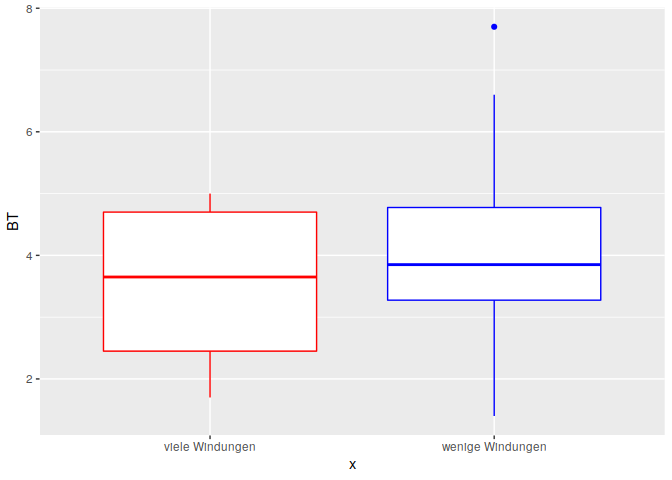

Gruppenunterschiede testen
==========================

Parametrische Verfahren
-----------------------

Wenn wir normalverteilte Daten haben, können wir andere Testverfahren nutzen, um auf Gruppenunterschiede zu testen. Diese Tests sind in der Regel "schärfer", d.h. genauer, als die non-parametrischen Verfahren, weswegen ihnen der Vorzug gegeben werden sollte, wenn es geht. Als erstes muss also immer getestet werden, ob eine Normalverteilung der Daten in beiden Gruppen vorliegt.

### F-Test

Der F-Test vergleicht die Varianzen von metrischen Variablen. Sollten wir "Varianzgleichheit" haben, können wir nachfolgend den t-Test machen. Haben wir dies nicht, muss uns ein KS-Test oder U-Test genügen.

Wir wissen von letzte mal, dass die Dicke des Bogens (Bow Thickness - BT) der Fibeln normalverteilt sind. Jetzt wollen wir untersuchen, ob die Fibeln mit besonders vielen Windungen (Coils) und die mit weniger sich in der Dicke des Bogens unterscheiden. Könnte ja gut sein. Wir laden also die Daten (1.) und unterteilen den Datensatz in die beiden Gruppen (mit weniger als 7 und über 6 Windungen, 2.), testen auf Normalverteilung (3.) und wenden dann den F-Test an (4.).

Die Nullhypothese sagt: Es gibt keinen Unterschied zwischen der Varianzen der beiden Gruppen. Die Alternativhypothese sagt: Die Varianzen der beiden Gruppen unterscheiden sich signifikant.

``` r
# 1. Daten laden:
library(archdata)
data("Fibulae")

#2. Daten unterteilen
Fib_6c <- subset(Fibulae, Fibulae$Coils < 7)
Fib_7c <- subset(Fibulae, Fibulae$Coils > 6)

#3. Test auf Normalverteilung
shapiro.test(Fib_7c$BT)
```

    ## 
    ##  Shapiro-Wilk normality test
    ## 
    ## data:  Fib_7c$BT
    ## W = 0.90969, p-value = 0.4808

``` r
shapiro.test(Fib_6c$BT)
```

    ## 
    ##  Shapiro-Wilk normality test
    ## 
    ## data:  Fib_6c$BT
    ## W = 0.96166, p-value = 0.4252

``` r
#4. F-Test
var.test(x = Fib_7c$BT,
         y = Fib_6c$BT,
         alternative = "two.sided")
```

    ## 
    ##  F test to compare two variances
    ## 
    ## data:  Fib_7c$BT and Fib_6c$BT
    ## F = 0.97724, num df = 3, denom df = 25, p-value = 0.8384
    ## alternative hypothesis: true ratio of variances is not equal to 1
    ## 95 percent confidence interval:
    ##   0.2645287 13.7942045
    ## sample estimates:
    ## ratio of variances 
    ##          0.9772414

Das Ergebnis des F-Tests gibt uns den F-Wert ( 0.977). Wir erinnern uns: Je näher er an 1 ist, desto eher liegt Varianzgleichheit vor. dann werden uns die Freiheitsgrade (df) für beide Datensätze angezeigt und der p-Wert (0.838). Der p-Wert gibt die Irrtumswahrscheinlichkeit, wenn wir die Alternativhypothese akzeptieren. Diese wird uns noch einmal genannt: "alternative hypothesis: true ratio of variances is not equal to 1". Das heißt, wir sollten hier die Nullhypothese annehmen, die besagt, dass es keinen Unterschied in der Varianz der beiden Gruppen gibt. Dann wird uns ein 95%-Konfidenzintervall angezeigt. Hier sehen wir eine große Spannbreite, wie groß das Varianzverhältnis vermutlich ist. Das ist in diesem Fall sehr groß, was bedeutet, dass wir kein sehr sehr sicheres Ergebnis haben. Das liegt v.a. daran, dass in der Gruppe mit den vielen Windungen nur sehr wenige Fibeln liegen. Am Ende wird noch einmal gesagt, wie das Verhältnis der beiden Varianzen innerhalb unserer Stichprobe ist.

Das ist kein perfektes Ergebnis, aber als Illustration reicht es.

Jetzt können wir damit den T-Test berechnen.

### t-test

Wir testen jetzt, ob sich die Mittelwerte so weit unterscheiden, dass wir von zwei unterschiedlichen Gruppen ausgehen können:

``` r
t.test(x = Fib_7c$BT,
         y = Fib_6c$BT,
         alternative = "two.sided")
```

    ## 
    ##  Welch Two Sample t-test
    ## 
    ## data:  Fib_7c$BT and Fib_6c$BT
    ## t = -0.6811, df = 4.007, p-value = 0.5331
    ## alternative hypothesis: true difference in means is not equal to 0
    ## 95 percent confidence interval:
    ##  -2.907578  1.761425
    ## sample estimates:
    ## mean of x mean of y 
    ##  3.500000  4.073077

Es wurde ein Welch-Test durchgeführt. Dies macht R automatisch, wenn er die Varianzgleichheit in den Grundgesamtheiten nicht sicher feststellen kann.

Die Nullhypothese ist: Es gibt keinen Unterschied zwischen den beiden Gruppen. Die Alternativhypothese ist: Es gibt einen Unterschied zwischen den beiden Gruppen.

Es wird der t-Wert genannt, die Freiheitsgrade und der p-Wert (0,53). Der p-Wert gibt die Wahrscheinlichkeit an, dass wir uns irren, wenn wir die Alternativhypothese ("alternative hypothesis: true difference in means is not equal to 0") annehmen. Außerdem wird uns ein Konfidenzintervall genannt und in welchem Bereich die beiden Mittelwerte aus den Stichproben liegen.

Der p-Wert erlaubt es uns wieder nicht, die Alternativhypothese sicher anzunehmen. Die beiden Gruppen unterscheiden sich nicht in der Dicke des Bogens.

Tcha. Das passiert manchmal. Tatsächlich haben wir in der Archäologie selten normalverteilte Daten. Deswegen sind der Mann-Whitney-Test und der K-S-Test wichtiger für uns.

Wir können uns das noch einmal als Boxplotdiagramm visualisieren:

``` r
library(ggplot2)

#man kann mit ggplot einfach mehrere Datensätze zusammen in einem Plot "übereinanderschreiben"

ggplot()+
  geom_boxplot(data = Fib_6c, aes(y = BT, x = "wenige Windungen"), col = "blue")+ 
  geom_boxplot(data = Fib_7c, aes(y = BT, x = "viele Windungen"), col = "red")
```



``` r
# tricksen: damit die beiden Boxplots sich nicht überlagern, gebe ich als x einfach eine Bennung an.
```

Wie man sieht, sind die beiden Medianwerte fast exakt gleich und der Quartilsabstand überlappt sich fas komplett. Als allgemeiner Tipp: Immer erst die Daten visualisieren, um herauszufinden, ob es sich lohnt, Teste laufen zu lassen. Wenn ich die Boxplots zuerst gesehen hätte, wäre mir klar gewesen, dass es sehr wahrscheinlich keinen unterschied zwischen den beiden Gruppen gibt.

Übungen!
========

So, Zeit, die Test-Verfahren einzuüben.

Arbeiten Sie bitte die folgenden vier Aufgaben in einem neuen RMD-Dokument durch. Gern können Sie sich in Ihren Gruppen beraten. Achten Sie darauf, dass das RMD-Dokument "knittable" ist, d.h., dass alle Pakete geladen werden, die Sie brauchen. Legen Sie im YAML-Header den Titel, Ihren Namen und als Output html fest.

Das vollständige RMD-Dokument mit Aufgabenstellung, Code und Interpretation geben Sie mir bitte bis nächste Woche ab.

1. Aufgabe:
-----------

Gibt es einen signifikanten Unterschied zwischen der Höhe protoappeninischen und subapppenischen bronzezeitlichen Tassen? Testen Sie die beiden Gruppen auf Normalverteilung, wenden Sie die passenden Testverfahren an und interpretieren Sie das Ergebnis!

``` r
data("BACups")
```

2. Aufgabe:
-----------

Randdurchmesser durch Schulterdurchmesser ist ein häufig genutztes Verhältnismaß, um zu schauen, ob Gefäße sich schließen (dann ist der Randdurchmesser geringer als der Schulterdurchmesser, d.h. das Verhältnis ist &lt; 1) oder ob sie sich öffnen (dann ist der Randdurchmesser größer als der Schulterdurchmesser, d.h. das Verhältnis ist &gt; 1).

In R können wir für die bronzezeitlichen Tassen einfach eine weitere Spalte hinzufügen, und das Verhältnis ausrechnen:

``` r
BACups$RDSD <- BACups$RD / BACups$SD
```

Visualisieren Sie das neue Verhältnismaß RDSD nach Phase getrennt. Haben Sie Anhaltspunkte dafür, dass es Unterschiede zwischen den beiden Phasen gibt?

Testen Sie, ob es Unterschiede zwischen den beiden Phasen gibt und interpretieren Sie das Ergebnis!

3. Aufgabe
----------

Ein weiteres Verhältnismaß kann uns etwas darüber aussagen, ob die Gefäße gedrungen oder schlank sind: Das Verhältnis von Höhe zu der breitesten Stelle des Gefäßes. Jetzt haben wir drei Maße, an denen der Durchmesser des Gefäßes gemessen wurde: Randdurchmesser (RD), Schulterdurchmesser (SD) und Nackendurchmesser (ND). Um den größten dieser Werte herauszufinden wenden wir eine Schleife an. Schleifen sind programmiertechnische Tricks, um einen Befehl mehrmals zu wiederholen, ohne sie mehrmals schreiben zu müssen.

Hier sagen wir: für jede Zahl i (\* for (i in*) von 1 bis (*c(1:)*) "so viele wie Zeilen im Datensatz BACups sind" (*nrow(BACups) ))*) tu das Folgende (das was in geschweiften klammern steht): Finde den größten Wert (*max()*) für die Zeile i in den Spalten RD, SD und ND heraus (*jeweils \[i\]*) und schreibe ihn in der Zeile i in die Spalte maxD hinein (* BACups$maxD\[i\] &lt;- \*).

``` r
for (i in c(1:nrow(BACups))) {
  BACups$maxD[i]  <- max(BACups$RD[i], BACups$SD[i], BACups$ND[i])
}
```

Wenn Sie das erfolgreich ausgeführt haben, haben Sie jetzt eine Spalte maxD. Visualisieren Sie bitte für beide Phasen, ob es Unterschiede in dem maximalen Durchmesser der Gefäße der beiden Phasen gibt.

Als Gedrungenheitsmaß müssen Sie jetzt noch das Verhältnis von maxD und H berechnen (analog zu dem Verhältnis Randdurchmesser zu Schulterdurchmesser oben). Testen Sie anschließend, ob es Unterschiede in der Gedrungenheit der Gefäße der beiden Phasen gibt! Wie können Sie das Ergebnis interpretieren?

4. Aufgabe
----------

Als letztes untersuchen wir, ob es Unterschiede in der Nackenhöhe der Gefäße der zwei Phasen gibt. Bitte Visualisieren Sie diese, wenden einen geeigneten Test an und interpretieren Sie das Ergebnis.
