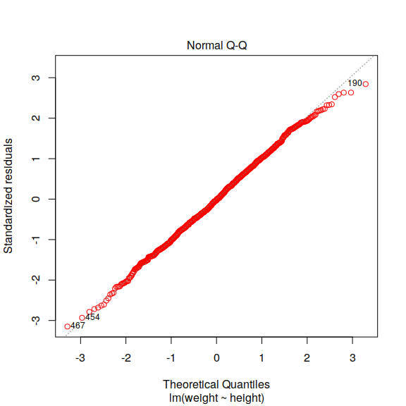
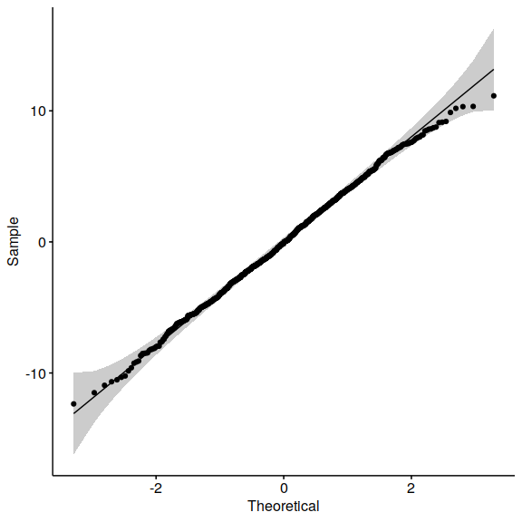
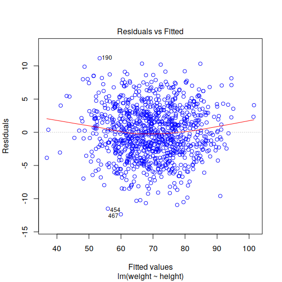
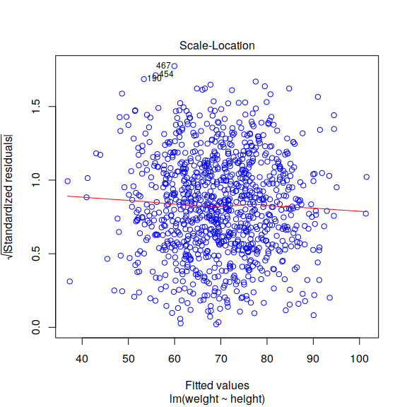
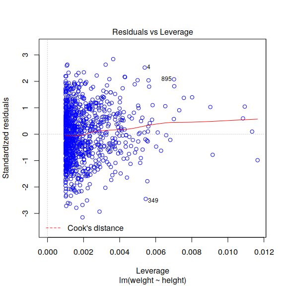
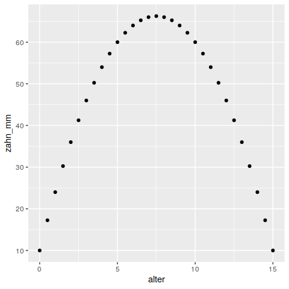
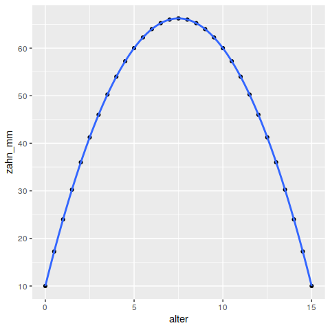
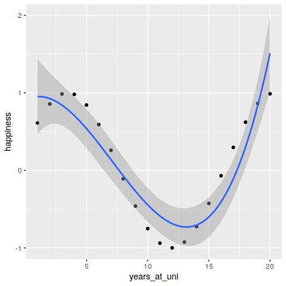

Pakete für heute:

``` r
library(dplyr)
library(tidyr)
library(ggplot2)

library(archdata)
```

Korrelation
===========

Um Zusammenhänge zu erfassen, gibt es für jedes Skalenniveau unterschiedliche Methoden:

-   für nominale Daten: Cramérs V

-   für ordinale Daten: Kendalls Tau und Spearmans Rho

-   für metrische Daten: Pearson-Bravais r

### Kendalls Tau

Rechnen wir doch einfach das Bsp aus der Präsentation nach: Wir haben einen Datensatz mit 4 Siedlungen, deren Anzahl von Öfen und Größe. Wir brauchen für den Test zwei Vektoren, die in der richtigen Reihenfolge diese beiden Wertereihen darstellen:

``` r
ha <-  c(2, 1, 4, 1.5)
nOfen <-  c(6, 9, 15, 3)
```

Jetzt geben wir diese in die Korrelationstestfunktion ein. R wählt automatisch die benötigte Version (a ist standard und b, wenn es Bindungen gibt). Über "alternative" kann man definieren, ob man schon glaubt, dass die erste oder zweite Gruppe größere Ränge einnimmt als die andere. Wir testen "two.sided", d.h. wir wissen das nicht:

``` r
 cor.test(ha, nOfen, method = "kendall", alternative = "two.sided")
#> 
#>  Kendall's rank correlation tau
#> 
#> data:  ha and nOfen
#> T = 4, p-value = 0.75
#> alternative hypothesis: true tau is not equal to 0
#> sample estimates:
#>       tau 
#> 0.3333333
```

Sie mal einer an! Nicht verrechnet!

Ein letztes Wort zu Kendalls Tau: Wenn man sehr viele Daten hat (sehr lange Vektoren), die man testen möchte, kann die Berechnung recht lange dauern (da ja jedes Paar gegeneinander getestet werden muss). Sollte das zu einem Rechnerabsturz oder so führen, informiert euch über Spearmans Rho (z.B.: <https://www.crashkurs-statistik.de/spearman-korrelation-rangkorrelation/>), der ist eigentlich wie der folgende (Pearson und Bravais r), aber an Rängen wie Kendalls Tau und geht deshalb auch mit ordinalen Daten. Er gilt als "weniger genau", aber für große Datensätze besser geeignet.

Der Code ist simpel:

``` r
 cor.test(ha, nOfen, method = "spearman", alternative = "two.sided")
#> 
#>  Spearman's rank correlation rho
#> 
#> data:  ha and nOfen
#> S = 6, p-value = 0.75
#> alternative hypothesis: true rho is not equal to 0
#> sample estimates:
#> rho 
#> 0.4
```

Jetzt aber geht es noch um metrische Daten:

Pearson und Bravais' R
----------------------

Für diesen Test können wir den gleichen Befehl nutzen, müssen nur die Methode ändern. Und den Datensatz, denn mit Vektoren der Länge 4 ist der Pearson-und Bravais' R nicht glücklich.

Nehmen wir doch also einfach die Bogenhöhe und Bogendicke der Fibeln im "Fibulae" - Datensatz.

Wir müssen zuerst die Voraussetzungen testen. Also: Sind die beiden Variablen für sich genommen normalverteilt?

``` r
data("Fibulae")

shapiro.test(Fibulae$BT)
#> 
#>  Shapiro-Wilk normality test
#> 
#> data:  Fibulae$BT
#> W = 0.97135, p-value = 0.5769
shapiro.test(Fibulae$BH)
#> 
#>  Shapiro-Wilk normality test
#> 
#> data:  Fibulae$BH
#> W = 0.94244, p-value = 0.1058
```

Ja, das sind sie. Sehr gut, nun können wir den r-Wert berechnen:

``` r
cor.test(Fibulae$BT, Fibulae$BH, method = "pearson", alternative = "two.sided")
#> 
#>  Pearson's product-moment correlation
#> 
#> data:  Fibulae$BT and Fibulae$BH
#> t = 3.9535, df = 28, p-value = 0.000476
#> alternative hypothesis: true correlation is not equal to 0
#> 95 percent confidence interval:
#>  0.3037634 0.7887258
#> sample estimates:
#>       cor 
#> 0.5985314
```

Das Ergebnis sagt uns folgendes:

Der p-Wert ist sehr sehr klein (p = 0,000476); er wird über eine Testgröße t berechnet, die den Wert 3,95 hat. Der Freiheitsgrad (df) hat den Wert 28.

Das 95%-Konfidenzintervall sagt, dass der R-Wert in der GG mit 95% Wahrscheinlichkeit zwischen ~ 0,3 und ~0,8 liegt.

Der in diesem Test errechnete Korrelationskoeffizient ist ~ 0,6.

Wir haben also einen sehr sicheren und einen mittleren bis starken Zusammenhang zwischen Bogendicke und -höhe.

Applaus!

Jetzt erstellen wir noch eine Linare Regression daraus:

Regression
==========

Eine Regression legt eine "best-fit"-Linie zwischen die Punkte. Sie soll möglichst gut den Punktverlauf abbilden.

Lineare Regression
------------------

Die Berechnung in R erfolgt sehr einfach mit dem Befehl `lm` (= "linear model"). So ein Modell wird häufig "fit" genannt ("Passung").

``` r
fit <- lm(BH ~ BT, data = Fibulae) # Berechnung: 1. Variable ist die abhängige Variable, 2. Variable die "vorhersagende" Variable
```

Schaut man sich dieses Modell dann einmal mit `summary` an, erhält man eine ganze Reihe an Informationen:

``` r
summary(fit)
#> 
#> Call:
#> lm(formula = BH ~ BT, data = Fibulae)
#> 
#> Residuals:
#>     Min      1Q  Median      3Q     Max 
#> -5.9146 -2.2994 -0.6297  2.5791  8.2754 
#> 
#> Coefficients:
#>             Estimate Std. Error t value Pr(>|t|)    
#> (Intercept)  10.2606     1.6912   6.067 1.53e-06 ***
#> BT            1.5611     0.3949   3.953 0.000476 ***
#> ---
#> Signif. codes:  0 '***' 0.001 '**' 0.01 '*' 0.05 '.' 0.1 ' ' 1
#> 
#> Residual standard error: 3.329 on 28 degrees of freedom
#> Multiple R-squared:  0.3582, Adjusted R-squared:  0.3353 
#> F-statistic: 15.63 on 1 and 28 DF,  p-value: 0.000476
```

Erst einmal wird wiederholt, wie das Modell berechnet wurde, dann gibt es einen Überblick über die Residuen und Werte wie die Schätzung des Y-Achsenabschnitts und des Steigungswinkels. Daraus kann man sich selber schon die Formel für die Regressionslinie ableiten:

`y = 10.3 + 1.56 * x`

Außerdem finden wir den Hinweis auf die Standardabweichung, den t-Wert und die Irrtumswahrscheinlichkeit für diese beiden Werte. Sowie die Standardabweichung der Residuen, den R²-Wert und dessen Wahrscheinlichkeit (mit einem F-Test getestet).

Die lineare Regression zu visualisieren ist in R ziemlich einfach. Ich kann einem Streudiagramm den `geom_smooth`-Befehl mit der Methode "lm" (linear model) hinzufügen. Der Befehl "se = FALSE" sagt aus, dass ich jetzt gern *kein* Konfidenzintervall (standard error) dazu visualisieren möchte.

``` r
ggplot(data = Fibulae)+
  geom_point(aes(x = BT, y = BH))+
  geom_smooth( aes(x = BT, y = BH), method = "lm",
              se = FALSE)
```


Einfach oder?

Dieses Diagramm können wir jetzt noch ein bisschen verbessern. Wir könnten

1.  doch das Konfidenzintervall angeben

2.  dazuschreiben, wie diese Linie mathematisch beschrieben werden kann und angeben, wie der R²-Wert der Linie aussieht.

Also, fangen wir an mit 1.:

``` r
ggplot(data = Fibulae)+
  geom_point(aes(x = BT, y = BH))+
  geom_smooth( aes(x = BT, y = BH), method = "lm",
              se = TRUE)
```

 Denkbar einfach.

Schauen wir uns doch einmal an, wie diese Linie mathematisch beschrieben werden und zusammen mit dem R²-Wert dem plot hinzugefügt werden kann.

Wir brauchen dafür das Paket `ggpmisc`. Bitte installiert es!

Dann fügen wir dem bisherigen Plot (am besten ihr kopiert das bisherige einfach mit strg+c und strg+v) den Befehl `stat_poly_eq` hinzu. `Stat_poly_eq` kann die Statistik der *equation* (Formel) einfügen. Dafür braucht es erst einmal noch die Eingabewerte der Regression (`x =` und `y =` ), dann die Information, welcher Text als "label" in den Graphen hinzugefügt werden soll: `paste` (füge ein) die Formel (`..eq.label..,`) und den R²-Wert (`..adj.rr.label..`) und separiere die beiden mit vier Leerzeichen (symbolisiert durch die Tilde). Formula sind eine bestimmte Art von Objekten in R. An dieser Stelle sagt man mit `formula = y~x`, dass y die abhängige Variable sein soll. `parse = TRUE` bedeutet "ja bitte schreib es hin" und `size` gibt die Schriftgröße an. `label.y.npc` platziert die Schrift und zwar auf der y-Achse nach Prozent (also in diesem Fall bei 95% der Y-Achse).

``` r

library(ggpmisc)

ggplot(data = Fibulae)+
  geom_point(aes(x = BT, y = BH))+
  geom_smooth( aes(x = BT, y = BH), method = "lm",
              se = TRUE)+
  stat_poly_eq(aes(x = BT, y = BH, label =  paste(..eq.label.., 
                                  ..adj.rr.label..,
                                  sep = "~~~~")),
               formula = y~x, # y sei die abhängige Variable
               parse = TRUE,
               size = 3,
               label.y.npc = 0.95)
```


Cool oder?

### Residualanalyse

Wie in der Vorlesung erwähnt, muss die Verteilung der Residuen bei einer linearen Regression bestimmte Voraussetzungen erfüllen. Dies testen wir jetzt in einem zweiten Schritt.

Mit dem Befehl von oben `summary(fit)` konnten wir auch schon ein paar Informationen zu den Residuen abfragen. Hier gab es den Minimalwert (Min), das 1. Quartil (1Q), den Median, das 3. Quartil (3Q) und den Maximalwert (Max), die einen Hinweis darauf geben, ob die Residuen normalverteilt sind.

Außerdem gibt es noch ein paar andere Möglichkeiten, die Residuen zu analysieren.

Den Q-Q-plot (genau wie bei dem Test auf Normalverteilung), dann einen Plot, der die Residuen zu den vorhergesagten Werten vergleicht, um deren Verteilung zu zeigen, ein Plot, anhand dessen man die Homoskedastizität überprüfen kann und ein letzter Plot, der für die best-fit-Linie besonders einflussreiche Punkte identifiziert.

All diese Plots werden mit der base - Funktion `plot` aufgerufen.

#### 1. Normalverteilung der Residuen

Der Q-Q-plot: Wenn die plot-Funktion auf eine lineare Regression aufgerufen wird, kann man mit `which =` bestimmen, welche Teile jetzt genau dargestellt werden sollen. `which = 2` erstellt ein Q-Q-plot. Mit `col = "red"` färben wir die Punkte rot ein.

``` r
plot(fit, which=2, col=c("red"))  # Q-Q Plot
```



Natürlich kann man das auch so testen, wie wir es bei der Normalverteilung gelernt haben:

``` r
library(ggpubr)
ggqqplot(fit$residuals)
```



Das gibt vielleicht ein bisschen publizierbareres Plot. Der Vorteil der `plot`-Funktion von `base` ist, dass die Achsen schon beschriftet sind und es schneller geht, wenn man nur intern gucken möchte, wie das Ergebnis aussieht.

Aber sieht gut soweit aus! Die Residuen sind normalverteilt.

#### Residuen und vorhergesagte Werte (residuals vs fitted)

Wenn wir die Residuen mit den vorhergesagten Werten vergleichen, können wir sehen, ob die Residuen einem bestimmten Muster folgen. Das Ziel ist hier, dass sie das nicht tun, also möglichst gleich verteilt sind.

Schauen wir uns das an:

``` r
plot(fit, which=1, col=c("blue")) # Residuals vs Fitted Plot
```



Die rote Linie zeigt eine Regression zwischen den Residuen und den vorhergesagten Werten. Das "Ziel" für eine gute lineare Regression ist, dass sie auf der 0-Achse liegt. Auch wenn es hier eine leichte Kurve gibt, liegt sie aber doch ziemlich nahe dran und ergibt kein distinktives Muster (zB eine Sinuskurve). Das zeigt, dass die Residuen halbwegs gleichmäßig verteilt sind und damit eine Voraussetzung für die lineare Regression erfüllt ist.

#### "Scale-Location"

Hier schauen wir, ob die Homoskedastizität gegeben ist, d. h. die Varianz der Residuen entlang der Regressionslinie etwa gleich bleibt.

Der Plot wird mit `which = 3` aufgerufen:

``` r
plot(fit, which=3, col=c("blue"))  # Scale-Location Plot
```



Hier sollten die Punkte gleichmäßig in beide Richtungen der roten Linie streuen.

Ein gutes und ein schlechtes Beispiel wären diese:

 Das gute links, halbwegs gleichmäßig verteilte Residuen und das schlechte rechts, wo die Residuen in der linken Ecke deutliich näher an der roten Linie liegen als weiter rechts, wo sie mehr streuen (Bildquelle und empfehlenswerte Anleitung: <https://rpubs.com/iabrady/residual-analysis> ).

#### Residuen gegen Ausreißer

Mit diesem Plot kann man die einflussreichen Punkte des Datensatzes bestimmen. Ein einflussreicher Punkt ist einer, der wenn er entfernt / hinzugetan wird, die Regressionslinie signifikant verändert. Dafür wird die "Cook'sche Distanz" berechnet, ein Maß für den Einfluss eines Punktes und die Grenzen für eine "Unbedenklichkeit" im plot mit roten gestrichelten Linien angezeigt. Liegen Punkte außerhalb dieser "Grenze" (der Markierung), sollte betrachtet werden, welche Rolle sie im Datensatz spielen.

``` r
plot(fit, which=5, col=c("blue")) 
```



Alle unsere Punkte und die rote Linie liegen innerhalb der gestrichelten "Cook's distance". Insofern gibt es hier keine Probleme.

Wir können also festhalten: Eine Lineare Regression ist für die Beschreibung der Abhängigkeit der Bogenhöhe von der Bogendicke der Fibeln aus Münsingen-Rain ist zulässig. Die Regression kann ungefähr (R² = ~ 0,34) schätzen, wie hoch ein Bogen sein wird, wenn wir seine Dicke kennen.

Nicht-lineare Regression
------------------------

In der VL gab es das Beispiel für eine nicht-lineare Regression mit dem Alter der Schafe und der Größe der Zähne. Nicht-lineare Zusammenhänge können durch polynomiale Funktionen beschrieben werden, die dem Schema:

$ y = a + b\_1*x + b\_2*x² + b\_3\*x^3 ...$

folgen. Natürlich lassen sich auch solche Regressionsanalysen in R berechnen.

Nehmen wir als Bsp fiktive Schafszähne und nehmen das Alter der Schafe alle halbe Jahre in Jahren auf, sowie die Zahngröße in mm. Ich simuliere dafür jetzt Daten:

``` r
alter <- seq(0,15, 0.5) # Reihe von Werten von 0 bis 15 in 0,5-er Schritten
zahn_mm <- 10 + 15*alter - alter^2  # ich simuliere eine Polynom-Funktion für die Abfolge von mm Angaben

schafe <- data.frame(alter, zahn_mm) # zusammen in einen Dataframe

ggplot()+
  geom_point(data = schafe,
             aes(x = alter,
                 y = zahn_mm))
```



Auf den ersten Blick sieht man, dass man diese Daten NICHT mit einer linearen Funktion schätzen kann, aber mit einer nicht-linearen Funktion. Dafür nehme ich wieder das `linear model`, aber definiere die Formel nicht einfach als `y ~ x` wie vorher, sondern gebe eine polynomial-Formel, eine einfache quadratische Funktion (mit einem x²) passt hier am besten: `y ~ x + I(x^2))` . Auch hier muss erst die Berechnung des Modells einer Variablen zugewiesen werden und dann kann man sich wieder das Ergebnis zusammenfassen lassen:

``` r
fit <- lm(zahn_mm ~ alter + I(alter^2), data = schafe) 


summary(fit)
#> 
#> Call:
#> lm(formula = zahn_mm ~ alter + I(alter^2), data = schafe)
#> 
#> Residuals:
#>        Min         1Q     Median         3Q        Max 
#> -2.774e-14 -4.283e-15  2.220e-16  3.836e-15  6.020e-14 
#> 
#> Coefficients:
#>               Estimate Std. Error    t value Pr(>|t|)    
#> (Intercept)  1.000e+01  7.251e-15  1.379e+15   <2e-16 ***
#> alter        1.500e+01  2.238e-15  6.703e+15   <2e-16 ***
#> I(alter^2)  -1.000e+00  1.442e-16 -6.937e+15   <2e-16 ***
#> ---
#> Signif. codes:  0 '***' 0.001 '**' 0.01 '*' 0.05 '.' 0.1 ' ' 1
#> 
#> Residual standard error: 1.434e-14 on 28 degrees of freedom
#> Multiple R-squared:      1,  Adjusted R-squared:      1 
#> F-statistic: 2.406e+31 on 2 and 28 DF,  p-value: < 2.2e-16
```

Da die Daten hier vorher mit genau einer solchen Formel berechnet wurden,ist natürlich das Konfidenzintervall extrem schmal. R sagt uns auch "essentially perfect fit: summary may be unreliable", hat also mitbekommen, dass da irgendetwas komisch ist. ;-)

Wir können uns das Ergebnis auch wieder visualisieren, wie bei einer linearen Regression:

``` r

library(ggplot2)
ggplot(data = schafe,
             aes(x = alter,
                 y = zahn_mm))+
  geom_point()+
    stat_smooth(method = "lm", formula = y ~ x + I(x^2))
```



Und all die anderen Dinge tun, die wir mit linearen Regressionen getan haben (v.a. Residualanalyse!).

Bei den simulierten Daten ist dies allerdings ein wenig witzlos...

### x³

Die polynomen Gleichungen können immer komplexer werden.

Nehmen wir ein kleines witziges Beispiel nach dem Comic von Jorge Cham: 

Ich konstruiere also einmal "wild" Zahlen mithilfe der Kosinusfunktion, um das abzubilden und versuche dann diese Werte mit einer Funktion zu schätzen, die der Formel $ y = x + x^2 + x^3$ folgt:

``` r
years_at_uni <- seq(1,20,1)
happiness <- cos(years_at_uni/2.7 + 5)

phd <- as.data.frame(cbind(years_at_uni,happiness))

ggplot(data = phd,
             aes(x = years_at_uni,
                 y = happiness))+
  geom_point()+
    stat_smooth(method = "lm", formula = y ~ x + I(x^2) + I(x^3))
```

 Bei solchen Verteilungen kann es durchaus sinnig sein, eine komplexe Funktion anzunehmen, da wir inhaltlich verstehen, warum die Werte erst sinken und dann wieder steigen.

Man muss dabei jedoch das Thema "overfitting" beachten:

### overfitting

Mit Polynomen und trigonometrischen Funktionen lassen sich unheimlich viele und unterschiedliche Wertereihen abbilden. Diese Funktionen können manchmal deutlich "bessere" Beschreibungen von den Verteilungen sein, die wir beobachten als zB eine lineare Regression (also höherer R²-Wert, kleinere Residuen etc). Man muss jedoch vorsichtig sein, dass man damit nicht "über das Ziel hinausschießt". Eine perfekte Anpassung mit 3 oder 4 "x hoch-Teilen" in der Gleichung mag möglich sein, aber was bedeutet das? Aus welcher Logik folgend sind die Beziehungen zwischen x und y so komplex? Und, ganz wichtig: Wenn ein paar Werte aus meiner Analyse herausfallen oder ein paar neue hinzukommen: Würde sich die Gleichung dann massiv ändern? Wenn ja, ist das ein guter Hinweis auf das "overfitting", die Über-Anpassung der mathematischen Gleichung an genau diesen einen Datensatz. Da wir aber mit Stichproben arbeiten, kann eine perfekte Anpassung an diese eine Stichprobe keinen Erkenntnisgewinn für die Grundgesamtheit bringen, wenn die veränderung weniger Werte die Gleichung verändern würde.

Würde ich die Person aus dem Comic von Jorge Cham die nächsten 30 Jahre weiter befragen, würden irgendwann die "happiness"-Werte vermutlich wieder sinken, da man dann als grauhaarige Professorin vllt nicht mehr mit einer Doktorandin verwechselt werden möchte. Und dann würde die Funktion *y* = *x* + *x*<sup>2</sup> + *x*<sup>3</sup> wieder nicht passen, ich bräuchte eine neue.

Herzlichen Glückwunsch!
=======================

Das war das Methodenrepertoire der Quantitativen Methoden-Übung.

Ihr könnt jetzt: verschiedene Skalenniveaus auseinander halten, Daten aufnehmen, Daten in R importieren, in R damit Grafiken erstellen, Lagemaße berechnen und Tests auf Gruppenunterschiede und Zusammenhänge von Variablen durchführen. Das ist echt ordentlich! Knallhart wissenschaftliches Arbeiten und so.

Damit die Umsetzung in der Zukunft klappt, noch einmal eine Übungsaufgabe:

Hausaufgabe
-----------

1.  Erstellen Sie sich ein neues R-Projekt.

2.  In diesem Projekt legen Sie die Daten Bsp\_Graeber.csv im "analysis/data/raw\_data/"-Ordner ab (Sie finden sie in ILIAS im Ordner "Daten").

3.  In ihrem "paper.Rmd" laden Sie die Daten mit einem relativen Pfad ein `read.csv2("../data/data_raw/Bsp_Graeber.csv", row.names = "X"` (erweitern Sie diesen Code mit der Zuweisung auf eine Variable ihrer Wahl).

In diesem Datensatz gibt es die folgenden Variablen:

-   id = Grabnummer

-   sex = Geschlechtsbestimmung am Skelett

-   age = Altersbestimmung am Skelett

-   height = geschätzte Körpergröße des Verstorbenen

-   grave.depth = geschätzte Originaltiefe des Grabes

-   grave.mound = Vorhandensein eines Grabhügels (ja oder nein)

-   site = Fundort (CCCC oder JSSFP)

-   arrow.points = Anzahl von beigegebenen Pfeilspitzen

-   pottery.pieces = Anzahl der beigegebenen Keramikgefäße

-   bronze.bracelets = Anzahl der beigegebenen bronzenen Armringe

1.  In Ihrer paper.Rmd bearbeiten Sie bitte die folgenden Fragen:

4.1. Visualisieren Sie die Altersverteilung auf beiden Gräberfeldern, so dass sie diese vergleichen können! Was fällt auf?

4.2. Gibt es einen Zusammenhang zwischen der Fundstelle (site) und ob die Bestattung einen Grabhügel hat (grave.mound)? Testen Sie!

4.3. Gibt es auf einem der beiden Gräberfelder (site) häufiger die Beigabe von bronzenen Armringen (bronze.bracelets)? Testen Sie!

4.4. Über beide Gräberfelder: Sind die Körpergrößen der Frauen und Männer unterschiedlich? Testen Sie!

4.5. Gibt es einen Zusammenhang zwischen der Körperhöhe und der Grabtiefe im Gesamtdatensatz? Berechnen Sie eine Korrelation und einen passende Regression. Überprüfen Sie alle Voraussetzungen!

**Bitte geben Sie mir das gesamte R-Projekt als zip-Datei ab. Ob die RMD dabei in eine docx, html oder pdf umgewandelt wird, ist mir egal, sie sollte aber erfolgreich umgewandelt werden können.**
