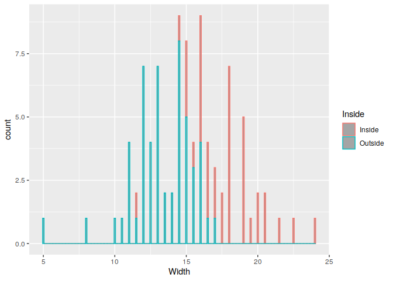
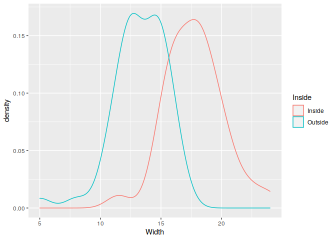
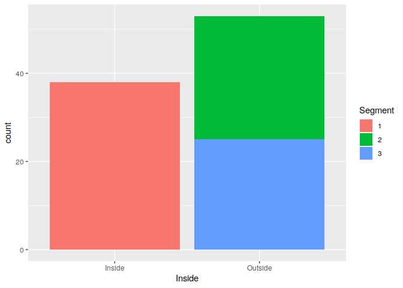
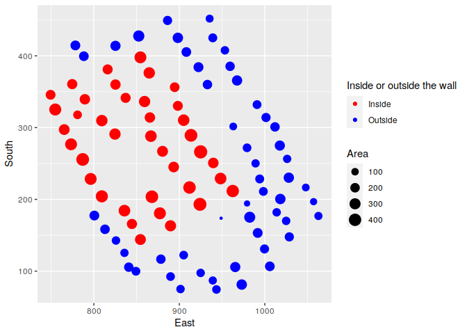

# Saving and loading data

R is able to work with a lot of data formats, but it’s always best to
save the data in the end in an Rdata-format.

## Load data

Let’s focus on the most important tabular data formats for now.

1.  CSV-data:

comma-separated values, these are text files, in which columns are
seperated by commas. This is the easiest and most versatile data format.
I recommend using it for long term data storage.

The code to read a csv and give it’s content to a variable is:

`mydata <- read.csv2("path/to/my/data/mydata.csv")`

AS WE NOW KNOW the PERFECT data structure, we put our data in the
analysis/data/raw_data folder.

In our great and amazing paper.Rmd we can use this simplified relative
path to our data set:

`mydata <- read.csv2("../data/raw_data/mydata.csv")`

for example

`BACups <- read.csv2("../data/raw_data/BACups.csv")`

1.  Excel-data:

We need a new R pacakge to load in excel-data. It is called `xlsx`:

    install.packages("xlsx")
    library(xlsx)

Now we can load the data like this:
`mydata <- read.xlsx("path/to/my/data/myexcel.xlsx", sheet = 1)`,
`sheet = 1` is an argument, that tells R, to use the first sheet in the
excel file (you know, it can have different table sheets). You can also
use the name of the sheet:

`mydata <- read.xlsx("c:/...path.../myexcel.xlsx", sheetName = "mysheet")`

REMEMBER: wen can use the beautiful short relative path, because we put
our data in the data/raw_data folder:

`mydata <- read.xlsx("../data/raw_data/mydata.xlsx, sheet = 1)`

1.  RData

RData-data can be loaded with an easy `load()`-command. I recommend
creating an Rdata file always after you’ve done some changes to your
data set and want to continue working with it. Rdata is loaded much
faster and it will have all the changes you already implemented in
there.

Just remember to save it in the derived_data folder so you can load it
via:

    load("../data/derived_data/dataBACups.Rdata")

Did you notice something?

You don’t have to give a variable name! This is saved in the Rdata
format. If you load csv or xslx files you will always have to “name” the
resulting data frame. Not so for Rdata data.

## Saving data

1.  CSV data:

To write a csv-file you can give this simple command:

     write.csv(data, "path/to/save/to/data.csv")

But remember we got the great relative path:

`write.csv(data, "../data/derived_data/data.csv")`

1.  Excel data

We use the same package as above for loading excel files:

    library(xlsx)

Than we can use more or less the same syntax again:

    write.xlsx(data, "path/to/save/to/data/data.xls, sheetName = "Sheet1")

or in relative path:

    write.xlsx(data, "../data/derived_data/data.xls, sheetName = "Sheet1")

1.  RData:

As mentioned before, there’s the Rdata-format, which is great for saving
a data set if you want to continue working on it. The code is simple:

`save(data, file = "../data/derived_data/data.RData")`

The first data means the variable of the data set you want to save. Then
I put the relative path which we can use from our paper file.
“data.RData” should be named something sensible for you to remember what
this data included.

## Example data

We can use an R package, which provides a number of different
archaeological data sets.

The name is “archdata”.

We install it first (remember: When installing a package you need to
quotation marks):

    install.packages("archdata")

Then we need to load it (for loading we don’t need the quotation marks):

``` r
library(archdata)
```

Now we can have a look, what’s in it, by using the help function:

    ?archdata

All the different datasets can be loaded using `data()`

``` r
data(Snodgrass)
```

Now in our environment there’s a big data set, called Snodgrass, which
describes house pits at the Mississippian Snodgrass site in Butler
County, Missouri, U.S.A..

## Some filtering

For the next step we are going to use a new compilation of packages,
which will grant us a powerful set of tools for data manipulation and
visualisation: the **tidyverse**. It consists of several packages that
work well together. It is like some kind of dialect in R. Some people
love it, others dislike it. As it makes things easier I like it. ;-)

We first need to install the packages. I will install them one by one
with you, because the “bulk download” we could do via
`install.packages("tidyverse")` would take quite long and we don’t have
time for that.

So please do:

    install.packages("dplyr")
    install.packages("magrittr")

Dplyr is the package for the filtering and grouping we will do. Magrittr
offers a special sign `%>%` which makes linking different steps easy.

After installing we need to load the package to be able to use the
functions inside

``` r
library(dplyr)
```

    ## 
    ## Attaching package: 'dplyr'

    ## The following objects are masked from 'package:stats':
    ## 
    ##     filter, lag

    ## The following objects are masked from 'package:base':
    ## 
    ##     intersect, setdiff, setequal, union

``` r
library(magrittr)
```

Let’s take the function `select` to choose columns in our Snodgrass
dataset. We could, for example want to just use the columns giving the
East and South coordinates.

`%>%` is called a “pipe” and it takes the input before it and sends it
to the next line of code. It is always at the end of an code expression.

``` r
Snodgrass %>% # send the data set Snodgrass to the next line
  select(East, # select these two columns
         South)
```

    ##        East  South
    ## 1    901.39  75.07
    ## 2    973.01  81.33
    ## 3    889.71 163.21
    ## 4    924.16 193.10
    ## 5    911.90 216.55
    ## 6    939.73 250.75
    ## 7    948.29 229.06
    ## 8    962.50 211.67
    ## 9    979.24 194.28
    ## 10   991.69 153.24
    ## 11   982.35 175.13
    ## 12   989.16 250.17
    ## 13   998.31 211.08
    ## 14   994.03 228.47
    ## 15   765.34 297.26
    ## 16   786.94 255.64
    ## 17   796.29 228.47
    ## 18   809.33 204.24
    ## 19   835.80 184.31
    ## 20   844.55 165.75
    ## 21   867.91 203.66
    ## 22   877.25 180.60
    ## 23   825.87 142.69
    ## 24   813.03 158.32
    ## 25   800.57 177.47
    ## 26   935.45 451.83
    ## 27   953.35 407.67
    ## 28   959.39 385.39
    ## 29   967.56 365.66
    ## 30  1017.58 274.98
    ## 31  1026.14 256.42
    ## 32  1047.94 216.55
    ## 33  1057.09 196.82
    ## 34  1018.16 200.53
    ## 35   932.92 359.99
    ## 36   922.41 384.22
    ## 37   908.20 405.33
    ## 38   898.27 425.06
    ## 39   854.48 397.90
    ## 40   864.80 376.21
    ## 41   894.57 356.28
    ## 42   898.27 330.29
    ## 43   905.08 310.35
    ## 44   913.65 289.25
    ## 45   866.74 288.08
    ## 46   865.57 314.07
    ## 47   859.35 336.34
    ## 48   816.14 381.09
    ## 49   837.16 341.42
    ## 50   825.29 359.99
    ## 51   824.70 291.01
    ## 52   809.33 309.77
    ## 53   789.48 339.47
    ## 54   749.38 345.72
    ## 55   754.83 325.21
    ## 56   773.32 276.74
    ## 57   774.68 360.58
    ## 58   778.38 414.51
    ## 59   788.31 399.46
    ## 60   825.29 413.92
    ## 61   835.80 125.49
    ## 62   854.48 144.06
    ## 63   878.42 116.70
    ## 64   889.71  92.47
    ## 65   943.43  74.49
    ## 66   939.14  86.99
    ## 67   924.94  97.55
    ## 68   965.42 105.75
    ## 69   999.67 130.96
    ## 70   939.14 425.06
    ## 71   852.53 427.60
    ## 72   886.21 449.29
    ## 73   963.08 301.56
    ## 74   979.24 271.86
    ## 75  1013.88 181.97
    ## 76  1024.97 170.05
    ## 77  1028.67 147.77
    ## 78  1005.90 106.73
    ## 79   990.92 332.04
    ## 80  1001.42 314.07
    ## 81  1062.73 176.89
    ## 82   893.41 245.09
    ## 83   880.37 266.97
    ## 84   924.94 266.19
    ## 85  1011.93 300.97
    ## 86  1028.09 230.23
    ## 87a  849.23  99.89
    ## 87b  840.86 105.56
    ## 88   948.88 173.76
    ## 89   905.08 122.36
    ## 90   780.91 317.78

As you can see, this works fine. We can also use `select` with rules:

``` r
Snodgrass %>%
  select_if(is.integer)
```

    ##     Points Abraders Discs Earplugs Effigies Ceramics Total Types
    ## 1        0        1     0        0        0        0     1     1
    ## 2        0        0     0        0        1        0     1     1
    ## 3        1        0     1        0        1        1     4     4
    ## 4        2        1     1        1        0        5    10     8
    ## 5        3        2     2        1        0        4    12     9
    ## 6        0        0     0        0        0        0     0     0
    ## 7        5        0     5        0        0        4    14     8
    ## 8       13        0     0        2        2       12    29    17
    ## 9        0        0     0        0        0        0     0     0
    ## 10       1        0     0        0        1        0     2     2
    ## 11       2        0     1        0        0        0     3     3
    ## 12       0        0     0        0        0        0     0     0
    ## 13       0        0     1        0        0        0     1     1
    ## 14       0        0     1        0        0        2     3     3
    ## 15       3        1     2        1        0        1     8     7
    ## 16       8        1     7        0        1       10    27    16
    ## 17       7        1    11        1        0       18    38    14
    ## 18       6        7     4        0        0       14    31     9
    ## 19       2        1     3        0        1       10    17    10
    ## 20       2        1     2        1        1        4    11     7
    ## 21       7        1     3        2        2       20    35    14
    ## 22       3        0     2        1        0        3     9     7
    ## 23       1        1     0        0        0        2     4     4
    ## 24       1        0     0        1        0        4     6     5
    ## 25       2        0     0        0        0        1     3     2
    ## 26       0        5     0        0        0        0     5     1
    ## 27       1        0     0        1        0        1     3     3
    ## 28       2        0     1        0        0        1     4     4
    ## 29       0        0     0        0        0        0     0     0
    ## 30       4        0     0        0        1        0     5     5
    ## 31       2        0     0        0        0        0     2     2
    ## 32       0        1     0        0        0        0     1     1
    ## 33       1        0     0        0        0        1     2     2
    ## 34       0        0     0        0        0        0     0     0
    ## 35       0        0     0        0        0        0     0     0
    ## 36       1        1     0        0        0        0     2     2
    ## 37       3        0     0        0        0        0     3     3
    ## 38       1        0     0        0        0        2     3     3
    ## 39       2        0     0        3        1        1     7     4
    ## 40       0        0     0        0        0        0     0     0
    ## 41       3        0     0        0        1        0     4     4
    ## 42       2        0     0        0        0        2     4     3
    ## 43       1        0     0        0        0        3     4     3
    ## 44      14        2     5        2        3        8    34    16
    ## 45      12        0     1        0        1        4    18    13
    ## 46       2        0     0        0        2        1     5     4
    ## 47       6        2     4        4        0        7    23    11
    ## 48       2        0     1        1        0        3     7     7
    ## 49       1        0     1        1        0        5     8     6
    ## 50       1        0     0        0        0       10    11     6
    ## 51       6        0     1        2        2        5    16    11
    ## 52      11        0     0        1        3        2    17    10
    ## 53       3        0     0        0        0        0     3     3
    ## 54       0        0     0        0        0        3     3     2
    ## 55       5        0     2        2        0        6    15     8
    ## 56      12        0     2        1        0        3    18    12
    ## 57       0        1     0        0        0        0     1     1
    ## 58       0        0     1        0        0        2     3     3
    ## 59       0        0     0        0        0        0     0     0
    ## 60       0        0     0        0        0        0     0     0
    ## 61       2        0     1        0        0        3     6     6
    ## 62       8        0     0        0        0        2    10     5
    ## 63       0        0     0        0        0        0     0     0
    ## 64       0        0     1        0        1        1     3     3
    ## 65       1        0     0        0        0        1     2     2
    ## 66       0        2     0        3        0        1     6     3
    ## 67       0        0     0        0        0        0     0     0
    ## 68       0        0     0        0        0        0     0     0
    ## 69       1        0     1        0        0        1     3     3
    ## 70       8        0     0        0        0        0     8     5
    ## 71       1        0     0        0        0        2     3     2
    ## 72       0        0     0        0        0        1     1     1
    ## 73       0        0     0        0        0        0     0     0
    ## 74       0        0     0        0        0        0     0     0
    ## 75       0        0     0        0        0        0     0     0
    ## 76       0        0     0        0        0        1     1     1
    ## 77       2        0     0        0        1        1     4     4
    ## 78       0        0     0        0        0        0     0     0
    ## 79       0        0     0        0        0        0     0     0
    ## 80       0        0     0        0        0        0     0     0
    ## 81       1        0     0        0        0        1     2     2
    ## 82       8        0     1        0        0        5    14    10
    ## 83       8        0     1        0        0        3    12     9
    ## 84      17        0     1        0        0        5    23    13
    ## 85       2        0     1        0        0        0     3     3
    ## 86       1        0     0        0        0        0     1     1
    ## 87a      2        0     1        0        0        0     3     3
    ## 87b      2        0     0        0        0        1     3     3
    ## 88       0        0     0        0        0        0     0     0
    ## 89       0        0     0        0        0        0     0     0
    ## 90       1        0     0        0        0        0     1     1

What we just did, was selecting columns. But of course we can also
filter our data to just show certain rows!

``` r
Snodgrass %>%
  filter(Ceramics > 1)
```

    ##      East  South Length Width Segment  Inside   Area Points Abraders Discs
    ## 4  924.16 193.10   21.0  21.5       1  Inside 451.50      2        1     1
    ## 5  911.90 216.55   20.5  20.0       1  Inside 410.00      3        2     2
    ## 7  948.29 229.06   18.0  19.0       1  Inside 342.00      5        0     5
    ## 8  962.50 211.67   21.0  19.0       1  Inside 399.00     13        0     0
    ## 14 994.03 228.47   13.0  13.0       3 Outside 169.00      0        0     1
    ## 16 786.94 255.64   21.0  20.5       1  Inside 430.50      8        1     7
    ## 17 796.29 228.47   19.0  19.0       1  Inside 361.00      7        1    11
    ## 18 809.33 204.24   20.0  19.0       1  Inside 380.00      6        7     4
    ## 19 835.80 184.31   19.0  18.0       1  Inside 342.00      2        1     3
    ## 20 844.55 165.75   15.0  16.0       1  Inside 240.00      2        1     2
    ## 21 867.91 203.66   21.0  20.0       1  Inside 420.00      7        1     3
    ## 22 877.25 180.60   18.0  20.5       1  Inside 369.00      3        0     2
    ## 23 825.87 142.69   12.0  12.0       2 Outside 144.00      1        1     0
    ## 24 813.03 158.32   14.0  14.5       2 Outside 203.00      1        0     0
    ## 38 898.27 425.06   16.0  16.0       3 Outside 256.00      1        0     0
    ## 42 898.27 330.29   14.0  16.0       1  Inside 224.00      2        0     0
    ## 43 905.08 310.35   18.5  18.0       1  Inside 333.00      1        0     0
    ## 44 913.65 289.25   18.0  24.0       1  Inside 432.00     14        2     5
    ## 45 866.74 288.08   20.5  16.5       1  Inside 338.25     12        0     1
    ## 47 859.35 336.34   18.0  17.5       1  Inside 315.00      6        2     4
    ## 48 816.14 381.09   14.5  16.0       1  Inside 232.00      2        0     1
    ## 49 837.16 341.42   15.0  15.5       1  Inside 232.50      1        0     1
    ## 50 825.29 359.99   16.3  15.0       1  Inside 247.50      1        0     0
    ## 51 824.70 291.01   18.0  17.5       1  Inside 315.00      6        0     1
    ## 52 809.33 309.77   18.0  18.0       1  Inside 324.00     11        0     0
    ## 54 749.38 345.72   14.5  15.0       1  Inside 217.50      0        0     0
    ## 55 754.83 325.21   19.5  19.0       1  Inside 370.50      5        0     2
    ## 56 773.32 276.74   20.0  18.0       1  Inside 360.00     12        0     2
    ## 58 778.38 414.51   15.0  14.5       3 Outside 217.50      0        0     1
    ## 61 835.80 125.49   12.5  11.0       2 Outside 137.50      2        0     1
    ## 62 854.48 144.06   16.0  18.0       1  Inside 288.00      8        0     0
    ## 71 852.53 427.60   20.0  15.5       3 Outside 310.00      1        0     0
    ## 82 893.41 245.09   16.0  17.0       1  Inside 272.00      8        0     1
    ## 83 880.37 266.97   17.5  16.5       1  Inside 288.85      8        0     1
    ## 84 924.94 266.19   21.0  22.5       1  Inside 472.50     17        0     1
    ##    Earplugs Effigies Ceramics Total Types
    ## 4         1        0        5    10     8
    ## 5         1        0        4    12     9
    ## 7         0        0        4    14     8
    ## 8         2        2       12    29    17
    ## 14        0        0        2     3     3
    ## 16        0        1       10    27    16
    ## 17        1        0       18    38    14
    ## 18        0        0       14    31     9
    ## 19        0        1       10    17    10
    ## 20        1        1        4    11     7
    ## 21        2        2       20    35    14
    ## 22        1        0        3     9     7
    ## 23        0        0        2     4     4
    ## 24        1        0        4     6     5
    ## 38        0        0        2     3     3
    ## 42        0        0        2     4     3
    ## 43        0        0        3     4     3
    ## 44        2        3        8    34    16
    ## 45        0        1        4    18    13
    ## 47        4        0        7    23    11
    ## 48        1        0        3     7     7
    ## 49        1        0        5     8     6
    ## 50        0        0       10    11     6
    ## 51        2        2        5    16    11
    ## 52        1        3        2    17    10
    ## 54        0        0        3     3     2
    ## 55        2        0        6    15     8
    ## 56        1        0        3    18    12
    ## 58        0        0        2     3     3
    ## 61        0        0        3     6     6
    ## 62        0        0        2    10     5
    ## 71        0        0        2     3     2
    ## 82        0        0        5    14    10
    ## 83        0        0        3    12     9
    ## 84        0        0        5    23    13

What did I do here? I told R to filter my dataset Snodgrass to include
only those rows, in which the Ceramics column has got a number higher
than 1.

The nice thing about the pipe is, it’s easy to combine several steps. So
let’s just take the Snodgrass data set, look only at the columns, that
are in the factor data format and filter them to those that include
effigies.

    Snodgrass %>%
      select_if(is.factor) %>%
      filter(Effigies > 0)

Why does this throw an error?

Right. It cannot filter for Effigies, because we removed the column
Effigis from the dataset before!

``` r
Snodgrass %>%
    filter(Effigies > 0)%>%
    select_if(is.factor)
```

    ##    Segment  Inside
    ## 2        2 Outside
    ## 3        1  Inside
    ## 8        1  Inside
    ## 10       2 Outside
    ## 16       1  Inside
    ## 19       1  Inside
    ## 20       1  Inside
    ## 21       1  Inside
    ## 30       3 Outside
    ## 39       1  Inside
    ## 41       1  Inside
    ## 44       1  Inside
    ## 45       1  Inside
    ## 46       1  Inside
    ## 51       1  Inside
    ## 52       1  Inside
    ## 64       2 Outside
    ## 77       2 Outside

This way it works!

## Visualisations

The most powerful visualisation toolbox in R is called `ggplot`. We will
install the package `ggplot2` and load it:

``` r
#install.packages("ggplot2")
library(ggplot2)
```

Now we can use this package to create plots.

We can create plots with three information: data, what kind of plot is
supposed to be created (starting with geom\_) and which aesthetics
should be shown. This means, what is supposed to be on the x-axis, this
is supposed to be on the y-axis,, this variable will set the colour.

``` r
ggplot()+
  geom_histogram(data = Snodgrass, aes(x = Width, 
                                  col = Inside), binwidth = 0.1,
                 alpha = 0.5)
```



A density plot can be created using geom_density

``` r
ggplot()+
  geom_density(data = Snodgrass, aes(x = Width, 
                                  col = Inside), alpha = 0.5)
```



To create a bar plot: use geom_bar

``` r
ggplot()+
  geom_bar(data = Snodgrass, aes(x = Inside, 
                                 fill = Segment))
```



For a scatter plot we can use geom_point. We visualise here not just the
points on an x and y - axis, but we colour the points according to
whether they are inside the wall or outside the wall and the size
according to the area of the house.

We can change the colours with scale_color_manual and the name of the
legend for the color.

``` r
ggplot(Snodgrass)+
  geom_point(aes(x = East,
                 y = South,
                 col = Inside, # colour the points according to the column inside
                 size = Area))+ # change size of the points according to the area
  scale_color_manual(values = c("red", "blue"), # make dots red and blue
    name = "Inside or outside the wall")
```


