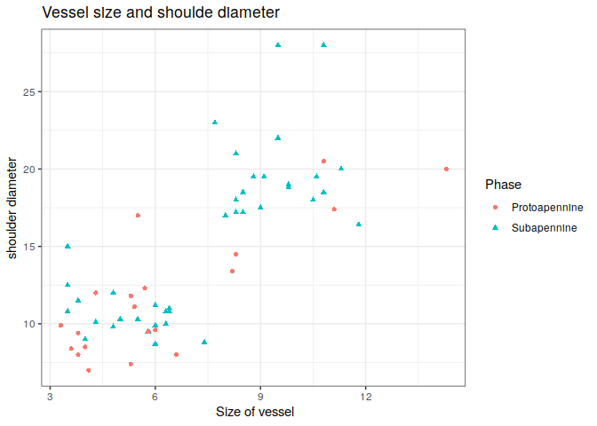
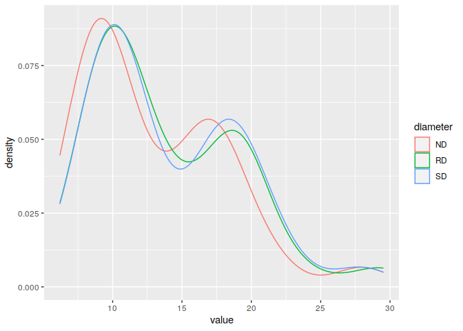
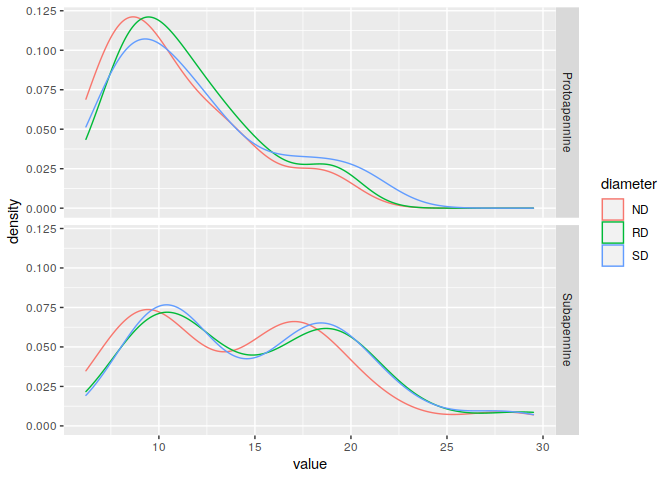
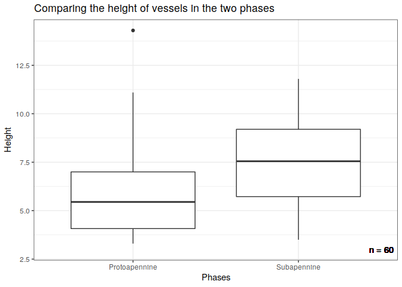
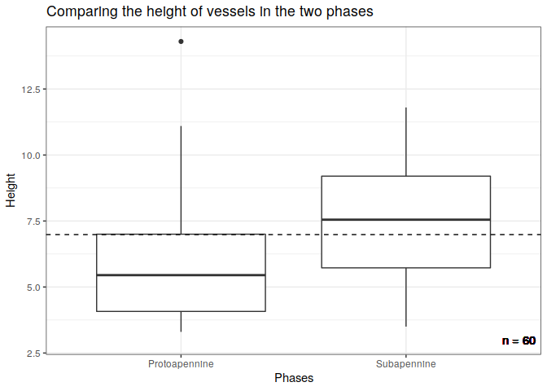

# Some more visualisations!

Let’s continue with plotting. There are some more functions to get to
know.

Let’s take the BACups data set from the archdata package. It describes
several measurements on pottery.

``` r
library(archdata)
data(BACups)
```

Now, let’s maybe visualise how shoulder diameter and height of the
vessels compare.

``` r
library(ggplot2)

ggplot(data = BACups)+
  geom_point(aes(x = H, y = SD, 
                 shape = Phase,  # shape of the points by Phase
                 color = Phase)) + #colour of the points by Phase
  labs(x =" Size of vessel", #x-axis labek
       y ="shoulder diameter", #y-axis label
       title = "Vessel size and shoulde diameter")+ #title of graph
  theme_bw() # theme black/white gives background look
```


As you can see I addded some parameter and arguments that change the
look of the graph:

1.  I can change the form of the points via shape: Shape is determined
    by phase here.

2.  I added x- and y-axis description as well as a title of the plot
    using the function labs().

3.  I changed the “theme” of the layout.

Please try putting rim diameter and neck diameter as the variables!

### density plot

Maybe we can visualise this differently as well. The density plots we
talked about before, but let’s now compare neck diameter, rim diameter
and shoulder diameter in one graph.

First we need to do some data management. GGplot needs “long” data –
tables, where I have an extra row for each value I want to plot.
Therefore, we need to get the ND, RD and SD values “below each other”.
The function that does this is called `gather` of the package `tidyr`.
It will “gather” all values in one column (which I call “value” in the
following code) and will give each value a “companion” in another new
column (key column called “diameter” in the code), which explains from
which column it came from.

``` r
#install.packages("tidyr")
library(tidyr)
BACups%>%
  gather(key = "diameter", 
         value = "value", 
         "RD", "ND","SD") %>%
  ggplot()+
  geom_density(aes(x = value, col= diameter))
```



Now, we should differentiate this plot for the Phases, right?

There is a nice little way to create facetted plots:

``` r
BACups%>%
  gather(key = "diameter", 
         value = "value", 
         "RD", "ND","SD") %>%
  ggplot()+
  geom_density(aes(x = value, col= diameter))+
  facet_grid(Phase~.)
```



Really useful!

### Boxplot

Boxplots are a diagram form that are a hassle to create in excel, but
very easy to do in R.

Let’s maybe again compare the proto- and the subappenine vessels and
their height:

``` r
ggplot(data = BACups)+
  geom_boxplot(aes(x = Phase, y = H)) + 
  labs(x ="Phases",
       y ="Height",
       title = "Comparing the height of vessels in the two phases")+
  theme_bw()
```


To every plot we can add additional things, such as lines or text.

Let’s write in the lower right hand corner of the last plot the size of
my dataset. Always a good practice.

We can add another “layer” to the plot by adding a `geom_text()` to the
whole thing. In it we define the aesthetics (x and y value for the
position of the text and the label aka “the text we want to write”). The
label needs to consist of part text (“n=”) and part function
(`nrow(BACups)`). `nrow` counts the number of rows in a data.frame. To
merge these two parts we use the function `paste` (similar to c() if we
want to combine values in a vector, but for text). Looks a bit
complicated, but works great:

``` r
ggplot(data = BACups)+
  geom_boxplot(aes(x = Phase, y = H)) + 
  labs(x ="Phases",
       y ="Height",
       title = "Comparing the height of vessels in the two phases")+
  geom_text(aes(x = 2.5, y = 3, 
                label = paste("n =", nrow(BACups))))+
  theme_bw()
```



Now, maybe we want to add a horizontal line at some point to show a
certain level that’s important for your analysis. We can add a
geom_hline for that:

``` r
ggplot(data = BACups)+
  geom_boxplot(aes(x = Phase, y = H)) + 
  labs(x ="Phases",
       y ="Height",
       title = "Comparing the height of vessels in the two phases")+
  geom_text(aes(x = 2.5, y = 3, 
                label = paste("n =", nrow(BACups))))+
  geom_hline(aes(yintercept = mean(BACups$H)), # draw the line where the mean value of H is
             linetype = "dashed")+ # make the line dashed
  theme_bw()
```



## ggplot: links

Theres a really nice blogpost showing how you can beautify ggplots step
by step here:
<https://cedricscherer.netlify.com/2019/05/17/the-evolution-of-a-ggplot-ep.-1/>

You can use these links to get help with ggplot:

-   I use the R cookbook constantly: <http://www.cookbook-r.com/>

-   there are cheat sheets:
    <https://raw.githubusercontent.com/rstudio/cheatsheets/main/data-visualization.pdf>

-   in German the R introduction has a chapter on ggplot:
    <https://r-intro.tadaa-data.de/book/visualisierung.html>
